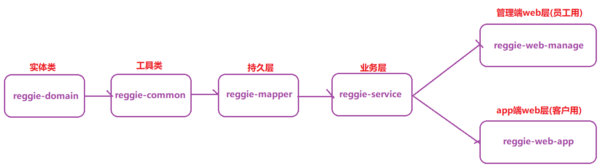
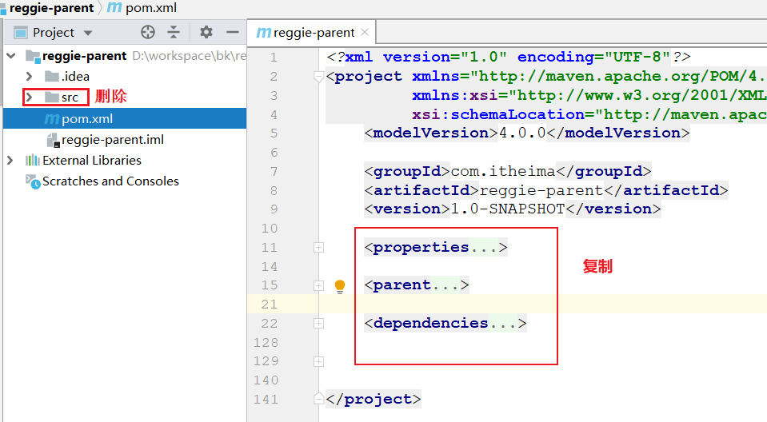
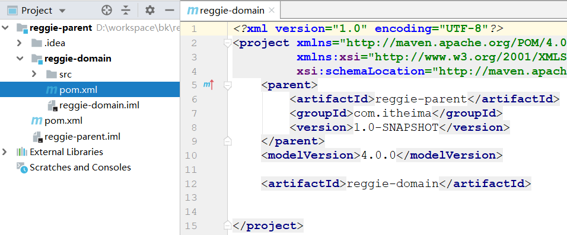
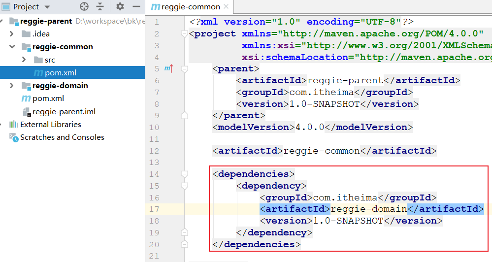
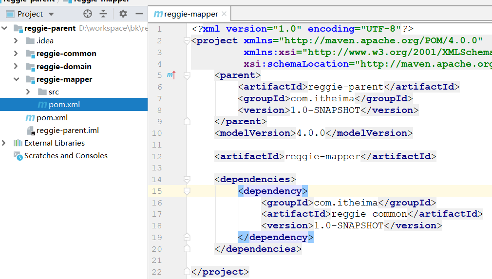
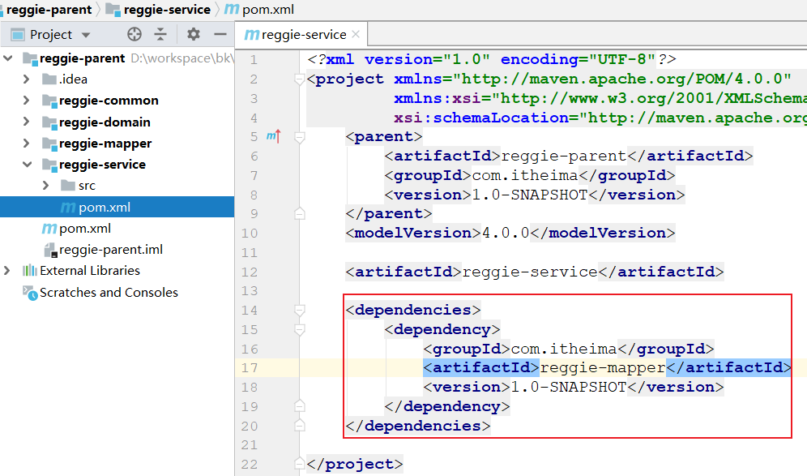
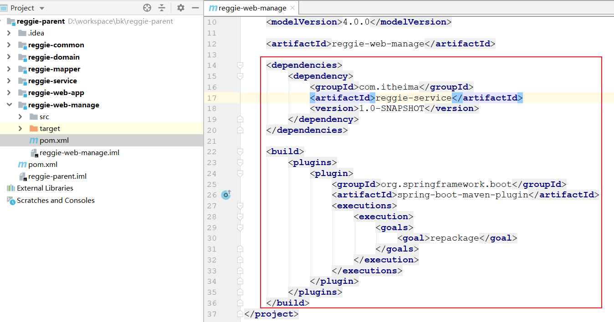
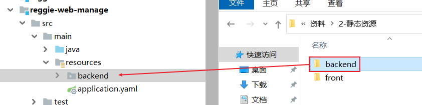

# 项目框架搭建

### 1.数据库建表

| **表名**      | **说明**         |
| ------------- | ---------------- |
| employee      | 员工表           |
| category      | 菜品和套餐分类表 |
| dish          | 菜品表           |
| setmeal       | 套餐表           |
| setmeal_dish  | 套餐菜品关系表   |
| dish_flavor   | 菜品口味关系表   |
| user          | 用户表（C端）    |
| address_book  | 地址簿表         |
| shopping_cart | 购物车表         |
| orders        | 订单表           |
| order_detail  | 订单明细表       |

### 2.项目模块搭建

#### （1）创建父工程



> 在idea中创建maven项目，名称`reggie-parent`，删除src目录，并在pom.xml中引入依赖  

  

~~~xml
<parent>
    <groupId>org.springframework.boot</groupId>
    <artifactId>spring-boot-starter-parent</artifactId>
    <version>2.4.5</version>
    <relativePath/>
</parent>

<dependencies>
    <dependency>
        <groupId>org.springframework.boot</groupId>
        <artifactId>spring-boot-starter-test</artifactId>
        <scope>test</scope>
    </dependency>
    <dependency>
        <groupId>org.springframework.boot</groupId>
        <artifactId>spring-boot-starter-web</artifactId>
    </dependency>
    <dependency>
        <groupId>org.springframework.boot</groupId>
        <artifactId>spring-boot-configuration-processor</artifactId>
        <optional>true</optional>
    </dependency>
    <dependency>
        <groupId>org.junit.jupiter</groupId>
        <artifactId>junit-jupiter-api</artifactId>
        <version>5.7.1</version>
        <scope>compile</scope>
    </dependency>

    <!--数据层-->
    <dependency>
        <groupId>mysql</groupId>
        <artifactId>mysql-connector-java</artifactId>
        <version>5.1.6</version>
    </dependency>
    <dependency>
        <groupId>com.alibaba</groupId>
        <artifactId>druid-spring-boot-starter</artifactId>
        <version>1.1.23</version>
    </dependency>
    <dependency>
        <groupId>org.mybatis.spring.boot</groupId>
        <artifactId>mybatis-spring-boot-starter</artifactId>
        <version>2.1.1</version>
    </dependency>
    <!--        <dependency>-->
    <!--            <groupId>com.baomidou</groupId>-->
    <!--            <artifactId>mybatis-plus-boot-starter</artifactId>-->
    <!--            <version>3.4.2</version>-->
    <!--        </dependency>-->

    <!--阿里云-->
    <dependency>
        <groupId>com.aliyun.oss</groupId>
        <artifactId>aliyun-sdk-oss</artifactId>
        <version>3.10.2</version>
    </dependency>
    <dependency>
        <groupId>com.aliyun</groupId>
        <artifactId>aliyun-java-sdk-core</artifactId>
        <version>4.0.6</version>
    </dependency>
    <dependency>
        <groupId>com.aliyun</groupId>
        <artifactId>aliyun-java-sdk-dysmsapi</artifactId>
        <version>1.1.0</version>
    </dependency>

    <!--工具类-->
    <dependency>
        <groupId>com.alibaba</groupId>
        <artifactId>fastjson</artifactId>
        <version>1.2.76</version>
    </dependency>
    <dependency>
        <groupId>org.apache.commons</groupId>
        <artifactId>commons-lang3</artifactId>
    </dependency>
    <dependency>
        <groupId>org.projectlombok</groupId>
        <artifactId>lombok</artifactId>
        <version>1.18.20</version>
    </dependency>
    <dependency>
        <groupId>cn.hutool</groupId>
        <artifactId>hutool-all</artifactId>
        <version>5.4.3</version>
    </dependency>

    <!--热部署-->
    <dependency>
        <groupId>org.springframework.boot</groupId>
        <artifactId>spring-boot-devtools</artifactId>
        <scope>runtime</scope>
    </dependency>
</dependencies>
~~~


#### （2）创建实体类模块

>创建`reggie-domain`模块，用于存放实体类 

  


#### （3）创建工具类模块

>创建`reggie-common`模块，用于存放通用的一些类，本模块需要依赖`reggie-domain`模块 

  


#### （4）创建持久层模块

>创建`reggie-mapper`模块，用于存放持久层代码，本模块需要依赖`reggie-common`模块  



  

#### （5）创建业务层模块

>创建`reggie-service`模块，用于存放业务层代码，本模块需要依赖`reggie-mapper`模块 



 

#### （6）创建表示层模块

>创建`reggie-web-manage`模块，用于存放管理后台的表示层代码，本模块需要依赖`reggie-service`模块

  

 
~~~xml
<dependencies>
    <dependency>
        <groupId>com.itheima</groupId>
        <artifactId>reggie-service</artifactId>
        <version>1.0-SNAPSHOT</version>
    </dependency>
</dependencies>

<build>
    <finalName>reggie-web-manage</finalName>
    <plugins>
        <plugin>
            <groupId>org.springframework.boot</groupId>
            <artifactId>spring-boot-maven-plugin</artifactId>
            <executions>
                <execution>
                    <goals>
                        <goal>repackage</goal>
                    </goals>
                </execution>
            </executions>
        </plugin>
    </plugins>
</build>
~~~

### 3.配置与资源导入

#### （1）添加配置文件

>在`reggie-web-manage`工程的resources目录下创建`application.yml`文件,并引入配置

~~~yaml
server:
  port: 8080
spring:
  application:
    name: reggie-web-manage # 应用名称
  datasource: # 数据源配置
    druid:
      driver-class-name: com.mysql.jdbc.Driver
      url: jdbc:mysql://localhost:3306/reggie?useUnicode=true&characterEncoding=utf-8&useSSL=false
      username: root
      password: root
      
mybatis:
  configuration:
    map-underscore-to-camel-case: true # 驼峰命名法映射 address_book ---> AddressBook
    log-impl: org.apache.ibatis.logging.stdout.StdOutImpl # 日志输出
  mapper-locations: classpath:/mappers/**.xml # 指定xml位置
~~~

#### （2）创建启动类

>在`reggie-web-manage`工程下创建启动类`com.itheima.reggie.WebManageApplication`

~~~java
package com.itheima.reggie;

import lombok.extern.slf4j.Slf4j;
import org.mybatis.spring.annotation.MapperScan;
import org.springframework.boot.SpringApplication;
import org.springframework.boot.autoconfigure.SpringBootApplication;
import org.springframework.transaction.annotation.EnableTransactionManagement;

@SpringBootApplication // 启动类
@MapperScan("com.itheima.reggie.mapper")// 扫描mybatis接口创建代理对象
@EnableTransactionManagement // 开启事务注解支持
@Slf4j
public class WebManageApplication {
    public static void main(String[] args) {
        SpringApplication.run(WebManageApplication.class, args);
        log.info("项目启动成功");
    }
}
~~~

#### （3）静态资源导入

> 资料中已经提供好了本项目所需要的静态资源，只需要将其引入到项目的resources即可 

 


 

#### （4）静态资源映射

>在Springboot项目中，<font color='#BAOC2F'>默认静态资源</font>的存放目录为：`classpath:/static/`
>
>而本项目中静态资源存放在backend目录中, 那么这个时候要想访问到静态资源，就需要设置静态资源映射。
>
>创建一个`com.itheima.reggie.config.ReggieWebMvcConfig`配置类，内容如下:

```java
package com.itheima.reggie.config;

import org.springframework.context.annotation.Configuration;
import org.springframework.web.servlet.config.annotation.ResourceHandlerRegistry;
import org.springframework.web.servlet.config.annotation.WebMvcConfigurer;

//web相关配置
@Configuration
public class ReggieWebMvcConfig implements WebMvcConfigurer {
    //设置静态资源映射
    public void addResourceHandlers(ResourceHandlerRegistry registry) {
        //当访问请求是/backend/**时,去classpath:/backend/寻找对应资源
        registry.addResourceHandler("/backend/**").addResourceLocations("classpath:/backend/");
    }
}
```


#### （5）简单测试

> 本地启动工程，通过下面地址进行访问测试http://localhost:8080/backend/page/login/login.html
>


