# 系统登录与退出

---

## 1.员工登录

### （1）思路分析

#### 前端核心代码  

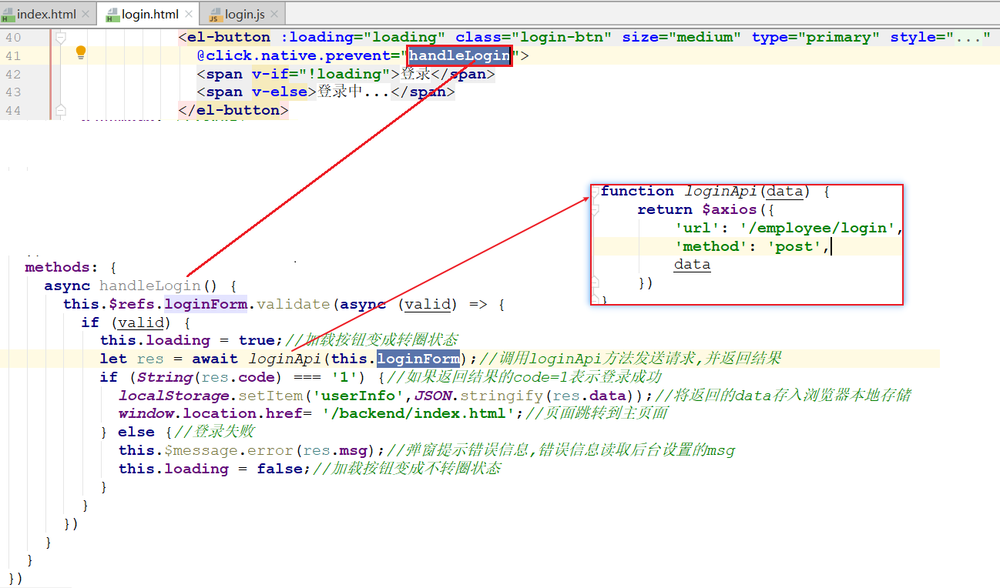 

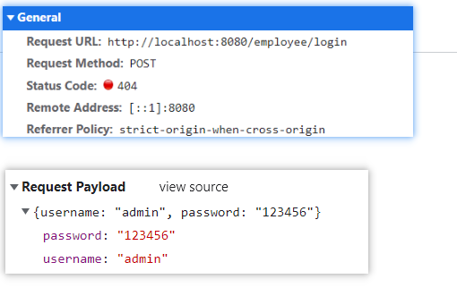 

#### 后台思路分析

>当点击登录按钮时，页面会发送请求到`/employee/login`并提交参数username和password, 
>
>后台接收请求参数，校验用户名和密码，返回登录结果
>
>通过观察结果，会发现返回的结果成会包含三部分：code操作结果代码、msg操作代码提示、data操作结果主信息
>
>~~~json
>{
>  "code":"1",
>  "msg":"登录成功",
>  "data":{
>        //返回的对象
>   }
>}
>~~~
>
>因此后台专门准备了一个封装类似对象的类ResultInfo（资料中已经提供），后台直接返回这个对象即可
>
>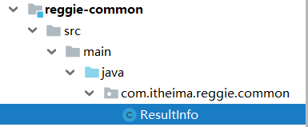  

  

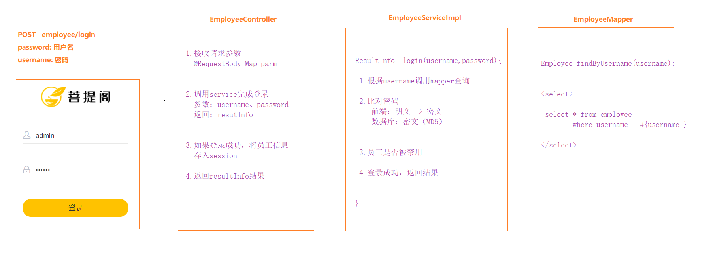 

### （2）代码编写

#### Employee

>在`reggie-domain`模块下创建`com.itheima.reggie.domain.Employee` 

~~~java
package com.itheima.reggie.domain;

import com.fasterxml.jackson.annotation.JsonFormat;
import lombok.Data;
import java.io.Serializable;
import java.util.Date;

// 员工
@Data
public class Employee implements Serializable {

    //状态标识常量
    public static final Integer STATUS_DISABLE = 0;
    public static final Integer STATUS_ENABLE = 1;

    private Long id;//主键

    private String username;//用户名

    private String name;//姓名

    private String password;//密码

    private String phone;//手机号

    private String sex;//性别

    private String idNumber;//身份证号

    private Integer status;//状态 0:禁用 1:正常

    @JsonFormat(timezone = "GMT+8", pattern = "yyyy-MM-dd HH:mm:ss")
    private Date createTime;//创建时间

    @JsonFormat(timezone = "GMT+8", pattern = "yyyy-MM-dd HH:mm:ss")
    private Date updateTime;//更新时间

    private Long createUser;//创建用户

    private Long updateUser;//更新用户
}
~~~

#### EmployeeController

>在`reggie-web-manage`模块下创建`com.itheima.reggie.controller.EmployeeController`

~~~java
package com.itheima.reggie.controller;

import com.itheima.reggie.common.Constant;
import com.itheima.reggie.common.ResultInfo;
import com.itheima.reggie.domain.Employee;
import com.itheima.reggie.service.EmployeeService;
import org.springframework.beans.factory.annotation.Autowired;
import org.springframework.web.bind.annotation.PostMapping;
import org.springframework.web.bind.annotation.RequestBody;
import org.springframework.web.bind.annotation.RestController;

import javax.servlet.http.HttpSession;
import java.util.Map;

// 内部员工模块
@RestController
public class EmployeeController {

    @Autowired
    private EmployeeService employeeService;

    @Autowired
    HttpSession session;

    @PostMapping("/employee/login")
    public ResultInfo login(@RequestBody Map<String, String> param) {
        // 1.接收请求参数
        String username = param.get("username");
        String password = param.get("password");
        // 2.调用service完成登录
        ResultInfo resultInfo = employeeService.login(username, password);
        // 3.如果登录成功，将员工信息存储session
        if (resultInfo.getCode() == 1) {
            Employee employee = (Employee) resultInfo.getData();
            session.setAttribute(Constant.SESSION_EMPLOYEE, employee);
        }
        // 4.返回结果
        return resultInfo;
    }
}

~~~

**这里需要一个常量类，从资料中导入即可**

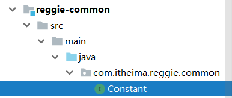 

#### EmployeeService

>在`reggie-service`模块下创建`com.itheima.reggie.service.EmployeeService`

~~~java
package com.itheima.reggie.service;

import com.itheima.reggie.common.ResultInfo;

public interface EmployeeService {

    // 员工登录
    ResultInfo login(String username, String password);
}

~~~

#### EmployeeServiceImpl

>在`reggie-service`模块下创建`com.itheima.reggie.service.impl.EmployeeServiceImpl`

~~~java
package com.itheima.reggie.service.impl;

import cn.hutool.core.util.StrUtil;
import cn.hutool.crypto.SecureUtil;
import com.itheima.reggie.common.ResultInfo;
import com.itheima.reggie.domain.Employee;
import com.itheima.reggie.mapper.EmployeeMapper;
import com.itheima.reggie.service.EmployeeService;
import org.springframework.beans.factory.annotation.Autowired;
import org.springframework.stereotype.Service;
import org.springframework.transaction.annotation.Transactional;

@Service
@Transactional
public class EmployeeServiceImpl implements EmployeeService {

    @Autowired
    private EmployeeMapper employeeMapper;

    @Override
    public ResultInfo login(String username, String password) {
        // 1.根据username调用mapper查询
        Employee employee = employeeMapper.findByUsername(username);
        if (employee == null) {
            return ResultInfo.error("员工不存在");
        }
        // 2.比对密码
        // 2-1 将前端密码进行加密
        String md5Pwd = SecureUtil.md5(password);
        // 2-2 取出数据密码，比对
        if (!StrUtil.equals(employee.getPassword(), md5Pwd)) { // 解决空指针问题
            return ResultInfo.error("密码不正确");
        }
        // 3.员工是否禁用
        if (employee.getStatus() == 0) {
            return ResultInfo.error("此员工被冻结，请联系管理员");
        }
        // 4.登录成功，返回结果
        return ResultInfo.success(employee);
    }
}

~~~

#### EmployeeMapper

>在`reggie-mapper`模块下创建`com.itheima.reggie.mapper.EmployeeMapper`

~~~java
package com.itheima.reggie.mapper;

import com.itheima.reggie.domain.Employee;

public interface EmployeeMapper {

    // 根据用户名查询
    Employee findByUsername(String username);
}

~~~

#### EmployeeMapper.xml

>在`reggie-mapper`模块下的`resource/mappers`下创建`EmployeeMapper.xml`

~~~xml
<?xml version="1.0" encoding="UTF-8" ?>
<!DOCTYPE mapper PUBLIC "-//mybatis.org//DTD Mapper 3.0//EN" "http://mybatis.org/dtd/mybatis-3-mapper.dtd">
<mapper namespace="com.itheima.reggie.mapper.EmployeeMapper">

    <select id="findByUsername" resultType="com.itheima.reggie.domain.Employee">
        select * from employee where username = #{username}
    </select>
</mapper>
~~~

### （3）debug调试

https://blog.csdn.net/yxl_1207/article/details/80973622

### （4）主页面结构

>本项目主页面主要使用iframe实现
>
> 

~~~html
<!DOCTYPE html>
<html lang="en">
    <head>
        <meta charset="UTF-8">
        <title>主页面模拟</title>
    </head>
    <body>
        <table width="100%">
            <tr>
                <td width="100px">
                    <ul>
                        <li><a href="http://www.itcast.cn" target="myFrame">传智</a></li>
                        <li><a href="https://www.aliyun.com" target="myFrame">阿里云</a></li>
                        <li><a href="https://www.taobao.com" target="myFrame">淘宝</a></li>
                        <li><a href="https://www.suning.com/" target="myFrame">苏宁</a></li>
                    </ul>
                </td>
                <td>
                    <iframe name="myFrame" src="http://www.itcast.cn" width="100%" height="800px">

                    </iframe>
                </td>
            </tr>
        </table>
    </body>
</html>
~~~

## 2.员工退出

### （1）思路分析

#### 前端核心代码

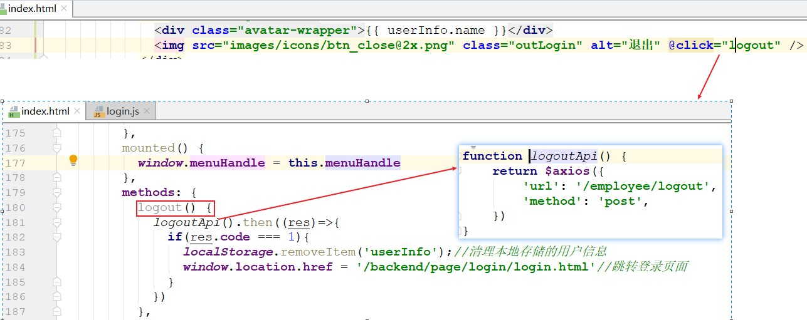  

#### 后台思路分析

>当点击退出按钮时，后台清理session中的用户信息，然后返回成功标识。

 

### （2）代码编写

#### EmployeeController

~~~java
// 退出
@PostMapping("/employee/logout")
public ResultInfo logout(){
    // 1.清除session
    session.invalidate();
    // 2.返回结果
    return ResultInfo.success(null);
}
~~~

## 3.员工列表

### （1）思路分析

#### 数据模型(employee表)

 

#### 前端核心代码

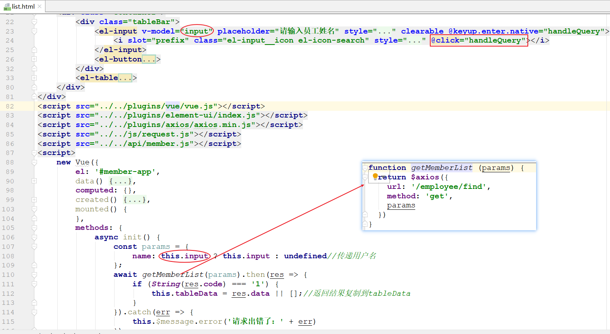 

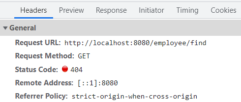 

#### 后台思路分析

>当`进入页面`或者`在搜索框输入员工姓名然后回车`的时候发起请求，查询回员工列表之后，将其渲染到页面表格中
>
>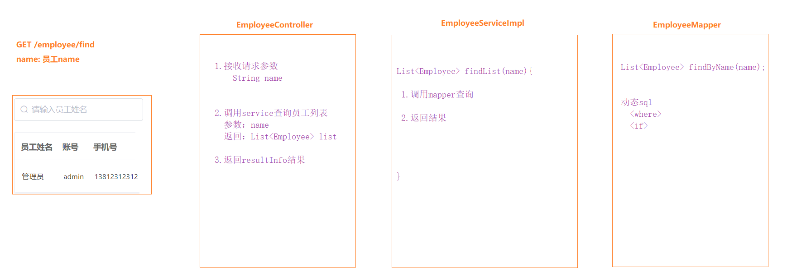 

### （2）代码实现

#### EmployeeController

~~~java
// 员工列表
@GetMapping("/employee/find")
public ResultInfo findList(String name) { // 1.接收请求参数

    // 2.调用service查询员工列表
    List<Employee> list = employeeService.findList(name);
    // 3.返回结果
    return ResultInfo.success(list);
}
~~~

#### EmployeeService

~~~java
// 员工列表
List<Employee> findList(String name);
~~~

#### EmployeeServiceImpl

~~~java
@Override
public List<Employee> findList(String name) {
    // 1.调用mapper查询
    List<Employee> list = employeeMapper.findByName(name);
    // 2.返回结果
    return list;
}
~~~

#### EmployeeMapper

~~~java
// 根据姓名查询
List<Employee> findByName(String name);
~~~

#### EmployeeMapper.xml

~~~xml
<select id="findByName" resultType="com.itheima.reggie.domain.Employee">
    select * from employee
    <where>
        <if test="name!=null and name!=''">
            name like CONCAT('%',#{name},'%')
        </if>
    </where>
</select
~~~

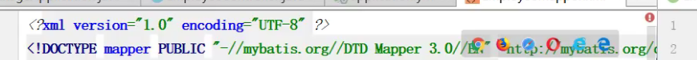

## 4.访问拦截

### （1）问题分析

> 目前已经完成了后台系统的员工登录功能，但是还存在一个问题，那就是用户如果不登录，直接访问系统首页，照样可以正常访问。 
>
> 这种设计明显不合理，我们希望看到的是，只有登录成功后才可以访问系统中的页面，如果没有登录, 访问系统时会自动跳转到登录页面。
>
> 这可以使用者拦截器来实现，在拦截器中判断用户是否已经登录，如果没有登录则返回提示信息，跳转到登录页面即可。

 

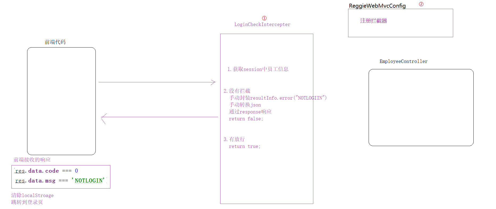 

### （2）功能实现

#### 前端代码

>前端已经定义好了一个拦截器，这个拦截器会在浏览器一端拦截请求和响应，所有的请求发送都会被这个拦截器拦截并处理
>
>现在我们只关注响应的一段，里面有个判断，逻辑时当返回的code=0并且msg=NOTLOGINT时，它会清空浏览器存储的员工信息，然后跳转登录页面

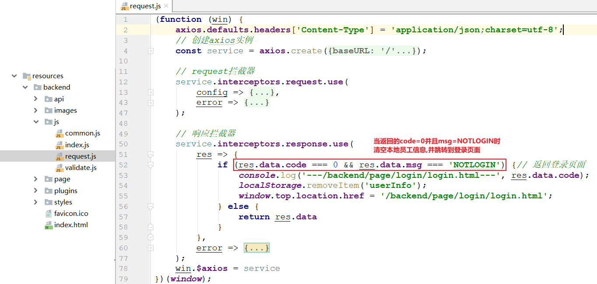 

#### 开发拦截器

>在`reggie-web-manage`模块下创建`com.itheima.reggie.interceptor.LoginCheckInterceptor`

~~~java
package com.itheima.reggie.interceptor;

import com.fasterxml.jackson.databind.ObjectMapper;
import com.itheima.reggie.common.Constant;
import com.itheima.reggie.common.ResultInfo;
import com.itheima.reggie.domain.Employee;
import org.springframework.stereotype.Component;
import org.springframework.web.servlet.HandlerInterceptor;

import javax.servlet.http.HttpServletRequest;
import javax.servlet.http.HttpServletResponse;
import javax.servlet.http.HttpSession;

// 登录拦截器
@Component
public class LoginCheckInterceptor implements HandlerInterceptor {

    // 登录拦截
    @Override
    public boolean preHandle(HttpServletRequest request, HttpServletResponse response, Object handler) throws Exception {
        // 1.获取session中员工信息
        HttpSession session = request.getSession();
        Employee employee = (Employee) session.getAttribute(Constant.SESSION_EMPLOYEE);

        // 2.判断 session中没员工，拦截
        if (employee == null) {
            // 手动封装提示信息
            ResultInfo resultInfo = ResultInfo.error("NOTLOGIN");
            // 手动转json
            ObjectMapper objectMapper = new ObjectMapper();
            String json = objectMapper.writeValueAsString(resultInfo);
            // 通过response响应
            response.setContentType("application/json;charset=utf-8");
            response.getWriter().write(json);
            return false;
        }

        // 3.session有员工，放行
        return true;
    }
}
~~~

#### 配置拦截器

>在`reggie-web-manage`模块下的`com.itheima.reggie.config.ReggieWebMvcConfig`中添加拦截器的配置

~~~java
@Autowired
private LoginCheckInterceptor loginCheckInterceptor;

//设置拦截器
@Override
public void addInterceptors(InterceptorRegistry registry) {
    //定义放行路径
    ArrayList<String> urls = new ArrayList<>();
    urls.add("/backend/**");//管理系统静态资源
    urls.add("/error");//错误请求
    urls.add("/employee/login");//管理系统登录请求
    urls.add("/employee/logout");//管理系统退出请求

    //配置拦截器和路径
    registry.addInterceptor(loginCheckInterceptor)
        .addPathPatterns("/**")//拦截所有
        .excludePathPatterns(urls); //放行指定路径
}
~~~

