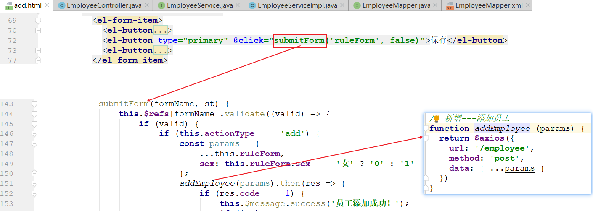
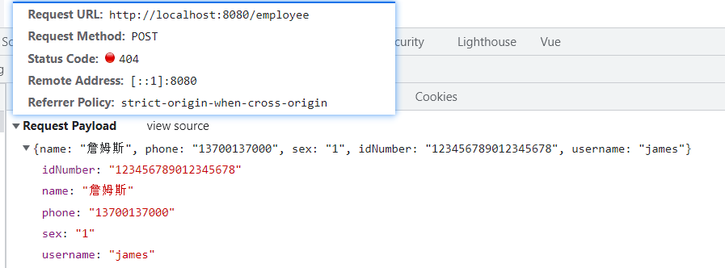
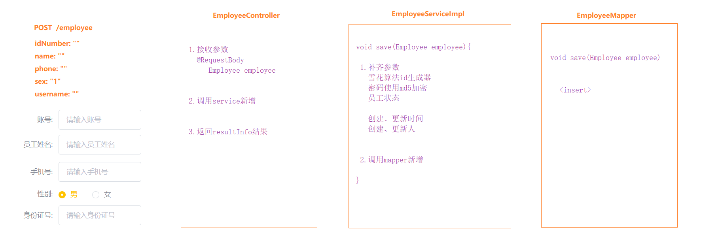
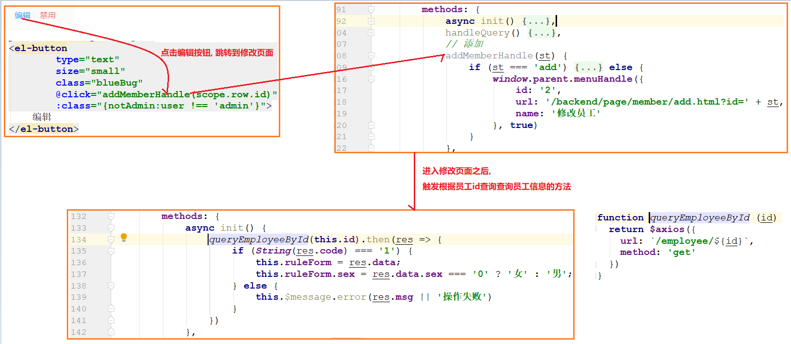
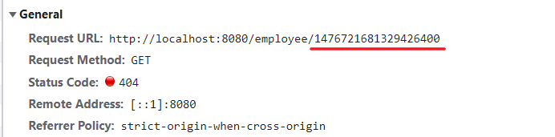
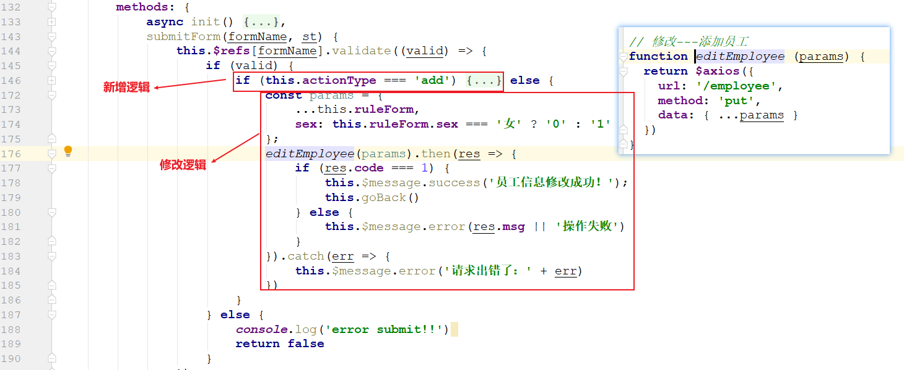
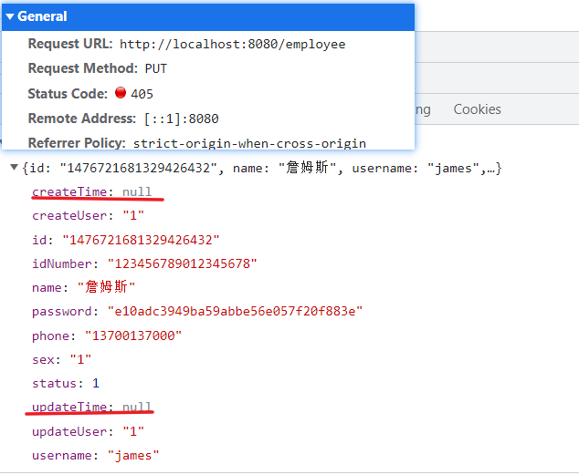
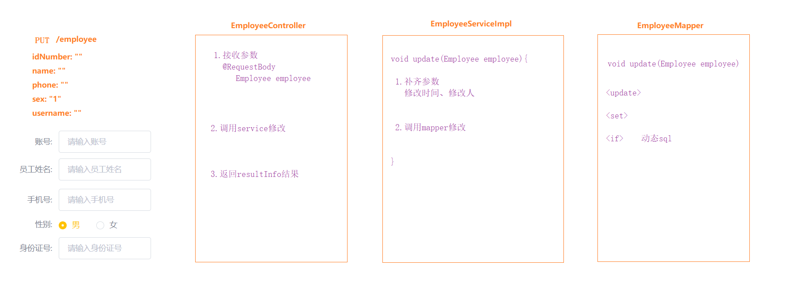
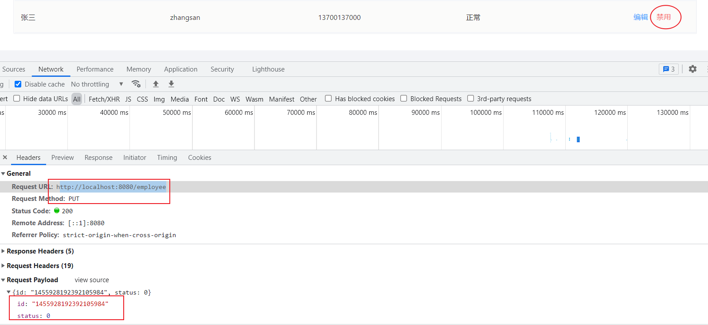

# 员工管理

---

## 1.新增员工

### （1）思路分析

#### 前端核心代码

 


 


#### 后台思路分析

>填写列表内容，点击保存按钮，提交表单，后台补齐表中所缺字段的值，然后保存到数据库

  

### （2）代码实现

#### EmployeeController

~~~java
// 新增员工
@PostMapping("/employee")
public ResultInfo save(@RequestBody Employee employee) {  //  1.接收请求体参数

    // 2.调用service新增
    employeeService.save(employee);

    // 3.返回结果
    return ResultInfo.success(null);
}
~~~

#### EmployeeService

~~~java
// 新增员工
void save(Employee employee);
~~~

#### EmployeeServiceImpl

~~~java
@Override
public void save(Employee employee) {
    // 1.补齐参数
    // 1-1 id  雪花算法ID生成器（课下作业）
    Long id = IdUtil.getSnowflake(1, 1).nextId();
    employee.setId(id);
    // 1-2 密码 md5加密
    String md5Pwd = SecureUtil.md5(Constant.INIT_PASSWORD);
    employee.setPassword(md5Pwd);
    // 1-3 员工状态
    employee.setStatus(Employee.STATUS_ENABLE);
    // 创建、更新时间
    employee.setCreateTime(new Date());
    employee.setUpdateTime(new Date());
    // 创建、更新人
    employee.setCreateUser(1L);
    employee.setUpdateUser(1L);

    // 2.调用mapper新增
    employeeMapper.save(employee);
}
~~~

#### EmployeeMapper

~~~java
// 员工新增
void save(Employee employee);
~~~

#### EmployeeMapper.xml

~~~xml
<!--注意：  name在前、 username在后 -->
<insert id="save">
    insert into employee
    values(
    #{id},
    #{name},
    #{username},
    #{password},
    #{phone},
    #{sex},
    #{idNumber},
    #{status},
    #{createTime},
    #{updateTime},
    #{createUser},
    #{updateUser}
    )
</insert>
~~~

### （3）ID精度损失问题

#### 问题说明

>新增完成之后执行查询所有，打印出id，忽然发现，后台返回的id发生了精度损失的情况
>
>这个问题的原因是js在对长度较长的长整型数据进行处理时会损失精度， 从而导致提交的id和数据库中的id不一致
>
>要想解决这个问题，也很简单，只需要让js处理的ID数据类型为字符串类型即可, 这样就不会损失精度了

#### 问题修复

>具体的方式是在后台程序中添加一个数据类型转换器，然后在转换器中自定义数据转换规则，然后将对象转换器配置到spring中

**JacksonObjectMapper**

>在`reggie-common`模块下创建`com.itheima.reggie.common.JacksonObjectMapper`,自定义映射规则

```java
import com.fasterxml.jackson.databind.module.SimpleModule;
import com.fasterxml.jackson.databind.ser.std.DateSerializer;
import com.fasterxml.jackson.databind.ser.std.ToStringSerializer;

import java.math.BigInteger;
import java.text.SimpleDateFormat;
import java.util.Date;

import static com.fasterxml.jackson.databind.DeserializationFeature.FAIL_ON_UNKNOWN_PROPERTIES;

/**
 * 对象映射器:基于jackson将Java对象转为json，或者将json转为Java对象
 * 将JSON解析为Java对象的过程称为 [从JSON反序列化Java对象]
 * 从Java对象生成JSON的过程称为 [序列化Java对象到JSON]
 */
public class JacksonObjectMapper extends ObjectMapper {

    public static final String DEFAULT_DATE_FORMAT = "yyyy-MM-dd";
    public static final String DEFAULT_DATE_TIME_FORMAT = "yyyy-MM-dd HH:mm:ss";
    public static final String DEFAULT_TIME_FORMAT = "HH:mm:ss";

    public JacksonObjectMapper() {
        super();
        //收到未知属性时不报异常
        this.configure(FAIL_ON_UNKNOWN_PROPERTIES, false);

        //反序列化时，属性不存在的兼容处理
        this.getDeserializationConfig().withoutFeatures(FAIL_ON_UNKNOWN_PROPERTIES);

        //自定义转换规则
        SimpleModule simpleModule = new SimpleModule()
                .addSerializer(BigInteger.class, ToStringSerializer.instance)//将BigInteger转换为String
                .addSerializer(Long.class, ToStringSerializer.instance)//将Long转换成String
                .addSerializer(Date.class, new DateSerializer(false, new SimpleDateFormat(DEFAULT_DATE_FORMAT))); // 将Date转为指定格式字符串
        this.registerModule(simpleModule);
    }
}
```

**ReggieWebMvcConfig**

>在`com.itheima.reggie.config.ReggieWebMvcConfig`中添加下面代码

```java
//扩展mvc框架的消息转换器
public void extendMessageConverters(List<HttpMessageConverter<?>> converters) {
    //创建消息转换器对象
    MappingJackson2HttpMessageConverter messageConverter = new MappingJackson2HttpMessageConverter();
    //设置对象转换器，底层使用Jackson将Java对象转为json
    messageConverter.setObjectMapper(new JacksonObjectMapper());
    //将上面的消息转换器对象追加到mvc框架的转换器集合中
    converters.add(0, messageConverter);
}
```


## 2.回显员工

### （1）思路分析

#### 前端核心代码



 

#### 后台思路分析

点击编辑按钮时，页面跳转到add.html，并在url中携带参数[员工id]

进入add.html之后，发送查询请求到后台，后台根据id从数据库查询员工信息返回给前端页面

 

 


### （2）代码实现

#### EmployeeController

~~~java
// 回显员工（根据id查询）
@GetMapping("/employee/{id}")
public ResultInfo findById(@PathVariable Long id) { // 1.接收参数
    // 2.调用serivce
    Employee employee = employeeService.findById(id);
    // 3.返回结果
    return ResultInfo.success(employee);

}
~~~

#### EmployeeService

~~~java
// 根据id查询
Employee findById(Long id);
~~~

#### EmployeeServiceImpl

~~~java
@Override
public Employee findById(Long id) {
    // 直接调用mapper
    return employeeMapper.findById(id);
}
~~~

#### EmployeeMapper

~~~java
// 根据id查询
Employee findById(Long id);
~~~

#### EmployeeMapper.xml

~~~xml
<select id="findById" resultType="com.itheima.reggie.domain.Employee">
    select * from employee where id = #{id}
</select>
~~~


## 3.修改员工

### （1）思路分析

#### 前端核心代码

>本项目中新增和修改使用的是同一段前端代码，他会根据跳转到当前页面时，路径上是否含有id参数判断是否是修改

 

 


#### 后台思路分析

 

### （2）代码实现

#### EmployeeController

~~~java
// 修改员工
@PutMapping("/employee")
public ResultInfo update(@RequestBody Employee employee) { // 1.接收参数
    // 2.调用serivce修改
    employeeService.update(employee);
    // 3.返回结果
    return ResultInfo.success(null);
}
~~~

#### EmployeeService

~~~java
// 修改员工
void update(Employee employee);
~~~

#### EmployeeServiceImpl

~~~java
@Override
public void update(Employee employee) {
    // 1.补齐参数
    employee.setUpdateTime(new Date());
    employee.setUpdateUser(1L); // 暂时写死1L

    // 2.调用mapper修改
    employeeMapper.update(employee);
}
~~~

#### EmployeeMapper

~~~java
// 修改员工
void update(Employee employee);
~~~

#### EmployeeMapper.xml

~~~xml
<!--只有字符串类型，才需要判断非空串...-->
<update id="update">
    update employee
    <set>
        <if test="name!=null and name!=''">
            name=#{name},
        </if>
        <if test="username!=null and username!=''">
            username=#{username},
        </if>
        <if test="password!=null and password!=''">
            password=#{password},
        </if>
        <if test="phone!=null and phone!=''">
            phone=#{phone},
        </if>
        <if test="sex!=null and sex!=''">
            sex=#{sex},
        </if>
        <if test="idNumber!=null and idNumber!=''">
            id_number=#{idNumber},
        </if>
        <if test="status!=null">
            status=#{status},
        </if>
        <if test="updateTime!=null">
            update_time=#{updateTime},
        </if>
        <if test="updateUser!=null">
            update_user=#{updateUser},
        </if>
    </set>
    where id = #{id}
</update>
~~~


### （3）账号禁用/启用

>账号的禁用/启用其实就是一种修改，它修改的是status字段的值（禁用0 启用1）
>
>这个请求使用的接口跟上面的修改是同一个，所以不需要在单独开发




 


