# 分类管理

---

## 1.分类列表

### （1）思路分析

#### 数据模型

分类对应的是category表，具体表结构如下：

 

套餐名称，是唯一的，不能够重复的，所以在设计表结构时，已经针对于name字段建立了唯一索引，如下：

 

#### 前端核心代码

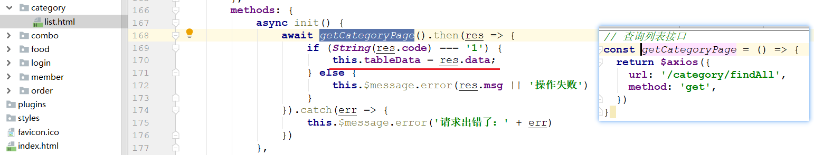 

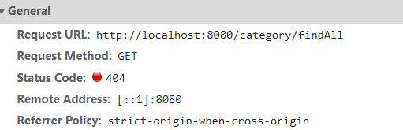 


#### 后台思路分析

>页面进入分类列表页面后立即发送请求，将所有分类信息查询回来
>
>注意：分类信息要按照sort正（升）序排列

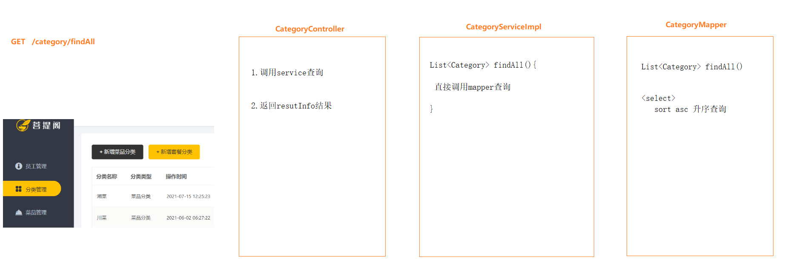 

 

### （2）代码实现

#### Category

> 在`reggie-domain`模块下创建`com.itheima.reggie.domain.Category`

~~~java
package com.itheima.reggie.domain;

import com.fasterxml.jackson.annotation.JsonFormat;
import lombok.Data;

import java.io.Serializable;
import java.util.Date;

//分类
@Data
public class Category implements Serializable {

    private Long id;//主键

    private Integer type;//类型 1 菜品分类 2 套餐分类

    private String name;//分类名称

    private Integer sort; //顺序

    // @JsonFormat(timezone = "GMT+8", pattern = "yyyy-MM-dd HH:mm:ss")
    private Date createTime;//创建时间

    // @JsonFormat(timezone = "GMT+8", pattern = "yyyy-MM-dd HH:mm:ss")
    private Date updateTime;//更新时间

    private Long createUser;//创建人

    private Long updateUser;//修改人

}
~~~

#### CategoryController

>在`reggie-web-manage`创建`com.itheima.reggie.controller.CategoryController`

~~~java
package com.itheima.reggie.controller;

import com.itheima.reggie.common.ResultInfo;
import com.itheima.reggie.domain.Category;
import com.itheima.reggie.service.CategoryService;
import org.springframework.beans.factory.annotation.Autowired;
import org.springframework.web.bind.annotation.GetMapping;
import org.springframework.web.bind.annotation.RestController;

import java.util.List;

@RestController
public class CategoryController {

    @Autowired
    private CategoryService categoryService;

    // 分类列表
    @GetMapping("/category/findAll")
    public ResultInfo findAll() {
        // 1.调用service查询
        List<Category> list = categoryService.findAll();
        // 2.返回resultInfo结果
        return ResultInfo.success(list);
    }
}
~~~

#### CategoryService

>在`reggie-service`模块下创建`com.itheima.reggie.service.CategoryService`

~~~java
package com.itheima.reggie.service;

import com.itheima.reggie.domain.Category;

import java.util.List;

public interface CategoryService {

    // 分类列表
    List<Category> findAll();
}

~~~

#### CategoryServiceImpl

>在`reggie-service`模块下创建`com.itheima.reggie.service.impl.CategoryServiceImpl`

~~~java
package com.itheima.reggie.service.impl;

import com.itheima.reggie.domain.Category;
import com.itheima.reggie.mapper.CategoryMapper;
import com.itheima.reggie.service.CategoryService;
import com.itheima.reggie.service.CategoryService;
import org.springframework.beans.factory.annotation.Autowired;
import org.springframework.stereotype.Service;
import org.springframework.transaction.annotation.Transactional;

import java.util.List;

@Service
@Transactional
public class CategoryServiceImpl implements CategoryService {

    @Autowired
    private CategoryMapper categoryMapper;

    @Override
    public List<Category> findAll() {
        return categoryMapper.findAll();
    }
}

~~~

#### CategoryMapper

>在`reggie-mapper`模块下创建`com.itheima.reggie.mapper.CategoryMapper`

~~~java
package com.itheima.reggie.mapper;

import com.itheima.reggie.domain.Category;

import java.util.List;

public interface CategoryMapper {

    // 查询所有
    List<Category> findAll();
}

~~~

#### CategoryMapper.xml

>在`reggie-mapper`模块的`resources/mappers`下创建`CategoryMapper.xml`

~~~xml
<?xml version="1.0" encoding="UTF-8" ?>
<!DOCTYPE mapper PUBLIC "-//mybatis.org//DTD Mapper 3.0//EN" "http://mybatis.org/dtd/mybatis-3-mapper.dtd">
<mapper namespace="com.itheima.reggie.mapper.CategoryMapper">

    <select id="findAll" resultType="com.itheima.reggie.domain.Category">
        select * from category order by sort asc
    </select>
</mapper>
~~~


## 2.新增分类

### （1）思路分析

#### 前端核心代码

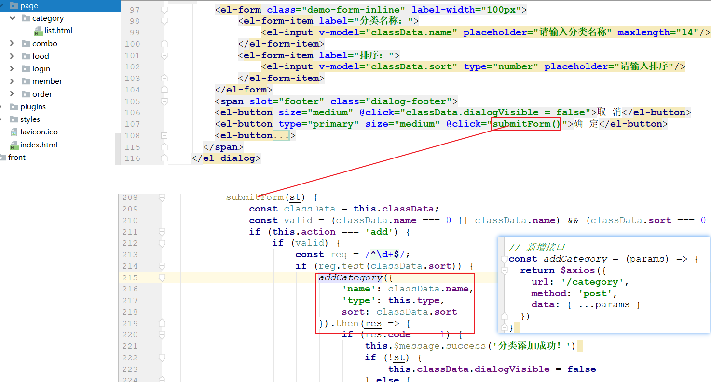 

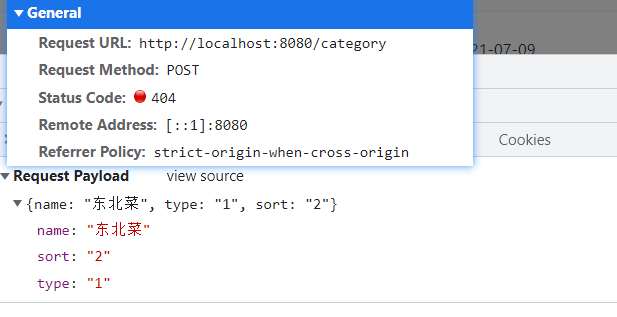 

#### 后台思路分析

>`添加菜品分类`和`添加套餐分类`使用的是同一个后台接口，只不过在传递参数的时候有所差异（type不一致）

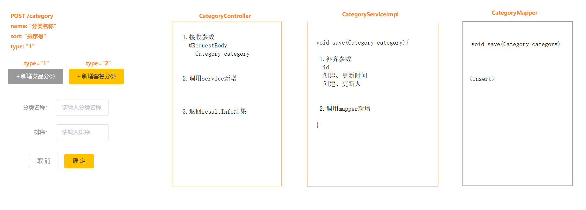 


 

### （2）代码实现

#### CategoryController

~~~java
// 新增分类
@PostMapping("/category")
public ResultInfo save(@RequestBody Category category) { //  1.接收参数

    // 2.调用service新增
    categoryService.save(category);

    // 3.返回resultInfo结果
    return ResultInfo.success(null);
}
~~~

#### CategoryService

~~~java
// 新增分类
void save(Category category);
~~~

#### CategoryServiceImpl

~~~java
// 新增分类
@Override
public void save(Category category) {
    // 1.补齐参数
    // 1-1 id
    long id = IdUtil.getSnowflake(1, 1).nextId();
    category.setId(id);
    // 1-2 创建、更新时间
    category.setCreateTime(new Date());
    category.setUpdateTime(new Date());
    // 1-3 创建、更新人
    category.setCreateUser(1L); // 暂时写死1L
    category.setUpdateUser(1L);// 暂时写死1L

    // 2.调用mapper新增
    categoryMapper.save(category);
}
~~~

#### CategoryMapper

~~~java
// 新增
void save(Category category);
~~~

#### CategoryMapper.xml

~~~xml
<insert id="save">
    insert into category
    values(
    #{id},
    #{type},
    #{name},
    #{sort},
    #{createTime},
    #{updateTime},
    #{createUser},
    #{updateUser}
    )
</insert>

~~~


## 3.修改分类

### （1）思路分析

#### 前端核心代码

>我们原来的数据反显，都是当打开修改框的时候，需要向后台发送一个请求，将数据查询回来
>
>目前这个功能并没有这么做，而是当点击修改按钮的时候，直接将修改按钮所在行的值赋值到修改框中得表单上

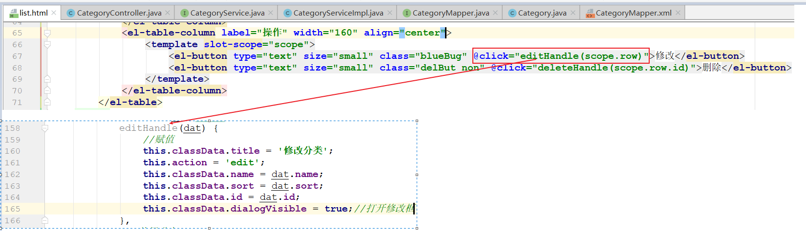 

>当修改完毕，点击确定提交按钮的时候，会将修改之后的数据发送到后台，后台接收数据后，根据id就行修改就可以了

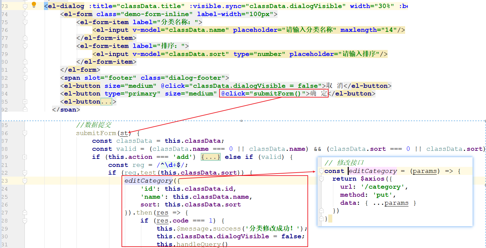 


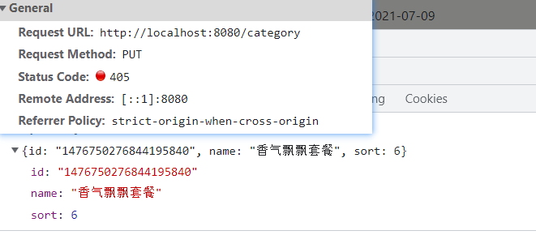 

#### 后台思路分析

> 前端提交要修改的分类的id、name、sort，后台需要根据id更新name和sort

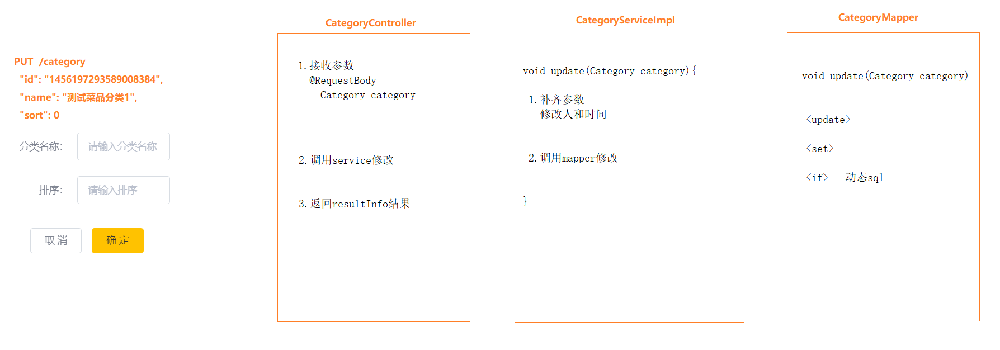 

 

### （2）代码实现

#### CategoryController

~~~java
// 修改分类
@PutMapping("/category")
public ResultInfo update(@RequestBody Category category) { // 1.接收参数
    // 2.调用serivce修改
    categoryService.update(category);

    // 3.返回resultInfo结果
    return ResultInfo.success(null);
}
~~~

#### CategoryService

~~~java
// 修改分类
void update(Category category);
~~~

#### CategoryServiceImpl

~~~java
// 修改分类
@Override
public void update(Category category) {
    // 1.补齐参数
    category.setUpdateTime(new Date());
    category.setUpdateUser(1l);// 暂时写死

    // 2.调用mapper修改
    categoryMapper.update(category);
}
~~~

#### CategoryMapper

~~~java
// 修改分类
void update(Category category);
~~~

#### CategoryMapper.xml

~~~xml
<update id="update">
    update category
    <set>
        <if test="type != null">
            type = #{type},
        </if>
        <if test="name != null and name != ''">
            name = #{name},
        </if>
        <if test="sort != null">
            sort = #{sort},
        </if>
        <if test="updateTime != null">
            update_time = #{updateTime},
        </if>
        <if test="updateUser != null">
            update_user = #{updateUser},
        </if>
    </set>
    where id = #{id}
</update>
~~~


## 4.删除分类

### （1）思路分析

#### 数据模型说明

那么在这里又涉及到我们后面要用到的两张表结构 dish(菜品表) 和 setmeal(套餐表)。具体的表结构如下： 

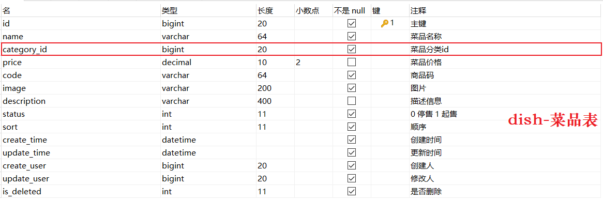 

 

>三张表关系如下

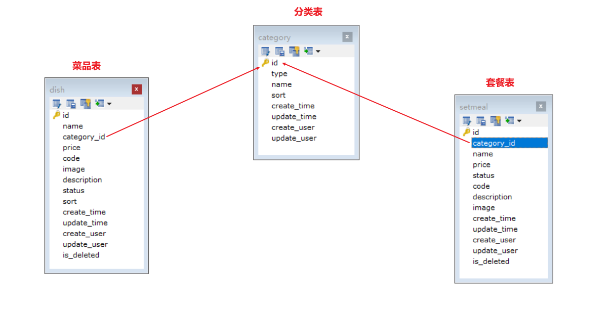 

#### 前端核心代码

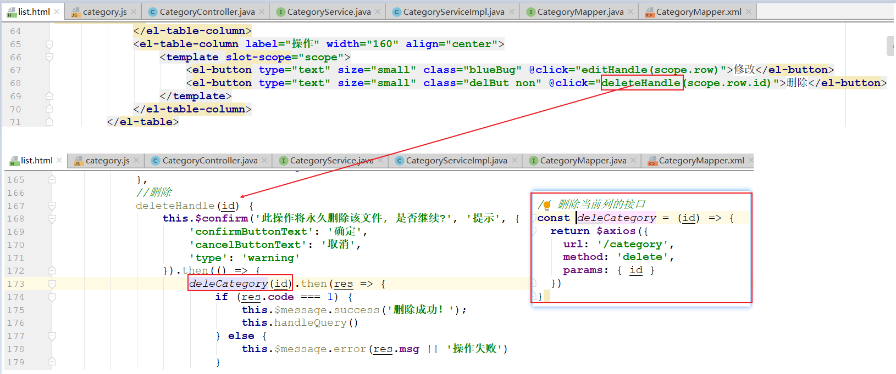 


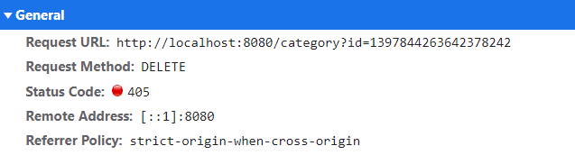 


#### 后台思路分析

>前端点击删除按钮，向后台发送删除请求，并携带id作为请求参数；后台接收id，然后根据id进行删除;
>
>注意删除分类之前要首先判断当前分类下是否含有菜品或者套餐，如果有，则不允许删除

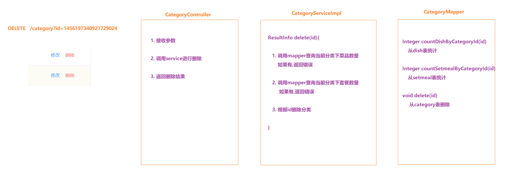 

### （2）代码实现

#### CategoryController

~~~java
// 删除分类
@DeleteMapping("/category")
public ResultInfo delete(Long id) { // 1.接收参数
    // 2.调用service删除
    ResultInfo resultInfo =  categoryService.delete(id);
    // 3.返回删除结果
    return resultInfo;

}
~~~

#### CategoryService

~~~java
// 删除分类
ResultInfo delete(Long id);
~~~

#### CategoryServiceImpl

~~~java
// 删除分类
@Override
public ResultInfo delete(Long id) {
    // 1.查询菜品数量
    Integer count1 = categoryMapper.countDishByCategoryId(id);
    if (count1 > 0) {
        return ResultInfo.error("该分类下还有菜品不能删除");
    }
    // 2.查询套餐数量
    Integer count2 = categoryMapper.countSetmealByCategoryId(id);
    if (count2 > 0) {
        return ResultInfo.error("该分类下还有套餐不能删除");
    }

    // 3.删除分类
    categoryMapper.delete(id);
    return ResultInfo.success(null);
}
~~~

#### CategoryMapper

~~~java
// 查询菜品数量
Integer countDishByCategoryId(Long id);

// 查询套餐数量
Integer countSetmealByCategoryId(Long id);

// 删除
void delete(Long id);
~~~

#### CategoryMapper.xml

~~~xml
<select id="countDishByCategoryId" resultType="java.lang.Integer">
    SELECT COUNT(*) FROM dish WHERE category_id = #{id}
</select>

<select id="countSetmealByCategoryId" resultType="java.lang.Integer">
    SELECT COUNT(*) FROM setmeal WHERE category_id = #{id}
</select>

<delete id="delete">
    delete from category where id = #{id}
</delete>
~~~

## 5.全局异常处理

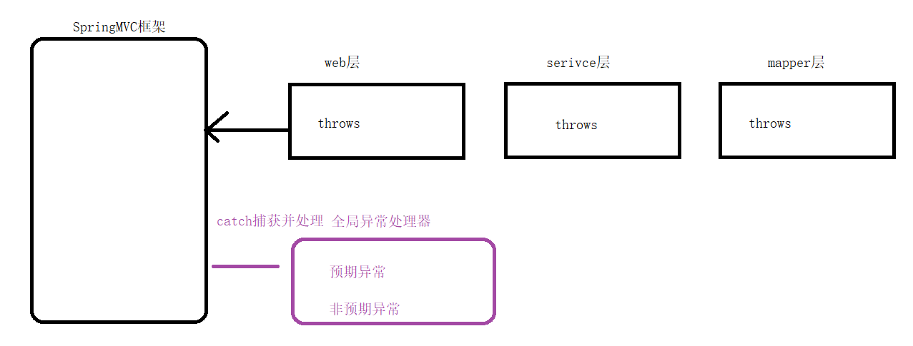 

### CustomException

>在`reggie-common`模块下创建`com.itheima.reggie.common.CustomException`

~~~java
package com.itheima.reggie.common;

//业务异常类
public class CustomException extends RuntimeException {
    public CustomException(String message){
        super(message);
    }
}
~~~

### GlobalExceptionHandler

>全局异常处理类，处理的异常主要分为两类：① 预期异常，需要给客户返回明确提示   ② 非预期异常，需要给客户返回统一的模糊提示  
>
>在`reggie-web-manage`模块下创建`com.itheima.reggie.handler.GlobalExceptionHandler`

~~~java
package com.itheima.reggie.handler;

import com.itheima.reggie.common.ResultInfo;
import lombok.extern.slf4j.Slf4j;
import org.springframework.web.bind.annotation.ExceptionHandler;
import org.springframework.web.bind.annotation.RestControllerAdvice;

//全局异常处理
@RestControllerAdvice
@Slf4j
public class GlobalExceptionHandler {
    
    // unique重复异常
    @ExceptionHandler(DuplicateKeyException.class)
    public ResultInfo duplicateKeyExceptionHandler(Exception ex) {
        log.error(ex.getMessage());
        return ResultInfo.error("名称重复");
    }

    // 预期异常处理方法
    @ExceptionHandler(CustomException.class)
    public ResultInfo exceptionHandler(CustomException ex) {
        log.error(ex.getMessage());
        return ResultInfo.error(ex.getMessage());// 返回逻辑中定义的错误提示
    }

    // 非预期异常处理方法
    @ExceptionHandler(Exception.class)
    public ResultInfo exceptionHandler(Exception ex) {
        log.error(ex.getMessage());
        return ResultInfo.error("对不起,网络问题,请稍后再试");// 返回一个固定的错误提示
    }
}
~~~


>版本一：delete的service层要改成下面这个版本

~~~java
@Override
public ResultInfo delete(Long id) {
    //1. 查看当前分类下是否有菜品,如果有,不允许删除本分类  查询dish表
    int count1 = categoryMapper.countDishByCategoryId(id);
    if (count1 > 0) {
        throw new CustomException("当前分类下存在菜品,不能删除");//抛异常
    }

    //2. 查看当前分类下是否有套餐,如果有,不允许删除本分类  查询setmeal表
    int count2 = categoryMapper.countSetmealByCategoryId(id);
    if (count2 > 0) {
        throw new CustomException("当前分类下存在套餐,不能删除");//抛异常
    }

    //3. 当前分类下什么都没有,可以删除
    categoryMapper.delete(id);
    return ResultInfo.success(null);
}
~~~


> 版本二：web层和service都需要修改
>
> ```java
>     // 删除分类
>     @DeleteMapping("/category")
>     public ResultInfo delete(Long id) { // 1.接收参数
>         // 2.调用service删除
>         categoryService.delete(id);
>         // 3.返回删除结果
>         return ResultInfo.success(null);
>     }
> ```
>
> ```java
> // 删除分类
> void delete(Long id);
> 
> // 删除分类
> @Override
> public void delete(Long id) {
>     // 1.查询菜品数量
>     Integer count1 = categoryMapper.countDishByCategoryId(id);
>     if (count1 > 0) {
>         // return ResultInfo.error("该分类下还有菜品不能删除");
>         throw new CustomException("该分类下还有菜品不能删除");
>     }
>     // 2.查询套餐数量
>     Integer count2 = categoryMapper.countSetmealByCategoryId(id);
>     if (count2 > 0) {
>         //  return ResultInfo.error("该分类下还有套餐不能删除");
>         throw new CustomException("该分类下还有套餐不能删除");
>     }
>     // 3.删除分类
>     categoryMapper.delete(id);
> }
> ```
>


## 6.技术优化

### （1）MyBatisPlus

>将当前项目持久层技术由原来的的mybatis替换成mybatisplus

#### 依赖添加MyBatisPlus

修改reggie-parent的pom.xml，添加mybatisplus依赖

~~~xml
<dependency>
    <groupId>com.baomidou</groupId>
    <artifactId>mybatis-plus-boot-starter</artifactId>
    <version>3.4.2</version>
</dependency>
~~~

#### 配置MyBatisPlus

修改reggie-web-manage的application.yml，替换为mybatisplus的配置

~~~yaml
server:
  port: 8080
spring:
  application:
    name: reggie # 应用名称
  datasource: # 数据源配置
    druid:
      driver-class-name: com.mysql.jdbc.Driver
      url: jdbc:mysql://localhost:3306/reggie?useUnicode=true&characterEncoding=utf-8&useSSL=false
      username: root
      password: root
#mybatis:
#  configuration:
#    map-underscore-to-camel-case: true # 驼峰命名法映射 address_book ---> AddressBook
#    log-impl: org.apache.ibatis.logging.stdout.StdOutImpl # 日志输出
#  mapper-locations: classpath:/mappers/**.xml # 指定xml位置
mybatis-plus:
  configuration:
    map-underscore-to-camel-case: true
    log-impl: org.apache.ibatis.logging.stdout.StdOutImpl
  mapper-locations: classpath:/mappers/**.xml
  global-config:
    db-config:
      id-type: ASSIGN_ID # id生成策略类型
~~~

#### Mapper接口继承BaseMapper

让当前的Mapper接口继承BaseMapper

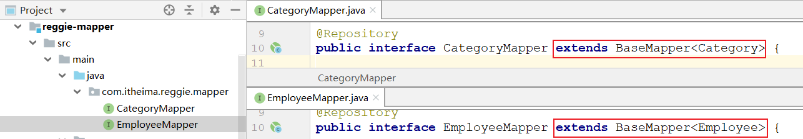  


### （2）公共字段处理

>目前每个表中都有四个字段：createUser、updateUser、createTime、updateTime
>
>如果每次都要单独设置实在是过于麻烦，本小节，我们使用mybatisplus的自动代码填充来处理公共字段

#### 注释掉当前代码

注释掉当前代码中设置操作人和操作时间的代码

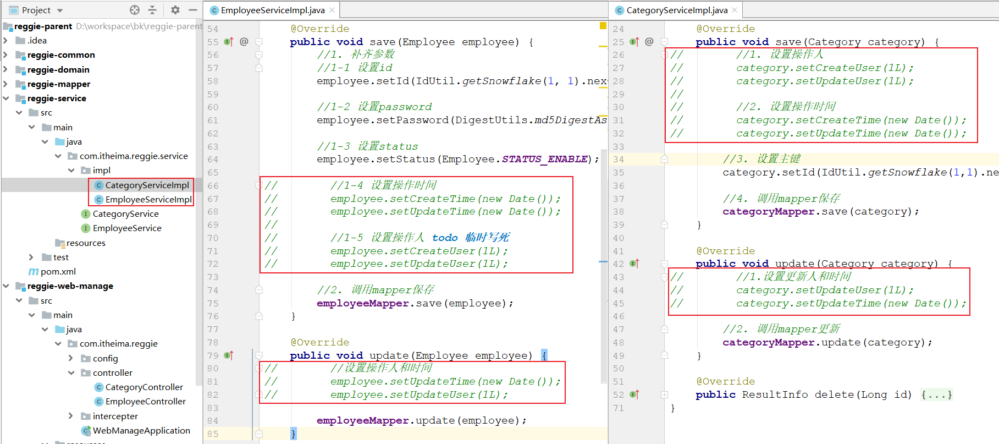  

#### 自动填充注解

对公共自动添加自动填充注解

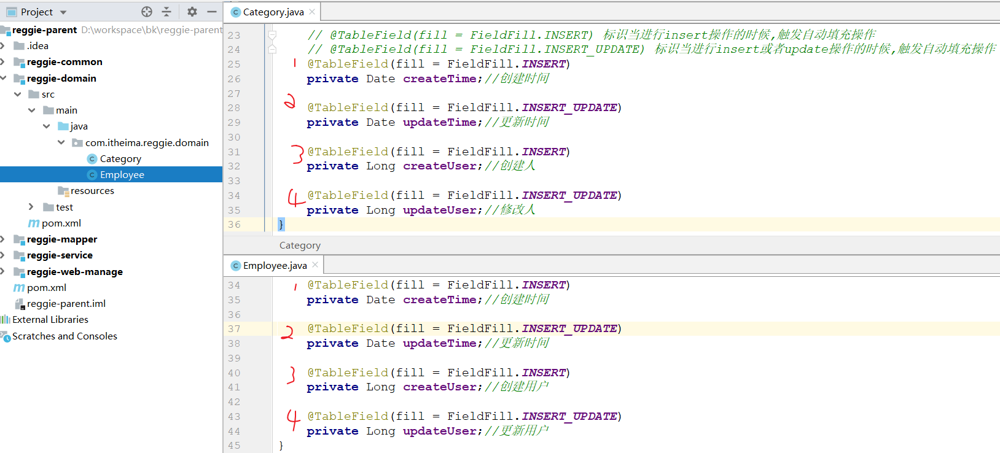  

#### 自动填充逻辑

编写自动填充逻辑

>在`reggie-mapper`模块下创建`com.itheima.reggie.config.MyMetaObjectHandler`类，内容如下

~~~java
package com.itheima.reggie.config;

import com.baomidou.mybatisplus.core.handlers.MetaObjectHandler;
import lombok.extern.slf4j.Slf4j;
import org.apache.ibatis.reflection.MetaObject;
import org.springframework.stereotype.Component;

import java.util.Date;

//自定义元数据对象处理器
@Component
@Slf4j
public class MyMetaObjectHandler implements MetaObjectHandler {
    //插入操作，自动填充
    @Override
    public void insertFill(MetaObject metaObject) {
        metaObject.setValue("createTime", new Date());
        metaObject.setValue("updateTime", new Date());
        metaObject.setValue("createUser", 1L);
        metaObject.setValue("updateUser", 1L);
    }

    //更新操作，自动填充
    @Override
    public void updateFill(MetaObject metaObject) {
        metaObject.setValue("updateTime", new Date());
        metaObject.setValue("updateUser", 1L);
    }
}
~~~

#### 更新方法设置

将更新方法改成mybatisPlus提供的

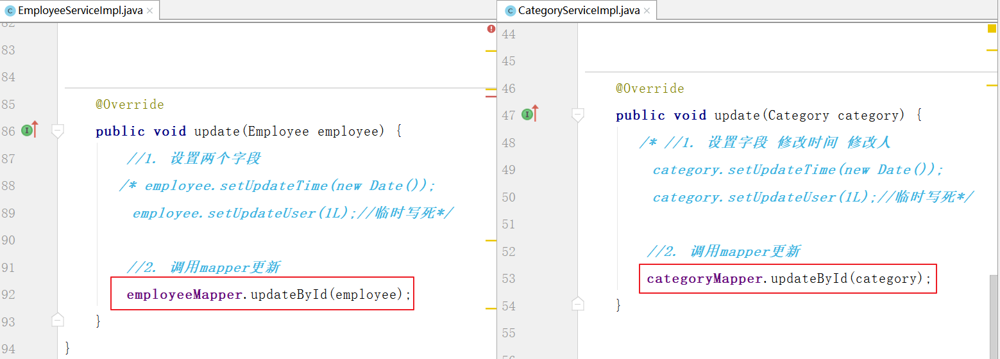 


### （3）用户信息共享

目前的代码中是这样设置操作用户Id的`metaObject.setValue("createUser", 1L);`

那么怎样才能在MyMetaObjectHandler中获取当前登录的用户的信息呢？ 

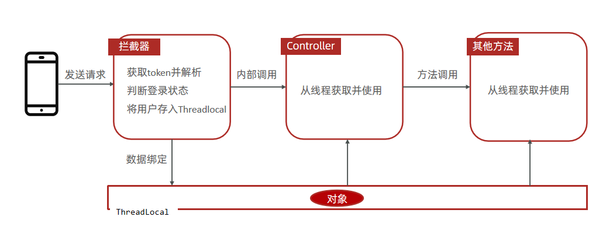

#### 拦截器

拦截器是Spring提供的一种技术, 他有三个方法: 

* preHandle() : 在目标方法之前执行，一般用于预处理 
* postHandle()：在目标方法执行之后执行，一般用于后处理 
* afterCompletion()：整个请求处理完毕，在视图渲染完毕时回调，一般用于资源的清理或性能的统计

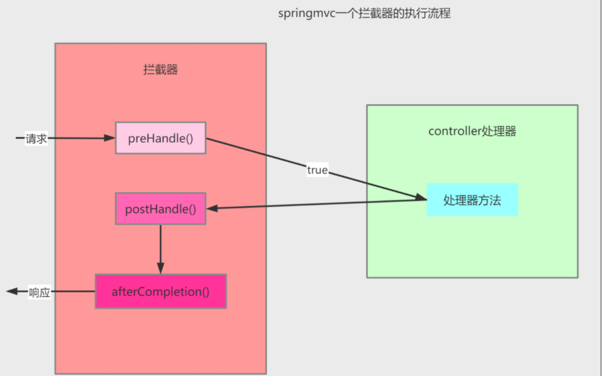 

#### ThreadLocal

线程局部变量，该变量对其他线程而言是隔离的；在进行对象跨层传递的时候，使用ThreadLocal可以避免多次传递，打破层次间的约束。

ThreadLocal的三个方法: 

- set(T value) ：设置当前线程绑定的变量
- get()：获取当前线程绑定的变量
- remove() ：移除当前线程绑定的变量 

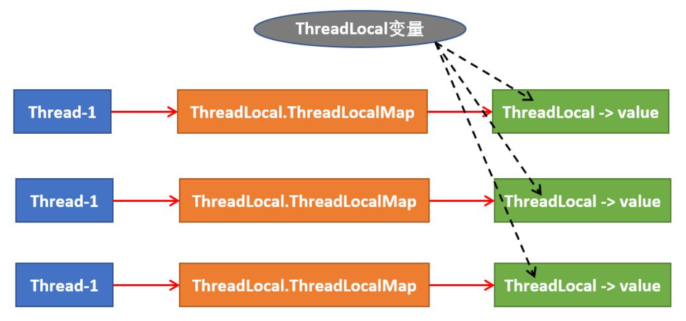 


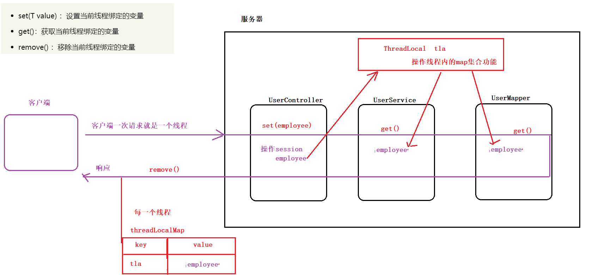 


#### 实现思路

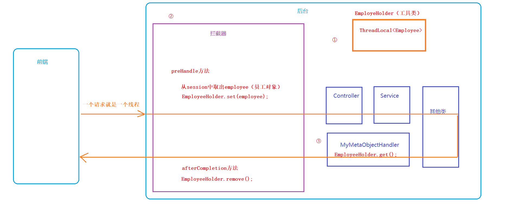 

#### 代码实现

#### EmployeeHolder

>在`reggie-common`下创建`com.itheima.reggie.common.EmployeeHolder`

~~~java
// threadLocal 封装工具类
public class EmployeeHolder {
    
    private static final ThreadLocal<Employee> TL= new ThreadLocal<>();
    
    
    // 设置
    public static void set(Employee employee){
        TL.set(employee);
    }
    // 获取
    public static Employee get(){
        return TL.get();
    }
    
    // 删除
    public static void remove(){
        TL.remove();
    }
}
~~~

#### LoginCheckInterceptor

~~~java
// 登录拦截器
@Component
public class LoginCheckInterceptor implements HandlerInterceptor {

    // 登录拦截
    @Override
    public boolean preHandle(HttpServletRequest request, HttpServletResponse response, Object handler) throws Exception {
        // 1.获取session中员工信息
        HttpSession session = request.getSession();
        Employee employee = (Employee) session.getAttribute(Constant.SESSION_EMPLOYEE);

        // 2.判断 session中没员工，拦截
        if (employee == null) {
            // 手动封装提示信息
            ResultInfo resultInfo = ResultInfo.error("NOTLOGIN");
            // 手动转json
            ObjectMapper objectMapper = new ObjectMapper();
            String json = objectMapper.writeValueAsString(resultInfo);
            // 通过response响应
            response.setContentType("application/json;charset=utf-8");
            response.getWriter().write(json);
            return false;
        }

        // 3.session有员工，放行
        EmployeeHolder.set(employee); // 将员工信息存储到线程内map集合
        return true;
    }

    @Override
    public void afterCompletion(HttpServletRequest request, HttpServletResponse response, Object handler, Exception ex) throws Exception {
        // 服务器响应前，删除线程内map集合
        EmployeeHolder.remove();
    }
}
~~~

#### MyMetaObjectHandler

```java
//自定义元数据对象处理器
@Component
@Slf4j
public class MyMetaObjectHandler implements MetaObjectHandler {

    //插入操作，自动填充
    @Override
    public void insertFill(MetaObject metaObject) {
        metaObject.setValue("createTime", new Date());
        metaObject.setValue("updateTime", new Date());

        Employee employee = EmployeeHolder.get();
        if (employee != null) {
            metaObject.setValue("createUser", employee.getId()); // 创建人
            metaObject.setValue("updateUser", employee.getId()); // 修改人
        }

    }

    //更新操作，自动填充
    @Override
    public void updateFill(MetaObject metaObject) {
        metaObject.setValue("updateTime", new Date());
        Employee employee = EmployeeHolder.get();
        if (employee != null) {
            metaObject.setValue("updateUser", employee.getId());  // 修改人
        }
    }
}
```


