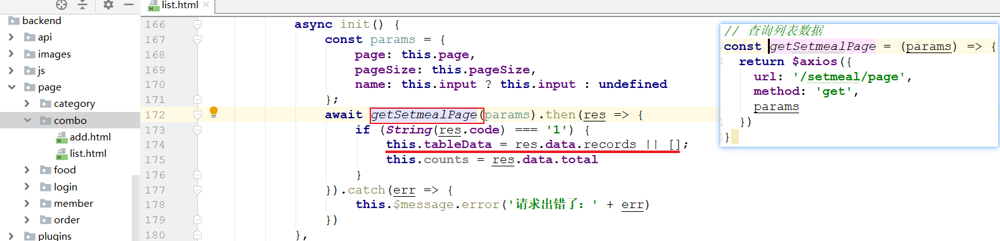
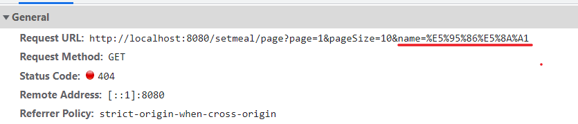
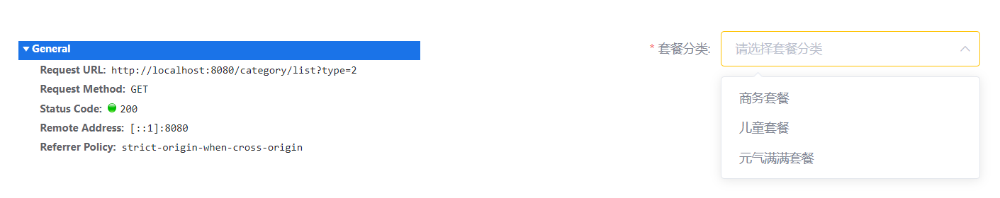
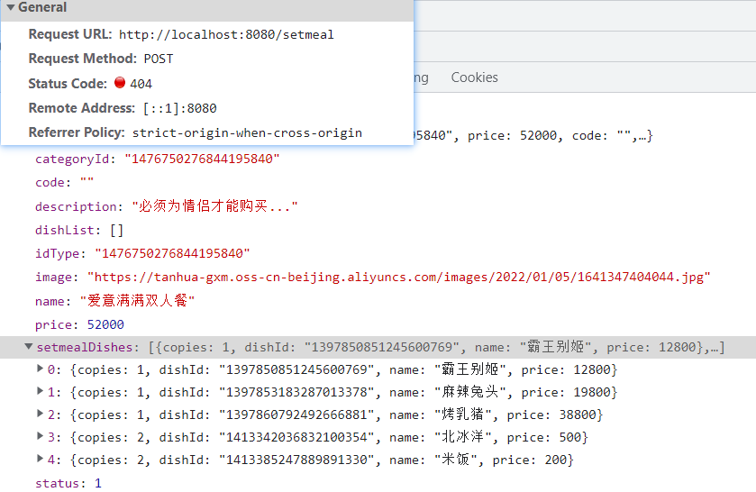
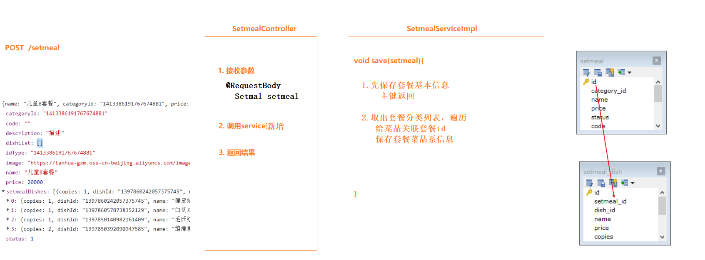
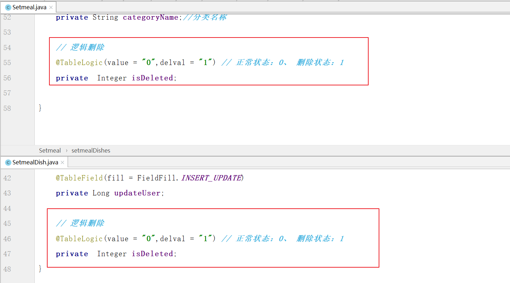
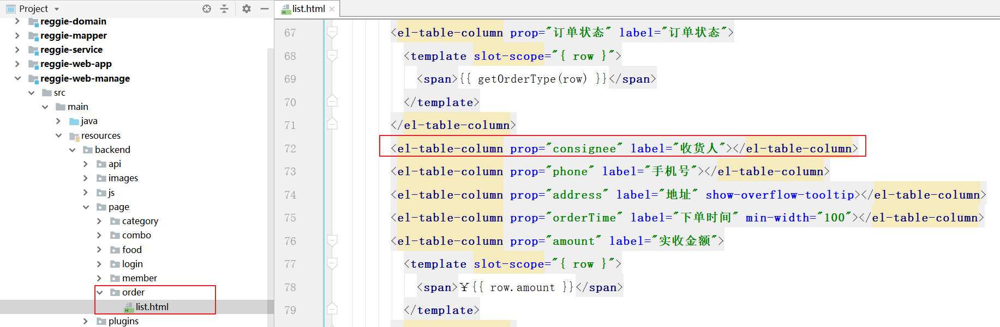
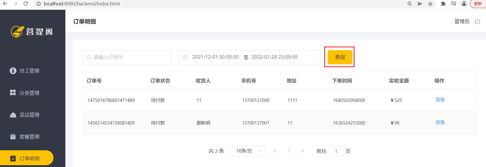

# 套餐管理

---

## 1.套餐列表

### （1）思路分析

#### 数据模型

套餐，涉及到数据库中两张表：setmeal（套餐表，存储套餐的基本信息）和setmeal_dish（套餐菜品关系表，存储套餐关联的菜品的信息）

**① 套餐表setmeal**

 

**② 套餐菜品关系表setmeal_dish**

 

在该表中，菜品的名称name，菜品的原价price实际上都是冗余字段，

因为我们在这张表中存储了菜品的ID(dish_id)，根据该ID我们就可以查询出name和price的数据信息，

而这里又存储了name和price，这样的话，在后续的查询展示操作中，就不需要再去查询数据库获取菜品名称和原价了

**③ 表关系**

 

#### 前端核心代码

前端进入菜品页面之后，会向后台发送请求，查询套餐数据，请求中会携带参数：page、pageNum、name（不一定有值）

 


 

#### 后台思路分析

 

### （2）后台代码

#### 导入资料

 

#### SetmealController

>在`reggie-web-manage`模块下创建`com.itheima.reggie.controller.SetmealController`

~~~java
@RestController
public class SetmealController {

    @Autowired
    private SetmealService setmealService;

    // 套餐分页查询
    @GetMapping("/setmeal/page")
    public ResultInfo findByPage(
            String name,
            @RequestParam(value = "page", defaultValue = "1") Integer pageNum,
            @RequestParam(value = "pageSize", defaultValue = "10") Integer pageSize) {// 1.接收参数
        // 2.调用service查询
        Page<Setmeal> page = setmealService.findByPage(pageNum, pageSize, name);

        // 3.返回结果
        return ResultInfo.success(page);
    }
}
~~~

#### SetmealService

>在`reggie-service`模块下创建`com.itheima.reggie.service.SetmealService`

~~~java
//套餐
public interface SetmealService {

    // 套餐分页查询
    Page<Setmeal> findByPage(Integer pageNum, Integer pageSize, String name);
}
~~~

#### SetmealServiceImpl

>在`reggie-service`模块下创建`com.itheima.reggie.service.impl.SetmealServiceImpl`

~~~java
//套餐
@Service
@Transactional
public class SetmealServiceImpl implements SetmealService {

    @Autowired
    private SetmealMapper setmealMapper;

    @Autowired
    private CategoryMapper categoryMapper;

    @Autowired
    private SetmealDishMapper setmealDishMapper;

    @Override
    public Page<Setmeal> findByPage(Integer pageNum, Integer pageSize, String name) {
        // 1.先查套餐基本信息
        // 1-1 构建条件对象
        LambdaQueryWrapper<Setmeal> setmealWrapper = new LambdaQueryWrapper<>();
        setmealWrapper.like(StrUtil.isNotEmpty(name), Setmeal::getName, name);
        // 1-2 构建分页对象
        Page<Setmeal> page = new Page<>(pageNum, pageSize);
        // 1-3 查询
        page = setmealMapper.selectPage(page, setmealWrapper);

        // 2.获取套餐list集合并遍历
        List<Setmeal> setmealList = page.getRecords();
        if (CollectionUtil.isNotEmpty(setmealList)) {
            for (Setmeal setmeal : setmealList) {
                // 3.根据category_id查询分类对象
                Category category = categoryMapper.selectById(setmeal.getCategoryId());
                // 将分类名称关联到套餐中
                setmeal.setCategoryName(category.getName());
                // 4.根据setmeal的id查询菜品（中间表）列表
                // 4-1 构建中间表条件对象
                LambdaQueryWrapper<SetmealDish> sdWrapper = new LambdaQueryWrapper<>();
                sdWrapper.eq(SetmealDish::getSetmealId, setmeal.getId());
                // 4-2  查询套菜菜品集合
                List<SetmealDish> setmealDishList = setmealDishMapper.selectList(sdWrapper);
                // 4-3 关联到套餐中
                setmeal.setSetmealDishes(setmealDishList);
            }
        }
        // 5.返回结果
        return page;
    }
}
~~~


## 2.新增套餐

###  （1）前端页面分析

点击新建套餐按钮，访问页面(backend/page/combo/add.html)，梳理一下新增套餐时前端页面和服务端的交互过程：

> 1. 页面加载发送ajax请求，请求服务端获取**套餐分类（传递的type为2）**数据并展示到下拉框中(==已实现==) 
>      


> 2. 页面加载时发送ajax请求，请求服务端获取**菜品分类（传递的type为1）**数据并展示到添加菜品窗口中(==已实现==)
>      


> 3. 根据菜品分类查询对应的**菜品列表**数据并展示到添加菜品窗口中(==未实现==)
>      

### （2）回显菜品列表

>前台发送请求，根据categoryId查询分类下的菜品列表

#### DishController

~~~java
// 根据分类id查询菜品列表
@GetMapping("/dish/list")
public ResultInfo findList(Long categoryId){
    List<Dish> dishList = dishService.findListByCategoryId(categoryId);
    return ResultInfo.success(dishList);
}
~~~

#### DishService

~~~java
// 根据分类id查询菜品列表
List<Dish> findListByCategoryId(Long categoryId);
~~~

#### DishServiceImpl

~~~java
// 根据分类id查询菜品列表
@Override
public List<Dish> findListByCategoryId(Long categoryId) {
    // 1.构建条件
    LambdaQueryWrapper<Dish> wrapper = new LambdaQueryWrapper<>();
    wrapper.eq(Dish::getCategoryId, categoryId ); // category_id = xxx
    wrapper.eq(Dish::getStatus, 1); // statuas = 1
    // 2.查询list
    return dishMapper.selectList(wrapper);
}
~~~

### （3）新增套餐

#### 前端核心代码

>前端选择好套餐内容之后，点击新增，会将页面的json信息发送到后台

 

 


#### 后台思路分析

>后台接收数据之后，将信息分别保存到Setmeal和SetmealDish表中

 

 

#### SetmealController

~~~java
// 套餐新增
@PostMapping("/setmeal")
public ResultInfo save(@RequestBody Setmeal setmeal) { // 1.接收参数
    // 2.调用service
    setmealService.save(setmeal);

    // 3.返回结果
    return ResultInfo.success(null);

}
~~~

#### SetmealService

~~~java
// 套餐新增
void save(Setmeal setmeal);
~~~

#### SetmealServiceImpl

~~~java
// 套餐新增
@Override
public void save(Setmeal setmeal) {
    // 1.先保存套餐基本信息
    setmealMapper.insert(setmeal);
    log.info("保存套餐基本信息，id：{},名称：{},价格：{}", setmeal.getId(),setmeal.getName(),setmeal.getPrice());
    // 2.取出套餐菜品列表
    List<SetmealDish> dishList = setmeal.getSetmealDishes();
    if (CollectionUtil.isNotEmpty(dishList)) {
        for (SetmealDish setmealDish : dishList) {
            // 关联套餐id
            setmealDish.setSetmealId(setmeal.getId());
            // 保存套餐菜品
            setmealDishMapper.insert(setmealDish);
        }
    }
}
~~~


## 3.删除套餐

### （1）需求分析

在套餐管理列表页面，点击删除按钮，可以删除对应的套餐信息。也可以通过复选框选择多个套餐，点击批量删除按钮一次删除多个套餐。

注意，对于状态为售卖中的套餐不能删除，需要先停售，然后才能删除。

 

两种请求的**地址**和**请求方式**都是相同的，不同的则是传递的id个数，所以在服务端可以提供一个方法来统一处理。

~~~http
DELETE /setmeal?ids=1423640210125656065,1423338765002256385
~~~

### （2）代码开发

>后台接收请求参数ids，然后遍历进行删除，但是要注意，必须==停售状态==之后才能删除。

#### SetmealController

~~~java
// 套餐删除
@DeleteMapping("/setmeal")
public ResultInfo deleteBatchIds(@RequestParam List<Long> ids) { // 1.接收参数
    // 2.调用serivce删除
    if (CollectionUtil.isNotEmpty(ids)) {
        setmealService.deleteBatchIds(ids);
    }

    // 3.返回结果
    return ResultInfo.success(null);
}
~~~

#### SetmealService

~~~java
// 套餐删除
void deleteBatchIds(List<Long> ids);
~~~

#### SetmealServiceImpl

~~~java
@Override
public void deleteBatchIds(List<Long> ids) {
    // 1.先判断套餐状态
    // 1-1 构建套餐条件对象
    LambdaQueryWrapper<Setmeal> setmealWrapper = new LambdaQueryWrapper<>();
    setmealWrapper.in(Setmeal::getId, ids);
    setmealWrapper.eq(Setmeal::getStatus, 1);
    // 1-2 查询套餐数量
    Integer count = setmealMapper.selectCount(setmealWrapper);
    if (count > 0) {
        throw new CustomException("删除的套餐状态必须为停售~~~");
    }

    // 2.再删除套餐
    setmealMapper.deleteBatchIds(ids);

    // 3.最后删除套餐菜品
    // 3-1 构建套餐菜品条件对象
    LambdaQueryWrapper<SetmealDish> sdWrapper = new LambdaQueryWrapper<>();
    sdWrapper.in(SetmealDish::getSetmealId, ids);
    // 3-2 条件删除
    setmealDishMapper.delete(sdWrapper);
}
~~~


### （3）逻辑删除

 


## 4.订单明细

 

 

```java
@GetMapping("/order/page")
public ResultInfo findByPage(
    @RequestParam(value = "page", defaultValue = "1") Integer pageNum,
    @RequestParam(value = "pageSize", defaultValue = "10") Integer pageSize,
    Long number, String beginTime, String endTime) { // 1.接收参数
    log.info("pageNum：" + pageNum + "，pageSize：" + pageSize + "，orderId：" + number);
    log.info("beginTime：" + beginTime + "，endTime：" + endTime);

    // 2.调用service
    Page<Order> page = orderService.findByPage(pageNum, pageSize, number, beginTime, endTime);

    // 3.返回结果
    return ResultInfo.success(page);
}
```

```java
//订单分页显示
Page<Order> findByPage(Integer pageNum, Integer pageSize, Long number, String beginTime, String endTime);
```

```java
@Override
public Page<Order> findByPage(Integer pageNum, Integer pageSize, Long number, String beginTime, String endTime) {
    // 1.查询订单分页数据
    // (1)查询条件封装
    LambdaQueryWrapper<Order> wrapper = new LambdaQueryWrapper<>();
    wrapper.like(number != null, Order::getId, number);
    wrapper.between(beginTime!=null&&endTime!=null, Order::getOrderTime, beginTime, endTime);
    // (2)订单分页对象封装
    Page<Order> page = new Page<>(pageNum, pageSize);
    // (3)执行mapper查询
    page = orderMapper.selectPage(page, wrapper);
    // 2.遍历每一个订单对象
    List<Order> orderList = page.getRecords();
    if (CollectionUtil.isNotEmpty(orderList)) {
        for (Order order : orderList) {
            // 4.查询订单对应的用户名称并封装
            LambdaQueryWrapper<User> queryWrapper = new LambdaQueryWrapper<>();
            queryWrapper.eq(User::getId, order.getUserId());
            User user = userMapper.selectOne(queryWrapper);
            // (3)封装到菜品对象中
            order.setUserName(user.getName());
        }
    }
    return page; // 菜品（分类、口味）
}
```

