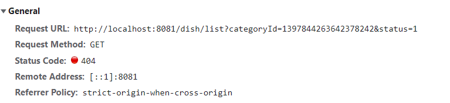
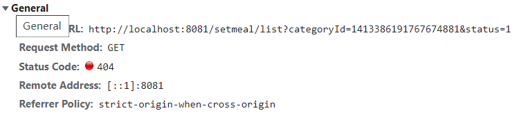
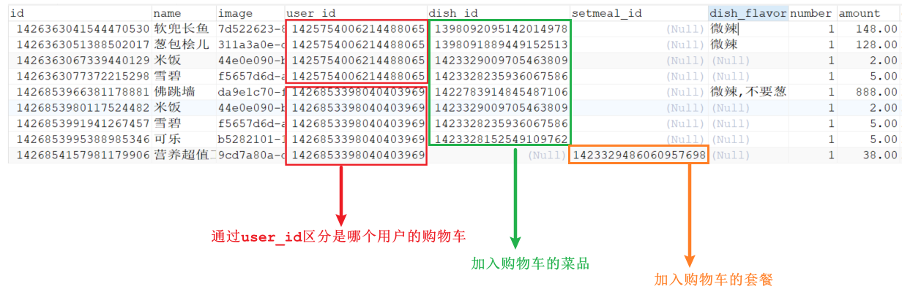

# 移动端模块开发

---

>app模块是供客户使用的手机端模块，本次采用H5编写，其基础结构跟`reggie-web-manage`类似

# 一、模块搭建

 

## （1）创建模块

### 创建模块

>创建`reggie-web-app`模块，依赖`reggie-service`模块

  

~~~xml
<dependencies>
    <dependency>
        <groupId>com.itheima</groupId>
        <artifactId>reggie-service</artifactId>
        <version>1.0-SNAPSHOT</version>
    </dependency>
</dependencies>

<build>
    <finalName>reggie-web-app</finalName>
    <plugins>
        <plugin>
            <groupId>org.springframework.boot</groupId>
            <artifactId>spring-boot-maven-plugin</artifactId>
            <executions>
                <execution>
                    <goals>
                        <goal>repackage</goal>
                    </goals>
                </execution>
            </executions>
        </plugin>
    </plugins>
</build> 
~~~

### 创建主类

>在`reggie-web-app`模块下创建`com.itheima.reggie.WebAppApplication`

~~~java
package com.itheima.reggie;

import lombok.extern.slf4j.Slf4j;
import org.mybatis.spring.annotation.MapperScan;
import org.springframework.boot.SpringApplication;
import org.springframework.boot.autoconfigure.SpringBootApplication;
import org.springframework.transaction.annotation.EnableTransactionManagement;

@SpringBootApplication//主类
@MapperScan("com.itheima.reggie.mapper")//指定mybatis类所在的包
@EnableTransactionManagement //开启对事物管理的支持
@Slf4j
public class WebAppApplication {
    public static void main(String[] args) {
        SpringApplication.run(WebAppApplication.class, args);
        log.info("项目启动成功");
    }
}
~~~

### 创建配置文件

>在`reggie-web-app`模块下的`resources`下创建`application.yml`

~~~yaml
server:
  port: 8081
spring:
  application:
    name: reggie-web-app # 应用名称
  servlet:
    multipart:
      max-request-size: 100MB # 最大请求文件大小,默认10MB
      max-file-size: 10MB # 单个请求文件大小,默认1MB
  datasource: # 数据源配置
    druid:
      driver-class-name: com.mysql.jdbc.Driver
      url: jdbc:mysql://localhost:3306/reggie?useUnicode=true&characterEncoding=utf-8&useSSL=false
      username: root
      password: root

mybatis-plus:
  configuration:
    map-underscore-to-camel-case: true
    log-impl: org.apache.ibatis.logging.stdout.StdOutImpl
  mapper-locations: classpath:/mappers/**.xml
  global-config:
    db-config:
      id-type: ASSIGN_ID # id生成策略类型
~~~

### 导入前端文件

>在`reggie-web-app`模块下的`resources`下添加资料中的`front目录`

 

## （2）创建基础类

### UserHolder

>在`reggie-common`模块下创建`com.itheima.reggie.common.UserHolder`

~~~java
package com.itheima.reggie.common;

import com.itheima.reggie.domain.User;

//ThreadLocal操作工具类
public class UserHolder {

    //维护ThreadLocal对象
    private static ThreadLocal<User> threadLocal = new ThreadLocal<>();

    //放入User
    public static void set(User user) {
        threadLocal.set(user);
    }

    //获取User
    public static User get() {
        return threadLocal.get();
    }

    //移除User
    public static void remove() {
        threadLocal.remove();
    }
}
~~~

### 统一异常处理器

>在`reggie-web-app`模块创建`com.itheima.reggie.handler.GlobalExceptionHandler`

~~~java
package com.itheima.reggie.handler;

import com.itheima.reggie.common.CustomException;
import com.itheima.reggie.common.ResultInfo;
import lombok.extern.slf4j.Slf4j;
import org.springframework.dao.DuplicateKeyException;
import org.springframework.web.bind.annotation.ExceptionHandler;
import org.springframework.web.bind.annotation.RestControllerAdvice;

//全局异常处理
@RestControllerAdvice
@Slf4j
public class GlobalExceptionHandler {

    //预期异常处理方法
    @ExceptionHandler(CustomException.class)
    public ResultInfo exceptionHandler(CustomException ex) {
        log.error(ex.getMessage());

        return ResultInfo.error(ex.getMessage());
    }

    //非预期异常处理方法
    @ExceptionHandler(Exception.class)
    public ResultInfo exceptionHandler(Exception ex) {
        log.error(ex.getMessage());

        return ResultInfo.error("对不起,网络问题,请稍后再试");
    }
}
~~~

### 拦截器

>在`reggie-web-app`模块创建`com.itheima.reggie.interceptor.LoginCheckInterceptor`

~~~java
package com.itheima.reggie.interceptor;

import com.alibaba.fastjson.JSON;
import com.itheima.reggie.common.Constant;
import com.itheima.reggie.common.ResultInfo;
import com.itheima.reggie.common.UserHolder;
import com.itheima.reggie.domain.User;
import org.springframework.stereotype.Component;
import org.springframework.web.servlet.HandlerInterceptor;

import javax.servlet.http.HttpServletRequest;
import javax.servlet.http.HttpServletResponse;

//登录拦截器
@Component
public class LoginCheckInterceptor implements HandlerInterceptor {

    @Override
    public boolean preHandle(HttpServletRequest request, HttpServletResponse response, Object handler) throws Exception {
        //1、判断登录状态，如果已登录，则直接放行
        User user = (User) request.getSession().getAttribute(Constant.SESSION_USER);
        if (user != null) {
            //将user方法ThreadLocal
            UserHolder.set(user);
            return true;
        }

        //2、如果未登录,禁止通行,返回错误
        String json = JSON.toJSONString(ResultInfo.error("NOTLOGIN"));
        response.getWriter().write(json);
        return false;
    }

    @Override
    public void afterCompletion(HttpServletRequest request, HttpServletResponse response, Object handler, Exception ex) throws Exception {
        UserHolder.remove();
    }
}
~~~

### 配置类

>在`reggie-web-app`模块创建`com.itheima.reggie.config.ReggieWebMvcConfig`

~~~java
package com.itheima.reggie.config;

import com.itheima.reggie.common.JacksonObjectMapper;
import com.itheima.reggie.interceptor.LoginCheckInterceptor;
import org.springframework.beans.factory.annotation.Autowired;
import org.springframework.context.annotation.Configuration;
import org.springframework.http.converter.HttpMessageConverter;
import org.springframework.http.converter.json.MappingJackson2HttpMessageConverter;
import org.springframework.web.servlet.config.annotation.InterceptorRegistry;
import org.springframework.web.servlet.config.annotation.ResourceHandlerRegistry;
import org.springframework.web.servlet.config.annotation.WebMvcConfigurer;

import java.util.ArrayList;
import java.util.List;

//web相关配置
@Configuration
public class ReggieWebMvcConfig implements WebMvcConfigurer {

    @Autowired
    private LoginCheckInterceptor loginCheckInterceptor;

    //设置拦截器
    @Override
    public void addInterceptors(InterceptorRegistry registry) {
        //定义放行路径
        ArrayList<String> urls = new ArrayList<>();
        urls.add("/front/**");//app系统静态资源
        urls.add("/error");//错误请求
        urls.add("/user/sendMsg");//app验证码发送
        urls.add("/user/login");//app登录
        urls.add("/user/logout");//app退出

        //配置拦截器和路径
        registry.addInterceptor(loginCheckInterceptor)
                .addPathPatterns("/**")//拦截所有
                .excludePathPatterns(urls); //放行指定路径
    }

    //设置静态资源映射
    public void addResourceHandlers(ResourceHandlerRegistry registry) {
        //当访问请求是/front/**时,去classpath:/front/寻找对应资源
        registry.addResourceHandler("/front/**").addResourceLocations("classpath:/front/");
    }

    //扩展mvc框架的消息转换器
    public void extendMessageConverters(List<HttpMessageConverter<?>> converters) {
        //创建消息转换器对象
        MappingJackson2HttpMessageConverter messageConverter = new MappingJackson2HttpMessageConverter();
        //设置对象转换器，底层使用Jackson将Java对象转为json
        messageConverter.setObjectMapper(new JacksonObjectMapper());
        //将上面的消息转换器对象追加到mvc框架的转换器集合中
        converters.add(0, messageConverter);
    }
}
~~~

### 自动填充配置

>修改`reggie-mapper`模块中得`com.itheima.reggie.config.MyMetaObjectHandler`，添加user信息的填充

~~~java
package com.itheima.reggie.config;

import com.baomidou.mybatisplus.core.handlers.MetaObjectHandler;
import com.itheima.reggie.common.EmployeeHolder;
import com.itheima.reggie.common.UserHolder;
import com.itheima.reggie.domain.Employee;
import com.itheima.reggie.domain.User;
import lombok.extern.slf4j.Slf4j;
import org.apache.ibatis.reflection.MetaObject;
import org.springframework.stereotype.Component;

import java.util.Date;

//自定义元数据对象处理器
@Component
@Slf4j
public class MyMetaObjectHandler implements MetaObjectHandler {
    //插入操作，自动填充
    @Override
    public void insertFill(MetaObject metaObject) {
        metaObject.setValue("createTime", new Date());
        metaObject.setValue("updateTime", new Date());
        Employee employee = EmployeeHolder.get();
        if (employee != null) {
            metaObject.setValue("createUser", employee.getId());
            metaObject.setValue("updateUser", employee.getId());
        }

        User user = UserHolder.get();
        if (user != null) {
            metaObject.setValue("createUser", user.getId());
            metaObject.setValue("updateUser", user.getId());
        }
    }

    //更新操作，自动填充
    @Override
    public void updateFill(MetaObject metaObject) {
        metaObject.setValue("updateTime", new Date());
        Employee employee = EmployeeHolder.get();
        if (employee != null) {
            metaObject.setValue("updateUser", employee.getId());
        }
        User user = UserHolder.get();
        if (user != null) {
            metaObject.setValue("updateUser", user.getId());
        }
    }
}
~~~


## （3）访问测试

 


# 二、用户登录

## （1）短信服务

在接下来要实现的移动端的业务开发中，第一块儿我们需要开发的功能就是移动端的登录功能，

而移动端的登录功能，比较流行的方式就是基于短信验证码进行登录，那么这里涉及到了短信发送的知识。

在项目中，我们自己是无法直接实现向用户手机发送验证码的，需要调用运营商的接口或者第三方提供的短信服务。

### 阿里云SMS

> 阿里云短信服务是阿里旗下的短信发送服务产品，官方地址： https://www.aliyun.com/product/sms

| 使用场景 | 案例                                                         |
| -------- | ------------------------------------------------------------ |
| 验证码   | APP、网站注册账号，向手机下发验证码；登录账户、异地登录时的安全提醒； <br>找回密码时的安全验证； 支付认证、身份校验、手机绑定等。 |
| 短信通知 | 向注册用户下发系统相关信息，包括： 服务开通、价格调整、 订单确认、物流动态、消费确认、 支付通知等普通通知短信。 |
| 推广短信 | 向注册用户和潜在客户发送通知和推广信息，包括促销活动通知、业务推广等商品与活动的推广信息。 |

 


### 发送短信流程

 


### 短信申请（不对个人用户开放）

**课下可以参考：短信服务.pdf 有具体的步骤操作**

```markdown
1. 访问阿里云平台-短信服务
		https://www.aliyun.com/product/sms

2. 选择短信服务 - 管理控制台

3. 选择国内消息

4. 申请签名和模板，预计2个小时

5. 充值一块钱
```


### SDK和API

https://help.aliyun.com/document_detail/55359.html  

 


### 抽取工具类

>在`reggie-common`模块下创建`com.itheima.reggie.common.SmsTemplate`

~~~java
package com.itheima.reggie.common;

import com.aliyuncs.DefaultAcsClient;
import com.aliyuncs.IAcsClient;
import com.aliyuncs.dysmsapi.model.v20170525.SendSmsRequest;
import com.aliyuncs.dysmsapi.model.v20170525.SendSmsResponse;
import com.aliyuncs.profile.DefaultProfile;
import com.aliyuncs.profile.IClientProfile;
import lombok.Data;
import org.springframework.boot.context.properties.ConfigurationProperties;
import org.springframework.stereotype.Component;

//短信发送工具类
@Data
@Component
@ConfigurationProperties(prefix = "reggie.sms")
public class SmsTemplate {

    private String key;
    private String secret;
    private String signName;
    private String templateCode;

    // 调用阿里云平台发送短信
    public void sendSms(String phoneNumbers, String code) {
        //设置超时时间
        System.setProperty("sun.net.client.defaultConnectTimeout", "10000");
        System.setProperty("sun.net.client.defaultReadTimeout", "10000");

        try {
            //初始化acsClient,暂不支持region化
            IClientProfile profile = DefaultProfile.getProfile("cn-hangzhou", key, secret);
            DefaultProfile.addEndpoint("cn-hangzhou", "cn-hangzhou", "Dysmsapi", "dysmsapi.aliyuncs.com");
            IAcsClient acsClient = new DefaultAcsClient(profile);

            //组装请求对象-具体描述见控制台-文档部分内容
            SendSmsRequest request = new SendSmsRequest();
            request.setPhoneNumbers(phoneNumbers);//手机号
            request.setSignName(signName);//短信前面
            request.setTemplateCode(templateCode);//短信模板
            request.setTemplateParam("{\"code\":\"" + code + "\"}");//验证码

            SendSmsResponse sendSmsResponse = acsClient.getAcsResponse(request);
        } catch (Exception e) {
            e.printStackTrace();
        }
    }
}
~~~

>在`reggie-web-app`模块下的`application.yaml`中添加下面配置

 ~~~yaml
reggie:
  sms:
    key: LTAI5tNmH22y9C7AxdFEgdNv
    secret: AHGC0JSnBuYtYg3BnNvyTuwlwyl27n
    sign-name: 黑马旅游网
    template-code: SMS_170836451
 ~~~

>编写测试类`com.itheima.reggie.test.SmsTemplateTest`测试

~~~java
package com.itheima.reggie.test;

import com.itheima.reggie.common.SmsTemplate;
import lombok.extern.slf4j.Slf4j;
import org.junit.jupiter.api.Test;
import org.springframework.beans.factory.annotation.Autowired;
import org.springframework.boot.test.context.SpringBootTest;

import java.io.FileNotFoundException;

@SpringBootTest
@Slf4j
public class SmsTemplateTest {
    @Autowired
    private SmsTemplate smsTemplate;

    @Test
    public void testFileUpload(){
        smsTemplate.sendSms("手机号", "123456");
    }
}
~~~


## （2）发送验证码 

### 前台核心代码

 


 

### 后台思路分析

 

 

### UserController

>在`reggie-web-app`模块下创建`com.itheima.reggie.controller.UserController`

~~~java
@RestController
public class UserController {

    @Autowired
    private HttpSession session;

    @Autowired
    private SmsTemplate smsTemplate;

    // 发送短信
    @PostMapping("/user/sendMsg")
    public ResultInfo sendMsg(@RequestBody Map<String, String> param) {// 接收请求参数
        // 1.取出手机号
        String phone = param.get("phone");
        // 2.生成6位随机数
        // String code = RandomUtil.randomNumbers(6);
        String code = "123"; // TODO 开发期验证写死，上线修改回来
        session.setAttribute("phone_sms:" + phone, code); // session中存储
        // 3.调用第三方接口发送
        // smsTemplate.sendSms(phone, code); // TODO 开发期不做短信发送，上线修改回来
        // 4.返回成功
        return ResultInfo.success(null);

    }
}
~~~

## （3）登录注册

> **登录流程：**输入手机号 > 获取验证码 > 输入验证码 > 点击登录 > 登录成功

### 数据模型

通过手机验证码登录时，涉及的表为user表，即用户表。结构如下:

 

### 前端核心代码

> 用户在登录页面输入验证码，点击【登录】按钮，发送ajax请求，服务端接收手机号和验证码处理登录请求，返回结果。
>
> 如果服务端返回的登录成功，页面将会把当前登录用户的手机号存储在sessionStorage中，并跳转到移动的首页页面。

  


 


### 后台思路分析

>这个接口兼具用户注册和登录的功能，实现思路是这样的：
>
>接收用户输入的手机号和验证码，首先判断验证码是否正确，如果不正确直接给出错误提示
>
>如果验证码没问题，接下来，验证用户的手机号在数据库是否存在
>
>​	如果存在，表示用户在进行登录操作，并且登录成功了
>
>​	如果不存在，表示用户在进行注册操作，需要将用户信息保存到user表中
>
> 

 

### UserController

~~~java
@Autowired
private UserService userService;

// 登录注册
@PostMapping("/user/login")
public ResultInfo login(@RequestBody Map<String, String> param) {
    // 1.接收请求参数：手机号和验证码
    String phone = param.get("phone");
    String code = param.get("code");
    // TODO 在学习redis之前 我们的验证码判断 暂时在controller中解决
    String codeFromSession = (String) session.getAttribute("phone_sms:" + phone);
    if (!StrUtil.equals(code, codeFromSession)) {
        throw new CustomException("验证码不一致.....");
    }

    // 2.调用service登录
    ResultInfo resultInfo = userService.login(code, phone);
    // 3.如果登录成功
    if (resultInfo.getCode() == 1) {
        User user = (User) resultInfo.getData();
        session.setAttribute(Constant.SESSION_USER, user);
    }
    // 4.返回结果
    return resultInfo;
}
~~~

### UserService

~~~java
//前台用户
public interface UserService {

    // 登录注册
    ResultInfo login(String code, String phone);
}
~~~

### UserServiceImpl

~~~java
//用户
@Service
@Transactional
public class UserServiceImpl implements UserService {

    @Autowired
    private UserMapper userMapper;

    @Override
    public ResultInfo login(String code, String phone) {
        // 1. 对比验证码（预留位置）
		
        // 2.根据手机号查询
        LambdaQueryWrapper<User> wrapper = new LambdaQueryWrapper<>();
        wrapper.eq(User::getPhone, phone);
        User user = userMapper.selectOne(wrapper);

        // 3.新用户帮他注册
        if (user == null) {
            user = new User();
            user.setPhone(phone); // 手机号
            user.setStatus(1); // 状态
            userMapper.insert(user);
        } else {
            // 4.老用户判断状态是否为禁用
            if (user.getStatus() != 1) {
                throw new CustomException("此用户已被禁用，请联系企业客服~~");
            }
        }

        // 5.登录成功
        return ResultInfo.success(user);
    }
}
~~~


## （4）验证码失效

使用的是JavaEE的监听器，监听session的数据变化

在`reggie-web-app`模块下创建`com.itheima.reggie.listener.MessageListener`

```java
package com.itheima.reggie.listener;

import cn.hutool.core.util.StrUtil;
import lombok.extern.slf4j.Slf4j;
import org.springframework.stereotype.Component;

import javax.servlet.http.*;
import java.util.Timer;
import java.util.TimerTask;

/**
 * 监听器，监听session中验证码有效期
 */
@Component
@Slf4j
public class MessageListener implements HttpSessionListener, HttpSessionAttributeListener {

    @Override
    public void sessionCreated(HttpSessionEvent se) {
        log.info("session创建了！监听器起作用了！");
    }

    /**
     * 监听向session中加入数据
     * @param sessionBindingEvent
     */
    @Override
    public void attributeAdded(HttpSessionBindingEvent sessionBindingEvent) {
        //1.获取当前监听的session
        HttpSession session = sessionBindingEvent.getSession();

        //2.获取监听到的session中本次存放的数据
        String key = sessionBindingEvent.getName();
        Object value = sessionBindingEvent.getValue();
        log.info("本次向session存放的数据：key：{},value：{}", key, value);

        //3.判断session中获取的数据是否为验证码（只对session中存储的验证码进行定时失效处理）
        if (key.startsWith("phone_sms")) {
//            //（1）创建定时器对象
//            Timer timer = new Timer();
//
//            //（2）创建定时器任务对象
//            TimerTask task = new TimerTask() {
//                @Override
//                public void run() {
//                    session.removeAttribute(key);
//                }
//            };
//            //（3）计时5分钟
//            timer.schedule(task,1000*60*5);

            //改成匿名内部类
            new Timer().schedule(new TimerTask() {
                @Override
                public void run() {
                    String code = (String) session.getAttribute(key);
                    //先判断session是否还存在该验证码，不存在再失效
                    if (StrUtil.isNotBlank(code)) {
                        session.removeAttribute(key);
                        log.info("session中的验证码：{}失效了！", key);
                    }
                }
            //}, 1000 * 60 * 5);
            }, 1000 * 5);
        }
    }
}
```

## （5）用户退出

### 前端

 

 


### 后端

```java
// 用户退出
@PostMapping("/user/logout")
public ResultInfo logout(){
    session.invalidate();
    return ResultInfo.success(null);
}
```


# 三、H5展示

## （1）首页侧边

>当进入首页之后，页面会触发一个查询分类列表的请求

 

>在`reggie-web-app`模块下创建`com.itheima.reggie.controller.CategoryController`，然后编写对应方法

~~~java
package com.itheima.reggie.controller;

import com.itheima.reggie.common.ResultInfo;
import com.itheima.reggie.domain.Category;
import com.itheima.reggie.service.CategoryService;
import org.springframework.beans.factory.annotation.Autowired;
import org.springframework.web.bind.annotation.GetMapping;
import org.springframework.web.bind.annotation.RestController;

import java.util.List;

@RestController
public class CategoryController {

    @Autowired
    private CategoryService categoryService;

    //根据type查询
    @GetMapping("/category/list")
    public ResultInfo findList() {
        List<Category> categoryList = categoryService.findAll();
        return ResultInfo.success(categoryList);
    }
}
~~~

用户登录成功后跳转到系统首页，在首页需要根据分类来展示菜品列表和套餐列表。

 

## （2）菜品展示

### 前端核心代码

> 当进入首页或者点击分类的时候，触发请求，从后台获取菜品或者套餐列表（参数为分类id和status）

 

  

### 后端思路分析

 


### DishController

>在`reggie-web-app`模块下创建 `com.itheima.reggie.controller.DishController`

```java
@RestController
public class DishController {

    @Autowired
    private DishService dishService;

    // h5菜品展示
    @GetMapping("/dish/list")
    public ResultInfo dishList(Long categoryId, Integer status) {// 1.接收参数
        // 2.调用service
        List<Dish> dishList = dishService.findDishList(categoryId, status);
        // 3.返回结果
        return ResultInfo.success(dishList);

    }
}
```

### DishService

~~~java
// h5菜品展示
List<Dish> findDishList(Long categoryId, Integer status);
~~~

### DishServiceImpl

~~~java
// h5菜品展示
@Override
public List<Dish> findDishList(Long categoryId, Integer status) {
    // 1.查询菜品列表
    // 1-1 构建条件
    LambdaQueryWrapper<Dish> dishWrapper = new LambdaQueryWrapper<>();
    dishWrapper.eq(Dish::getCategoryId, categoryId);
    dishWrapper.eq(Dish::getStatus,status );
    // 1-2 查询
    List<Dish> dishList = dishMapper.selectList(dishWrapper);

    // 2.遍历菜品列表
    if (CollectionUtil.isNotEmpty(dishList)) {
        for (Dish dish : dishList) {
            // 3.查询菜品对应口味列表
            // 3-1 构建条件
            LambdaQueryWrapper<DishFlavor> flavorWrapper = new LambdaQueryWrapper<>();
            flavorWrapper.eq(DishFlavor::getDishId, dish.getId());
            // 3-2 查询口味
            List<DishFlavor> flavorList = dishFlavorMapper.selectList(flavorWrapper);
            // 3-3 设置菜品中
            dish.setFlavors(flavorList);
        }
    }

    // 4.返回结果
    return dishList;
}
~~~

## （3）套餐展示

### 前端核心代码

 

 

### 后端思路分析


 


### SetmealController

>在`reggie-web-app`模块下创建 `com.itheima.reggie.controller.SetmealController`

~~~java
@RestController
public class SetmealController {

    @Autowired
    private SetmealService setmealService;

    // h5页面套餐展示
    @GetMapping("/setmeal/list")
    public ResultInfo setmealList(Long categoryId, Integer status) { // 1.接收参数

        // 2.调用service
        List<Setmeal> setmealList = setmealService.setmealList(categoryId, status);

        // 3.返回结果
        return ResultInfo.success(setmealList);

    }
}
~~~

### SetmealService

~~~java
// h5页面套餐展示
List<Setmeal> setmealList(Long categoryId, Integer status);
~~~

### SetmealServiceImpl

~~~java
// h5页面套餐展示
@Override
public List<Setmeal> setmealList(Long categoryId, Integer status) {
    // 1.构建条件
    LambdaQueryWrapper<Setmeal> wrapper = new LambdaQueryWrapper<>();
    wrapper.eq(Setmeal::getCategoryId, categoryId);
    wrapper.eq(Setmeal::getStatus, status);
    // 2.执行查询
    List<Setmeal> setmealList = setmealMapper.selectList(wrapper);
    // 3.返回结果
    return setmealList;
}
~~~


## （4）套餐菜品展示


```java
@GetMapping("/setmeal/dish/{id}")
public ResultInfo getDishesBySetmealId(@PathVariable Long id) {
    // 1.调用service
    List<SetmealDish> dishList = setmealService.getDishesBySetmealId(id);

    // 2.返回结果
    return ResultInfo.success(dishList);
}
```

```java
// 移动端获取套餐中菜品详情
List<SetmealDish> getDishesBySetmealId(Long id);
```

```java
@Override
public List<SetmealDish> getDishesBySetmealId(Long id) {
    // 1.查询原始数据
    LambdaQueryWrapper<SetmealDish> SetmealDishWrapper = new LambdaQueryWrapper<>();
    SetmealDishWrapper.eq(id != null, SetmealDish::getSetmealId, id);
    List<SetmealDish> setmealDishList = setmealDishMapper.selectList(SetmealDishWrapper);

    //2.对额外需要使用的数据进行查询 并封装
    if (CollectionUtil.isNotEmpty(setmealDishList)) {
        for (SetmealDish setmealDish : setmealDishList) {
            //（1）查询数据
            LambdaQueryWrapper<Dish> dishWrapper = new LambdaQueryWrapper<>();
            dishWrapper.eq(Dish::getId, setmealDish.getDishId());
            Dish dish = dishMapper.selectOne(dishWrapper);
            //（2）封装数据
            setmealDish.setImage(dish.getImage());
        }
    }

    return setmealDishList;
}
```


# 四、购物车

## （1）需求说明

>移动端用户可以将菜品或者套餐添加到购物车。
>
>- 对于菜品来说，如果设置了口味信息，则需要选择规格后才能加入购物车
>
>- 对于套餐来说，可以直接点击+将当前套餐加入购物车
>
>在购物车中可以修改菜品和套餐的数量，也可以清空购物车。
>
>这里面我们需要实现的功能包括: 1). 添加购物车    2). 查询购物车    3). 清空购物车  4). 修改购物车

 

## （2）添加购物车

### 数据模型

用户的购物车数据，也是需要保存在数据库中的，购物车对应的数据表为`shopping_cart`表，具体表结构如下：

 

- 购物车数据是关联用户的，在表结构中，我们需要记录，每一个用户的购物车数据是哪些
- 菜品列表展示出来的既有套餐，又有菜品
    - 如果APP端选择的是套餐，就保存套餐ID(setmeal_id)
    - 如果APP端选择的是菜品，就保存菜品ID(dish_id)
- 对同一个菜品/套餐，如果选择多份不需要添加多条记录，增加数量number即可

**最终shopping_cart表中存储的数据示例:**

 

### 前端页面分析

> 点击 "加入购物车" 或者 "+" 按钮，页面发送ajax请求，请求服务端，将菜品或者套餐添加到购物车

 

 

 

### 后端思路分析

 

 

 

### 导入代码

 

### CartController

>在`reggie-web-app`模块下创建`com.itheima.reggie.controller.CartController`

~~~java
@RestController
public class CartController {

    @Autowired
    private CartService cartService;

    // 添加购物车
    @PostMapping("cart/add")
    public ResultInfo cartAdd(@RequestBody Cart cartParam) {
        // 调用service添加
        Cart cart = cartService.cartAdd(cartParam);
        // 返回购物车数据
        return ResultInfo.success(cart);
    }
}
~~~

### CartService

~~~java
public interface CartService {

    // 添加购物车
    Cart cartAdd(Cart cartParam);
}
~~~

### CartServiceImpl

~~~java
@Service
@Transactional
public class CartServiceImpl implements CartService {

    @Autowired
    private CartMapper cartMapper;

    @Override
    public Cart cartAdd(Cart cartParam) {
        // 1.先查询是否有此购物项 条件：用户id+菜品id 、 用户id+套餐id
        // 1-1 构建条件
        LambdaQueryWrapper<Cart> cartWrapper = new LambdaQueryWrapper<>();
        cartWrapper.eq(Cart::getUserId, UserHolder.get().getId()); // 用户id
        cartWrapper.eq(cartParam.getDishId() != null, Cart::getDishId, cartParam.getDishId()); // 菜品id
        cartWrapper.eq(cartParam.getSetmealId() != null, Cart::getSetmealId, cartParam.getSetmealId()); // 套餐id
        // 1-2 查询记录
        Cart cart = cartMapper.selectOne(cartWrapper);

        // 2.判断
        if (cart == null) {//  新增记录
            cartParam.setNumber(1); // 补齐数量
            cartParam.setUserId(UserHolder.get().getId()); // 补齐用户id
            cartParam.setCreateTime(new Date()); // 添加购物车时间
            cartMapper.insert(cartParam);
            // 3.返回新增购物车
            return cartParam;

        } else { //  数量+1，更新济洛路
            cart.setNumber(cart.getNumber() + 1);
            cartMapper.updateById(cart);
            // 4.返回更新购物车
            return cart;
        }

    }
}
~~~


## （3）查询购物车

### 前端代码

>当前代码并未向后端发送查询购物车的请求，这是因为代码中注释掉了请求地址

  


 


### 后端思路分析

  


### CartController

~~~java
// 查询购物车列表
@GetMapping("/cart/list")
public ResultInfo cartList() {
    // 调用service查询
    List<Cart> cartList = cartService.cartList();
    // 返回结果
    return ResultInfo.success(cartList);
}
~~~

### CartService

~~~java
// 查询购物车列表
List<Cart> cartList();
~~~

### CartServiceImpl

~~~java
// 查询购物车列表
@Override
public List<Cart> cartList() {
    // 1.构建条件
    LambdaQueryWrapper<Cart> wrapper = new LambdaQueryWrapper<>();
    wrapper.eq(Cart::getUserId, UserHolder.get().getId());  // 根据当前登录人id

    // 2.查询并返回
    return cartMapper.selectList(wrapper);
}
~~~

## （4）修改购物车(作业)

>这里的修改购物车主要用于减少购物车中货物的数量，当数量降低到0的时候，需要删除此条记录

### 前端代码

>当前代码并未向后端发送修改购物车的请求，提交要修改的菜品或者套餐id

 


 

### 后端思路分析

  

### CartController

~~~java

~~~

### CartService

~~~java

~~~

### CartServiceImpl

~~~java

~~~


## （5）清空购物车

### 前端代码

>当前代码并未向后端发送修改购物车的请求，提交要修改的菜品或者套餐id

 

 


### 后端思路分析

 >后端根据用户的id删除当前用户的购物车

  

### CartController

~~~java
// 清空购物车
@DeleteMapping("/cart/clean")
public ResultInfo cartClean(){
    // 调用service删除
    cartService.cartClean();
    // 返回成功
    return ResultInfo.success(null);
}
~~~

### CartService

~~~java
// 清空购物车
void cartClean();
~~~

### CartServiceImpl

~~~java
// 清空购物车
@Override
public void cartClean() {
    // 1.构建条件
    LambdaQueryWrapper<Cart> wrapper = new LambdaQueryWrapper<>();
    wrapper.eq(Cart::getUserId,UserHolder.get().getId() );

    // 2.删除购物车
    cartMapper.delete(wrapper);
}
~~~


# 五、地址簿

> 地址簿，指的是移动端消费者用户的地址信息，用户登录成功后可以维护自己的地址信息。同一个用户可以有多个地址信息，但是只能有一个**默认地址**。
>
> 对于地址簿管理，我们需要实现以下几个功能： 1)  地址列表查询   2) 新增/编辑/删除地址  3) 设置默认值地址

  

 

## （1）地址列表

### 数据模型

用户的地址信息会存储在`address_book`表，即地址簿表中。具体表结构如下：

  

### 前端核心代码

>前端页面在进入到地址簿页面之后，会发送请求`GET   /address/list`获取地址列表，渲染到页面

 

 


### 后端思路分析

> 课下作业画图


### AddressController

>在`reggie-web-app`模块下创建`com.itheima.reggie.controller.AddressController`

~~~java
@RestController
public class AddressController {

    @Autowired
    private AddressService addressService;

    // 查询购物车列表
    @GetMapping("/address/list")
    public ResultInfo addressList() {
        // 调用service查询
        List<Address> addresseList = addressService.addressList();
        // 返回结果
        return ResultInfo.success(addresseList);
    }
}
~~~

### AddressService

~~~java
public interface AddressService {

    // 查询购物车列表
    List<Address> addressList();
}
~~~

### AddressServiceImpl

~~~java
@Service
@Transactional
public class AddressServiceImpl implements AddressService {

    @Autowired
    private AddressMapper addressMapper;

    // 查询购物车列表
    @Override
    public List<Address> addressList() {
        // 1.构建条件
        LambdaQueryWrapper<Address> wrapper = new LambdaQueryWrapper<>();
        // SELECT * FROM `address_book` WHERE user_id = 1458310743471493121
        wrapper.eq(Address::getUserId, UserHolder.get().getId());
        // 2.查询并返回
        return addressMapper.selectList(wrapper);
    }
}
~~~


## （2）地址新增

### 前端核心代码

>当用户填写完地址信息之后，会发送请求`POST   /address`，后台接收请求，然后向数据保存用户地址。

  

 

### 后端思路分析

> 课下作业
>
>  


### AddressController

~~~java
// 新增地址
@PostMapping("/address")
public ResultInfo save(@RequestBody Address address) { // 1.接收参数
    // 2.调用service保存
    addressService.save(address);

    // 3.返回成功
    return ResultInfo.success(null);

}
~~~

### AddressService

~~~java
// 新增地址
void save(Address address);
~~~

### AddressServiceImpl

~~~java
// 新增地址
@Override
public void save(Address address) {
    // 1.补全信息
    address.setUserId(UserHolder.get().getId());

    // 2.mapper保存
    addressMapper.insert(address);
}
~~~


## （3）修改默认地址

### 前端核心代码

>当用户选择一个地址设为默认地址后，会发送该地址的id发送到后台，后台接收地址id后，
>
>首先将当前用户的所有地址isDetault设置为0，然后再将此id的isDetault设置为1。

  


### 后端思路分析

 


### AddressController

~~~java
// 设置默认地址
@PutMapping("/address/default")
public ResultInfo setDefault(@RequestBody Map<String,Long> param){// 1.接收参数
    Long id = param.get("id");
    // 2.调用service更新
    addressService.setDefault(id);
    // 3.返回成功
    return ResultInfo.success(null);

}
~~~

### AddressService

~~~java
// 设置默认地址
void setDefault(Long id);
~~~

### AddressServiceImpl

~~~java
// 设置默认地址
@Override
public void setDefault(Long id) {
    // 1.把当前用户所有的地址设置成非默认
    // 1-1 准备实体
    Address address1 = new Address();
    address1.setIsDefault(0);
    // 1-2 构建条件
    LambdaQueryWrapper<Address> wrapper = new LambdaQueryWrapper<>();
    wrapper.eq(Address::getUserId, UserHolder.get().getId());
    // 1-3 条件更新
    addressMapper.update(address1, wrapper);

    // ---------------------------------
    // 2.把当前地址设置为默认的
    // 2-1 准备实体
    Address address2 = new Address();
    address2.setId(id);
    address2.setIsDefault(1);
    // 2-2 主键更新
    addressMapper.updateById(address2);

}
~~~

## （4）查询默认地址

### 前端核心代码

>当用户下单的时候，会自动调用此接口，去查询当前用户的默认地址

  

### AddressController

~~~java
// 查询用户的默认收货地址
@GetMapping("/address/default")
public ResultInfo findDefault() {
    //  调用service查询
    Address address = addressService.findDefault();
    if (address == null) {
        throw new CustomException("请设置默认地址后，结算购物车");
    }
    return ResultInfo.success(address);
}
~~~


### AddressService

~~~java
// 查询用户的默认收货地址
Address findDefault();
~~~

### AddressServiceImpl

~~~java
// 查询用户的默认收货地址
@Override
public Address findDefault() {
    //1.找到当前用户默认的地址对象
    LambdaQueryWrapper<Address> addressWrapper = new LambdaQueryWrapper<>();
    addressWrapper.eq(Address::getUserId, UserHolder.get().getId());
    addressWrapper.eq(Address::getIsDefault, 1);
    Address address = addressMapper.selectOne(addressWrapper);

    //2.对查询结果进行判断
    if (address == null) {
        throw new CustomException("没有默认地址，请先添加地址!");
    }

    return address;
}
~~~

## （5）修改地址


```java
@GetMapping("/{id}") // 前面没有#
public ResultInfo findById(@PathVariable Long id) {
    // 1.调用service查询
    Address address = addressService.findById(id);
    // 2.返回结果
    return ResultInfo.success(address);
}

@PutMapping
public ResultInfo update(@RequestBody Address address) {
    // 1.调用service保存
    addressService.update(address);

    // 2.返回成功
    return ResultInfo.success("修改成功");
}
```

```java
//地址回显
Address findById(Long id);

//修改地址
void update(Address address);
```

```java
@Override
public Address findById(Long id) {
    // 1.先查菜品基本信息
    Address address = addressMapper.selectById(id);
    return address;
}

@Override
public void update(Address address) {
    // mapper保存
    addressMapper.updateById(address);
}
```


## （6）删除地址


```java
@DeleteMapping
public ResultInfo update(@RequestParam List<Long> ids) {
    // 1.调用service进行逻辑删除
    addressService.deleteBatchIds(ids);

    // 2.返回成功
    return ResultInfo.success("逻辑删除成功");
}
```

```java
//地址的批量逻辑删除
void deleteBatchIds(List<Long> ids);
```

```java
@Override
public void deleteBatchIds(List<Long> ids) {
    // 1.查询需要进行删除的地址
    LambdaQueryWrapper<Address> queryWrapper = new LambdaQueryWrapper();
    queryWrapper.in(ids != null, Address::getId, ids);
    List<Address> addressList = addressMapper.selectList(queryWrapper);

    // 2.封装地址对象
    Address address = new Address();
    address.setIsDeleted(1);

    // 3.mapper进行逻辑删除
    addressMapper.update(address, queryWrapper);
}
```


# 六、用户下单

## （1）需求分析

移动端用户将菜品或者套餐加入购物车后，可以点击购物车中的 "去结算" 按钮，页面跳转到订单确认页面，点击 "去支付" 按钮则完成下单操作。

 

##  （2）数据模型

用户下单业务对应的数据表为orders表和order_detail表(一对多关系,一个订单关联多个订单明细)：

| 表名         | 含义       | 说明                                                         |
| ------------ | ---------- | ------------------------------------------------------------ |
| orders       | 订单表     | 主要存储订单的基本信息(如: 订单号、状态、金额、支付方式、下单用户、收件地址等) |
| order_detail | 订单明细表 | 主要存储订单详情信息(如: 该订单关联的套餐及菜品的信息)       |

具体的表结构如下: 

**① orders 订单表**

    

**② order_detail 订单详情表**

  

**③  数据示例:**

>用户提交订单时，需要往订单表orders中插入一条记录，并且需要往order_detail中插入一条或多条记录。

 

## （3）前端页面分析

> 在开发代码之前，需要梳理一下用户下单操作时前端页面和服务端的交互过程：

**1). 在购物车中点击去结算按钮，页面跳转到订单确认页面,(已经完成，我们无需操作)**

 

**2). 在订单确认页面，发送ajax请求，获取用户默认地址和购物车数据(前面已经实现)**

  

**3). 在订单确认页面点击支付按钮，发送ajax请求，请求服务端完成下单操作**

 


## （4）后端思路分析

 


## （5）后端代码实现

### 导入类

 

### OrderController

>在`reggie-web-app`模块创建`com.itheima.reggie.controller.OrderController`

~~~java
@RestController
public class OrderController {

    @Autowired
    private OrderService orderService;

    // 用户下单
    @PostMapping("/order/submit")
    public ResultInfo orderSubmit(@RequestBody Order order) {
        // 调用service生成订单
        orderService.save(order);
        // 返回成功
        return ResultInfo.success(null);
    }
}
~~~

### OrderService

~~~java
public interface OrderService {

    void save(Order order);
}
~~~

### OrderServiceImpl

~~~java
@Service
@Transactional
public class OrderServiceImpl implements OrderService {
    @Autowired
    private CartService cartService;

    @Autowired
    AddressMapper addressMapper;

    @Autowired
    private OrderDetailMapper orderDetailMapper;

    @Autowired
    private OrderMapper orderMapper;

    @Override
    public void save(Order order) {
        // 1.获取用户信息
        User user = UserHolder.get();

        // 2.获取购物车信息
        List<Cart> cartList = cartService.cartList();
        if (CollectionUtil.isEmpty(cartList)) {
            throw new CustomException("购物车为空不能下单");
        }

        // 3.获取地址信息
        Address address = addressMapper.selectById(order.getAddressId());
        if (address == null) {
            throw new CustomException("收货地址为空不能下单");
        }

        // 4.封装订单明细并保存（遍历所有的购物车记录，将每一个购物车记录转换成一个订单详情记录）
        // （1）使用雪花算法生成订单id（为了让每个订单详情都有orderId可以赋值，这里手动生成orderId）
        long orderId = IdWorker.getId();// mp提供的工具类
        // （2）计算订单总金额
        BigDecimal amount = new BigDecimal(0);
        // （3）遍历购物车封装订单明细
        for (Cart item : cartList) {
            OrderDetail orderDetail = new OrderDetail();// 创建订单明细对象

            orderDetail.setName(item.getName()); // 购物车菜品名称
            orderDetail.setOrderId(orderId);// 订单id
            orderDetail.setDishId(item.getDishId());// 购物车菜品id
            orderDetail.setSetmealId(item.getSetmealId());// 购物车套餐id
            orderDetail.setDishFlavor(item.getDishFlavor());// 购物车口味
            orderDetail.setNumber(item.getNumber());// 购物车数量
            orderDetail.setAmount(item.getAmount());// 购物车金额
            orderDetail.setImage(item.getImage());// 购物车图片

            // 订单总金额累加： amount = amount + (cart.getAmount() * cart.getNumber())
            amount = amount.add(item.getAmount().multiply(new BigDecimal(item.getNumber())));
            // 保存订单明细
            orderDetailMapper.insert(orderDetail);
        }

        // 5.封装订单并保存（再将订单中的所有字段补全）
        order.setId(orderId); // 订单id
        order.setNumber(String.valueOf(orderId));// 订单号（id号就是订单号）
        order.setStatus(1); // 1为待付款
        order.setUserId(user.getId());// 用户id

        order.setOrderTime(new Date());// 下单时间
        order.setCheckoutTime(new Date()); // 结账时间
        order.setAmount(amount); // 订单金额

        //查询地址对象，获取收货人手机号、收货人地址、收货人姓名
        order.setUserName(user.getName()); // 用户名称
        order.setPhone(address.getPhone()); // 收货人手机号
        order.setAddress(address.getDetail()); // 收货人地址
        order.setConsignee(address.getConsignee()); // 收货人名称
        // 保存订单
        orderMapper.insert(order);

        // 6.清空购物车
        cartService.cartClean();
    }
}
~~~

# 七、历史订单&最新订单


```java
@GetMapping("/userPage")
public ResultInfo userOrdrePage(
    @RequestParam(value = "page", defaultValue = "1") Integer pageNum,
    @RequestParam(value = "pageSize", defaultValue = "10") Integer pageSize) { // 1.接收参数

    // 2.调用service
    Page<Order> page = orderService.userOrdrePage(pageNum, pageSize);

    // 3.返回结果
    return ResultInfo.success(page);
}
```

```java
//移动端用户订单查询
Page<Order> userOrdrePage(Integer pageNum, Integer pageSize);
```

```java
@Override
public Page<Order> userOrdrePage(Integer pageNum, Integer pageSize) {
    // 1.封装分页对象.
    Page<Order> page = new Page<>(pageNum, pageSize);

    // 2.查询该用户名下所有的订单信息
    LambdaQueryWrapper<Order> orderWrapper = new LambdaQueryWrapper<>();
    orderWrapper.eq(Order::getUserId, UserHolder.get().getId());
    page = orderMapper.selectPage(page, orderWrapper);
    //List<Order> orderList = orderMapper.selectList(orderWrapper);

    // 3.查询每个订单信息下的订单详情
    List<Order> orderList = page.getRecords();
    if (CollectionUtil.isNotEmpty(orderList)) {
        for (Order order : orderList) {
            // 查询订单对应的订单内容明细OrderDetails并封装
            LambdaQueryWrapper<OrderDetail> orderDetailWrapper = new LambdaQueryWrapper<>();
            orderDetailWrapper.eq(OrderDetail::getOrderId, order.getId());
            List<OrderDetail> orderDetailList = orderDetailMapper.selectList(orderDetailWrapper);
            // 计算这笔订单的金额
            BigDecimal amount = new BigDecimal(0);
            for (OrderDetail orderDetail : orderDetailList) {
                amount = amount.add(orderDetail.getAmount().multiply(new BigDecimal(orderDetail.getNumber())));
            }
            // 封装到订单对象中
            order.setAmount(amount);
            order.setOrderDetails(orderDetailList);
        }
    }
    return page;
}
```


