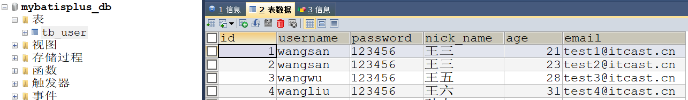
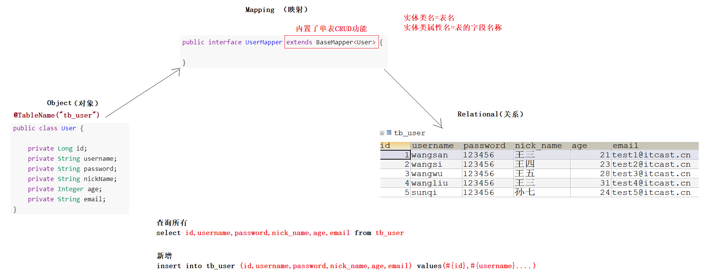
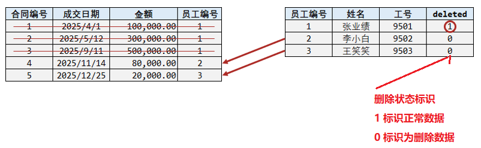
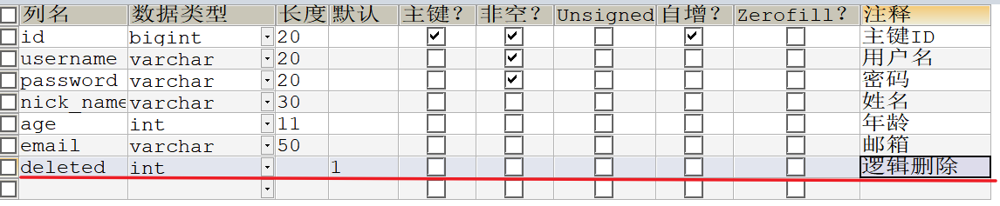
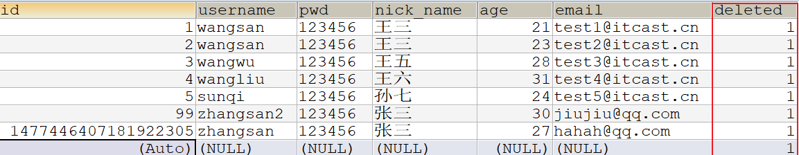
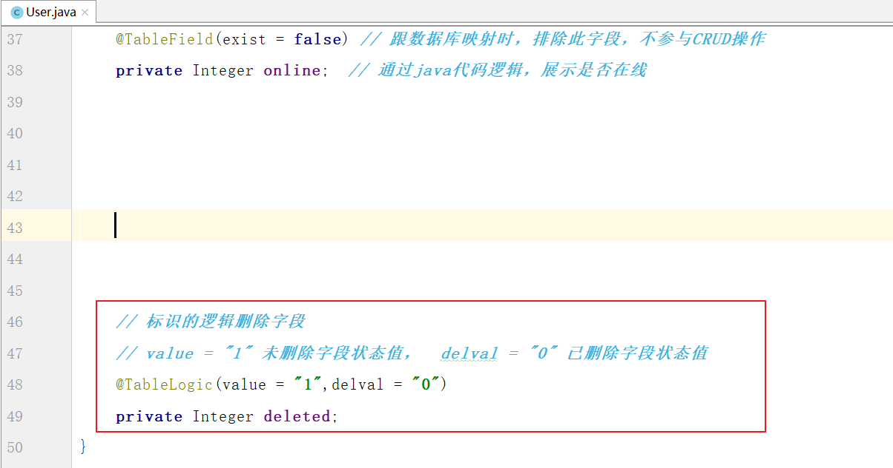
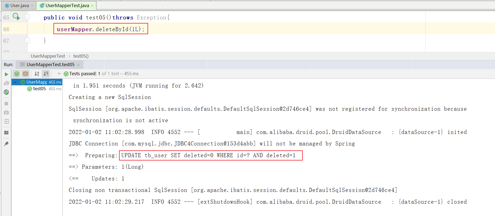
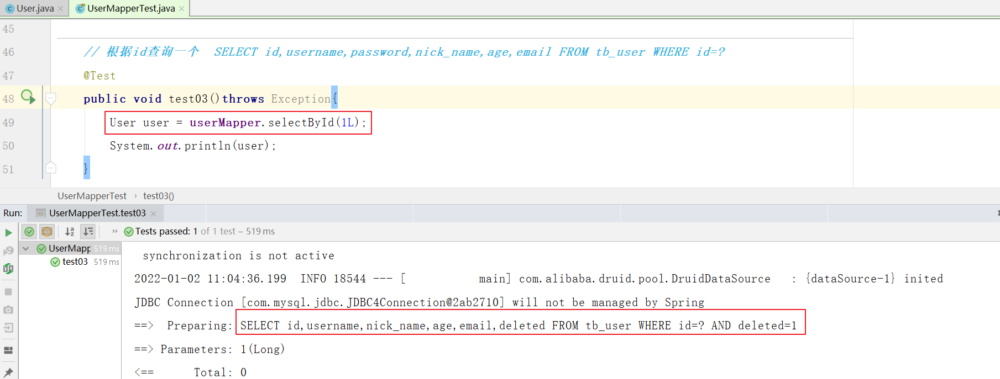

# MybatisPlus

---

## 1.介绍

Mybatis-Plus（简称MP）是一个 `Mybatis 的增强工具`，在 Mybatis 的基础上只做增强不做改变，`为简化开发、提高效率而生`。

Mybatis-Plus已经封装好了大量增删改查的方法，程序员只需要继承BaseMapper就可以使用这些方法了，无需自己再开发。

**官网：https://baomidou.com/，下面是其特性：**

- 无侵入：只做增强不做改变，不会对现有工程产生影响
- 强大的 CRUD 操作：内置通用 Mapper，少量配置即可实现单表CRUD操作
- 支持 Lambda：编写查询条件无需担心字段写错
- 支持主键自动生成（雪花、uuid）
- 内置分页插件

 

## 2.入门案例

>向数据库保存一个User对象

### 选择数据环境

  

### ORM映射

  


### 创建工程,导入依赖

~~~xml
<parent>
    <groupId>org.springframework.boot</groupId>
    <artifactId>spring-boot-starter-parent</artifactId>
    <version>2.2.2.RELEASE</version>
</parent>

<dependencies>
    <dependency>
        <groupId>mysql</groupId>
        <artifactId>mysql-connector-java</artifactId>
        <version>5.1.6</version>
    </dependency>
    <dependency>
        <groupId>com.alibaba</groupId>
        <artifactId>druid</artifactId>
        <version>1.1.15</version>
    </dependency>
    <dependency>
        <groupId>org.projectlombok</groupId>
        <artifactId>lombok</artifactId>
    </dependency>
    <dependency>
        <groupId>org.springframework.boot</groupId>
        <artifactId>spring-boot-starter-test</artifactId>
    </dependency>
    <dependency>
        <groupId>com.baomidou</groupId>
        <artifactId>mybatis-plus-boot-starter</artifactId>
        <version>3.4.0</version>
    </dependency>
</dependencies>
~~~


### 创建User实体类

~~~java
@Data
@NoArgsConstructor
@AllArgsConstructor
@TableName("tb_user")//当前实体类对应的数据表名,默认值为当前类名首字母小写
public class User {

    /*
        mp主键生成策略
            AUTO(0)：数据库自增
            【默认】NONE(1)：如果程序添加了ID就用程序员，如果没有添加就用雪花算法
            INPUT(2)：由程序员手动添加
            ASSIGN_ID(3)：雪花算法生成ID
            ASSIGN_UUID(4)：UUID算法生成ID
     */
    @TableId(type = IdType.NONE)
    private Long id;
    private String username;
    private String password;
    private String nickName;
    private Integer age;
    private String email;
}
~~~

### 创建UserMapper接口

~~~java
// mapper接口继承BaseMapper
public interface UserMapper extends BaseMapper<User> {
}
~~~

### 添加配置文件

>在resources中添加配置文件`application.yml`，然后在里面加入下面配置

 ~~~yaml
spring:
  datasource: # 数据源配置
    driver-class-name: com.mysql.jdbc.Driver
    url: jdbc:mysql://127.0.0.1:3306/mybatisplus_db?useSSL=false&characterEncoding=utf-8
    username: root
    password: root
    type: com.alibaba.druid.pool.DruidDataSource

mybatis-plus:
  configuration:
    log-impl: org.apache.ibatis.logging.stdout.StdOutImpl # 日志打印
 ~~~

### 创建启动类

~~~java
@SpringBootApplication
@MapperScan("com.itheima.mapper")
public class MyBatisPlusApplication {
    
    public static void main(String[] args) {
        SpringApplication.run(MyBatisPlusApplication.class, args);
    }
}
~~~

### 测试

~~~java
@RunWith(SpringRunner.class)
@SpringBootTest
public class UserMapperTest {

    @Autowired
    private UserMapper userMapper;


    // 新增记录
    @Test
    public void test01()throws Exception{
        User user = new User();
        user.setId(99L); // 可以手动指定主键
        user.setUsername("zhangsan2");
        user.setPassword("123456");
        user.setNickName("张三");
        user.setAge(30);
        user.setEmail("hahah@qq.com");

        userMapper.insert(user);
    }
    
}
~~~


## 3.基本操作

>MybatisPlus提供了单表的增删改查方法，程序员可以直接使用
>
>~~~java
>int insert(T entity);// 插入一条记录
>
>T selectById(Serializable id);// 主键查询
>List<T> selectBatchIds(Collection idList); // 主键批量查询
>
>int updateById(T entity);// ID修改【支持动态sql】
>
>int deleteById(Serializable id); // ID删除
>int deleteBatchIds(Collection idList);// ID批量删除
>~~~

~~~java
@RunWith(SpringRunner.class)
@SpringBootTest
public class UserMapperTest {

    @Autowired
    private UserMapper userMapper;


    // 新增记录
    @Test
    public void test01()throws Exception{
        User user = new User();
        user.setId(99L); // 可以手动指定
        user.setUsername("zhangsan2");
        user.setPassword("123456");
        user.setNickName("张三");
        user.setAge(30);
        user.setEmail("hahah@qq.com");

        userMapper.insert(user);
    }

    // 更新记录【支持动态sql】  UPDATE tb_user SET email=? WHERE id=?
    @Test
    public void test02()throws Exception{
        User user = new User();
        user.setId(99L);
        user.setEmail("jiujiu@qq.com");
        userMapper.updateById(user);
    }


    // 根据id查询一个  SELECT id,username,password,nick_name,age,email FROM tb_user WHERE id=?
    @Test
    public void test03()throws Exception{
        User user = userMapper.selectById(99L);
        System.out.println(user);
    }

    // 根据多个id查询  SELECT id,username,password,nick_name,age,email FROM tb_user WHERE id IN ( ? , ? )
    @Test
    public void test04()throws Exception{
        List<Long> idList = new ArrayList<>();
        idList.add(1L);
        idList.add(99L);
        List<User> list = userMapper.selectBatchIds(idList);
        System.out.println(list);
    }

    // 根据id删除一个  DELETE FROM tb_user WHERE id=?
    @Test
    public void test05()throws Exception{
        userMapper.deleteById(1477447971397271554L);
    }

    // 根据多个id删除（此代码就不知行了...）  DELETE FROM tb_user WHERE id IN( ? , ? )
    @Test
    public void test06()throws Exception{
        List<Long> idList = new ArrayList<>();
        idList.add(1L);
        idList.add(99L);
        userMapper.deleteBatchIds(idList);
    }

    // 查询所有  SELECT id,username,password,nick_name,age,email FROM tb_user
    @Test
    public void test07()throws Exception{
        List<User> list = userMapper.selectList(null);
        System.out.println(list);
    }
}
~~~

## 4.高级操作

>MybatisPlus提供了Wrapper对象来封装各种条件，比如条件、分页、排序、分组、过滤等等
>
>~~~java
>List<T> selectList(Wrapper<T> queryWrapper);// 条件查询，返回值为多条记录
>T selectOne(Wrapper<T> queryWrapper);// 条件查询，返回值为一条记录
>
>int delete(Wrapper<T> wrapper);// 条件删除
>int update(T entity,Wrapper<T> updateWrapper);// 条件更新
>~~~


### 书写格式

>MybatisPlus支持使用多种格式组装条件，我们推荐使用Lambda格式

~~~java
@RunWith(SpringRunner.class)
@SpringBootTest
public class UserMapperTest2 {

    @Autowired
    private UserMapper userMapper;

    // 条件查询，普通语法   SELECT * FROM tb_user WHERE age > 25
    @Test
    public void test01() throws Exception {
        // 动态条件
        Integer age = null;
        // 查询对象
        QueryWrapper<User> wrapper = new QueryWrapper<>();
        if (age != null) {
            wrapper.gt("age", age);  // age > 25
        }
        List<User> list = userMapper.selectList(wrapper);
        System.out.println(list);
    }

    // 条件查询，lambda语法 SELECT * FROM tb_user WHERE age > 25
    @Test
    public void test02() throws Exception {
        // 动态条件
        Integer age = null;
        // 查询对象
        LambdaQueryWrapper<User> wrapper = new LambdaQueryWrapper<>();
        wrapper.gt(age!=null,User::getAge, age); // age > 25
        List<User> list = userMapper.selectList(wrapper);
    }
}
~~~

### 设置条件

| 查询方法                                  | 说明     | 例子                                                         |
| ----------------------------------------- | -------- | ------------------------------------------------------------ |
| eq、ne、gt、ge、lt、le、isNull、isNotNull | 比较运算 | eq("name", "老王")`--->`name = '老王'                        |
| like、notLike、likeLeft、likeRight        | 模糊查询 | likeRight("name", "王")`--->`name like '王%'                 |
| in、notIn、between、notBetween            | 范围运算 | in("age",{1,2,3})`--->`age in (1,2,3)                        |
| or、and                                   | 拼接     | eq("id",1).or().eq("name","老王")`--->`id = 1 or name = '老王' |

~~~java
// 多条件查询
// SELECT * FROM tb_user WHERE id=3 AND nick_name LIKE '王%' AND age between 20 and 30
@Test
public void test03() throws Exception {
    // 查询对象
    LambdaQueryWrapper<User> wrapper = new LambdaQueryWrapper<>();

    // 方式一：  默认多条件查询，使用and关键字拼接
    /*wrapper.eq(User::getId, 3);
        wrapper.likeRight(User::getNickName, "王");
        wrapper.between(User::getAge, 20 , 30);*/

    // 方式二：链式编程 ，默认多条件查询，使用and关键字拼接
    // wrapper.eq(User::getId, 3).likeRight(User::getNickName, "王").between(User::getAge, 20 , 30);

    // 补充：如果想使用or关键字呢？
    wrapper.eq(User::getId, 3).or().likeRight(User::getNickName, "王").or().between(User::getAge, 20 , 30);

    List<User> list = userMapper.selectList(wrapper);
    System.out.println(list);
}
~~~

### 投影、分组、排序

>查询投影主要用于控制返回哪些列的数据

| 查询方法                | 说明 | 例子                                                      |
| ----------------------- | ---- | --------------------------------------------------------- |
| orderByAsc、orderByDesc | 排序 | orderByDesc("id", "name")`--->`order by id DESC,name DESC |
| groupBy                 | 分组 | groupBy("id", "name")`--->`group by id,name               |
| having                  | 过滤 | having("sum(age) > 10")`--->`having sum(age) > 10         |

~~~java
@RunWith(SpringRunner.class)
@SpringBootTest
public class UserMapperTest3 {

    @Autowired
    private UserMapper userMapper;

    // 投影+排序
    // SELECT id,nick_name,age FROM tb_user ORDER BY age DESC
    @Test
    public void test01() throws Exception {
        // 创建查询对象
        LambdaQueryWrapper<User> wrapper = new LambdaQueryWrapper<>();
        wrapper.select(User::getId, User::getNickName, User::getAge); // SELECT id,nick_name,age \
        wrapper.orderByDesc(User::getAge);// ORDER BY age DESC

        List<User> list = userMapper.selectList(wrapper);
        System.out.println(list);
    }

    // 分组统计（普通语法）
    // SELECT nick_name,COUNT(*) AS total  FROM tb_user GROUP BY nick_name HAVING total > 1
    @Test
    public void test02() throws Exception {
        // 创建查询对象
        QueryWrapper<User> wrapper = new QueryWrapper<>();
        wrapper.select("nick_name,COUNT(*) AS total "); // SELECT nick_name,COUNT(*) AS total
        wrapper.groupBy("nick_name");// GROUP BY nick_name
        wrapper.having("total > 1 ");// HAVING total > 1

        List<Map<String, Object>> list = userMapper.selectMaps(wrapper);

        System.out.println(list);

    }
}

~~~


### 分页查询

> Mybatis框架可以使用（pageHelper）：必须复习

>Mybatis-Plus内置了专门用于分页的插件，使用起来非常简单，它是基于拦截器原理实现分页的

**① 配置拦截器**

~~~java
package com.itheima.config;

import com.baomidou.mybatisplus.extension.plugins.MybatisPlusInterceptor;
import com.baomidou.mybatisplus.extension.plugins.inner.PaginationInnerInterceptor;
import org.springframework.context.annotation.Bean;
import org.springframework.context.annotation.Configuration;

@Configuration
public class MybatisPlusConfig {
    
    @Bean
    public MybatisPlusInterceptor mybatisPlusInterceptor(){
        //1 创建MybatisPlusInterceptor拦截器对象
        MybatisPlusInterceptor mpInterceptor=new MybatisPlusInterceptor();
        //2 添加分页拦截器
        mpInterceptor.addInnerInterceptor(new PaginationInnerInterceptor());
        return mpInterceptor;
    }
}
~~~

**② 分页代码实现**

~~~java
// 分页查询
@Test
public void test03() throws Exception {
    // 前端传递二个参数：当前页、每页个数
    Integer pageNum = 2;
    Integer pageSize = 5;

    // 1.开启分页
    Page<User> page = new Page<>(pageNum, pageSize);

    // 2.分页查询
    /*
            参数一：分页
            参数二：条件
         */
    page =userMapper.selectPage(page, null);

    // 输出结果
    System.out.println(page.getTotal()); // 总记录数
    System.out.println(page.getPages()); // 总页数
    System.out.println(page.getRecords()); // list结果集
    System.out.println(page.getCurrent()); // 当前页
    System.out.println(page.getSize()); // 每页个数
}
~~~


## 5.几个注解

### @TableField

> @TableField标注在实体属性上，它特殊用法：
>

| 属性   | 类型    | 默认值            | 描述                                                         |
| :----- | :------ | :---------------- | :----------------------------------------------------------- |
| value  | String  | ""                | 数据库字段名，如果同名可以省略                               |
| exist  | boolean | true              | 是否为数据库表字段，如果表中没有该字段必须设置为false，CRUD都不会包含该字段 |
| select | boolean | true              | 查询时是否查询该字段，如果设置为false，查询时不包含，但是insert、update、delete包含 |
| fill   | Enum    | FieldFill.DEFAULT | 字段自动填充策略，默认不会自动填充值                         |

~~~java
@Data
@NoArgsConstructor
@AllArgsConstructor
@TableName("tb_user")//当前实体类对应的数据表名,默认值为当前类名首字母小写
public class User {

    /*
        mp主键生成策略
            AUTO(0)：数据库自增
            【默认】NONE(1)：如果程序添加了ID就用程序员，如果没有添加就用雪花算法
            INPUT(2)：由程序员手动添加
            ASSIGN_ID(3)：雪花算法生成ID
            ASSIGN_UUID(4)：UUID算法生成ID
     */
    @TableId(type = IdType.NONE)
    private Long id;
    private String username;

    /*
     @TableField
        value = "pwd" 如果实体类属性与表中字段不一致时，手动映射
        select = false  表示查询时排除此字段
     */
    @TableField(value = "pwd",select = false)
    private String password;
    private String nickName;
    private Integer age;
    private String email;

    @TableField(exist = false) // 跟数据库映射时，排除此字段，不参与CRUD操作
    private Integer online;  // 通过java代码逻辑，展示是否在线
}
~~~

### @TableLogic（逻辑删除）

>@TableLogi标注在实体属性上，表示此字段用于逻辑删除的标识
>
>逻辑删除就是为了保证数据的完整，在业务上需要删除一条记录时，我们并不是执行一个delete语句将数据记录从数据表中删除

```markdown
场景：

老板要求把P50下架删除，因为卖完了，也不进货了

小张一个delete把数据给删除了

年底了，老板要统计 P50 的利润，结果数据没有了，一查是小张干的！ 
```


>而是使用一个标识列，将要删除的数据标识为删除状态（本质是执行了一条update语句）

 

**①：在user表中添加逻辑删除标记字段,并设置默认值为1**

  

 

**②：实体类中添加对应字段，设定为当前字段为逻辑删除标记字段**

 

**③ 删除其中一个用户观察效果**

 

 


 

