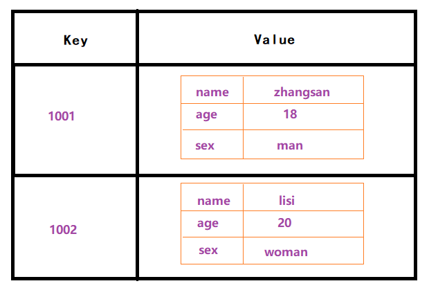
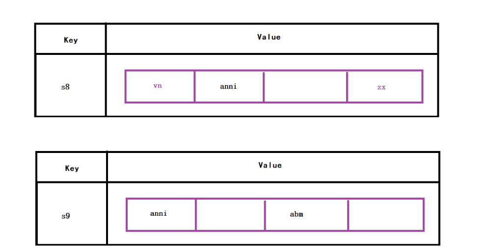

# Redis

---

Redis是一个基于==内存==的==key-value==结构的数据库 

NoSQL（Not Only SQL ）不仅仅是SQL，泛指==非关系型数据库==，NoSQL数据库并不是要取代关系型数据库，而是关系型数据库的==补充==。

主要特点：

- 基于内存存储，读写性能高 – Redis读的速度是110000次/S
- 适合存储热点数据（商品、资讯、新闻）
- 它存储的value类型比较丰富（五种数据类型），也称为结构化`NoSQL`数据库


 

# 1.Redis的命令

## Redis存储的数据类型

Redis采用的是键值对存储，（key）键的类型只能为字符串，（value）值支持五种数据类型：

 


## String字符串

字符串类型是Redis中最为基础的数据存储类型

 

```markdown
新增 set key value
查询 get key
删除 del key	
```

```markdown
* 新增的时候设置过期时间
		setex key second value
		
* 根据键判断记录是否存在
		exists key  
		
* 查看剩余时间
		ttl key

* 新增的时候判断可以是否存在
		setnx key value
```

 

```markdown
* 自增(减)操作：
		incr/decr key
```

 

## Hash哈希

Hash类型极其类似于java中的Map,值里面可以存放一组组的键值对

该类型非常适合于存储java中对象的信息

 

```markdown
* 新增
		hset key hkey hvalue
		
* 查询
	所有
		hgetall key
	单个
		hget key hkey
```

 

```markdown
* 获取所有hkey
		hkeys key 
		
* 获取所有hvalue
		 hvals key 
		 
* 删除
	单个
		hdel key hkey
	所有
		del key 
```

 

## List列表

List类型底层是一个==双向字符串链表==。里面的元素是==有序的，可重复的==

我们可以从链表的任何一端进行元素的增删

 

```markdown
* 新增
	左压入
		lpush key value
	右压入
		rpush key value
		
* 查询元素
		lrange key  [开始索引  结束索引]
		              0         -1
		
* 列表长度
		llen key
```

 


 

```markdown
* 删除元素
	左弹出
		lpop key
	右弹出
		rpop key
```

 

## Set集合

Set类型底层是一张hash表。里面的元素是==无序的，不可重复的==

 

```markdown
* 新增
		sadd key value
		
* 查询元素
		smembers key
		
* 查询集合数量
		scard key
		
* 删除元素	
		srem key value
```

 


 

```markdown
* 求集合的交集：
		sinter key1 key2
		
* 求集合的并集：
		sunion key1 key2
		
* 求集合的差集：
		sdiff  key1 key2		
```

 


## ZSet集合

Zset,也称sortedSet, 在Set的基础上，加入了有序功能，在添加元素的时候，允许指定一个分数，它会按照这个分数排序

 

```markdown
* 新增
		zadd key score value
		
* 查询
	升序
		zrange key start end [withscores] 
	降序	
		zrevrange key start end [withscores] 

* 删除
		zrem key value
```

 

## 通用命令

```markdown
* 模糊查询键
		keys *

* 删除多个键
		del key key ....

* 根据键判断值类型 
		type key

* 选择数据库
		select 0~15

* 清空当前数据库
		flushdb

* 清空所有数据库
		flushall
```


# 2.Jedis的使用

Redis作为一款优秀的缓存服务器存在，大多数语言都提供了连接Redis的驱动包，在java中，比较出名的是Jedis和Redisson，我们今天以Jredis为例学习，看看如何是用程序操作redis。

## JedisAPI

| 方法                  | 解释                                                         |
| --------------------- | ------------------------------------------------------------ |
| new Jedis(host, port) | 创建jedis对象，参数host是redis服务器地址，参数port是redis服务端口 |
| set(key,value)        | 设置字符串类型的数据                                         |
| get(key)              | 获得字符串类型的数据                                         |
| hset(key,field,value) | 设置哈希类型的数据                                           |
| hget(key,field)       | 获得哈希类型的数据                                           |
| lpush(key,values)     | 设置列表类型的数据                                           |
| lpop(key)             | 列表左面弹栈                                                 |
| rpop(key)             | 列表右面弹栈                                                 |
| del(key)              | 删除指定的key                                                |

## Jedis使用

创建工程，引入依赖


```xml
<parent>
    <groupId>org.springframework.boot</groupId>
    <artifactId>spring-boot-starter-parent</artifactId>
    <version>2.4.5</version>
</parent>

<dependencies>
    <dependency>
        <groupId>redis.clients</groupId>
        <artifactId>jedis</artifactId>
        <version>2.9.3</version>
    </dependency>
</dependencies>
```

```java
public class JedisTest {

    public static void main(String[] args) {
        // 1.创建连接
        Jedis jedis = new Jedis("127.0.0.1", 6379);

        // 2.新增（修改）、查询、删除
        // jedis.set("1002", "李四");
        String value = jedis.get("1002");
        System.out.println(value);

        // 3.关闭连接
        jedis.close();
    }
}
```


## Jedis连接池

```java
public class JedisPoolTest {

    public static void main(String[] args) {
        // 0.创建连接池配置对象
        JedisPoolConfig config = new JedisPoolConfig();
        config.setMaxTotal(50); // 最大连接数
        config.setMaxIdle(20); // 最大空闲数
        // 1.创建连接池
        JedisPool jedisPool = new JedisPool(config,"127.0.0.1",6379);
        // 2.获取连接
        Jedis jedis = jedisPool.getResource();
        // 3.进行 新增、修改、删除、查询

        // 4.归还连接
        jedis.close();
    }
}
```


# 3.SpringDataRedis

Spring Data Redis提供了从Spring应用程序轻松配置和访问Redis的功能

通过`RedisTemplate`对底层Jedis进行了高度封装，提供了redis各种操作

1. ValueOperations：简单键值对操作 String

2. SetOperations：set类型数据操作 set

3. ZSetOperations：zset类型数据操作 sortedset---->zset

4. HashOperations：针对hash类型的数据操作 hash

5. ListOperations：针对list类型的数据操作 list

## 环境搭建


### 调整坐标

```xml
<parent>
    <groupId>org.springframework.boot</groupId>
    <artifactId>spring-boot-starter-parent</artifactId>
    <version>2.4.5</version>
</parent>

<dependencies>

    <dependency>
        <groupId>redis.clients</groupId>
        <artifactId>jedis</artifactId>
        <version>2.9.3</version>
    </dependency>
    <dependency>
        <groupId>org.springframework.boot</groupId>
        <artifactId>spring-boot-starter-test</artifactId>
        <scope>test</scope>
    </dependency>
    <dependency>
        <groupId>org.springframework.boot</groupId>
        <artifactId>spring-boot-starter-data-redis</artifactId>
    </dependency>
</dependencies>
```

### 添加配置文件application.yml

```yaml
spring:
  application:
    name: redis_demo
  redis:
    host: localhost
    port: 6379
    database: 0 # 操作的是0号数据库
    jedis: #Redis连接池配置
      pool:
        max-active: 8 #最大连接数
        max-wait: 1ms #连接池最大阻塞等待时间
        max-idle: 4 #连接池中的最大空闲连接
        min-idle: 0 #连接池中的最小空闲连接
```

### 创建启动类

```java
package com.itheima;

import org.springframework.boot.SpringApplication;
import org.springframework.boot.autoconfigure.SpringBootApplication;

@SpringBootApplication
public class RedisApplication {
    public static void main(String[] args) {
        SpringApplication.run(RedisApplication.class, args);
    }
}
```

### 创建测试类

```java
@SpringBootTest
public class RedisTemplateTest {

    @Autowired
    private RedisTemplate redisTemplate;  // 父类，保存数据时，底层进行jdk序列化

    @Autowired
    private StringRedisTemplate stringRedisTemplate;  // 子类，保存数据值，就是string格式

    // 演示
    @Test
    public void testString() throws Exception {
        // 父类操作string类型
        // ValueOperations opsForValue = redisTemplate.opsForValue();
        // 子类操作string类型
        ValueOperations<String, String> opsForValue = stringRedisTemplate.opsForValue();

        // 存数据
        opsForValue.set("1004", "彭于晏");

    }
}
```

## SpringDataRedis_API

### 操作字符串类型数据

~~~java
// 操作字符串类型
@Test
public void test01() throws Exception {
    // 获取string操作对象
    ValueOperations<String, String> opsForValue = stringRedisTemplate.opsForValue();

    // 存值
    // opsForValue.set("city", "北京");

    // 取值
    // String value = opsForValue.get("city");
    // System.out.println(value);

    // 存验证码存活5分钟
    // opsForValue.set("sms_13700137000", "6375", Duration.ofMinutes(5));

    // 存值判断如果key存在，不做任何操作
    opsForValue.setIfAbsent("city", "上海");
}
~~~

### 操作哈希类型数据

~~~java
// 操作hash类型
@Test
public void test02() throws Exception {
    // 获取hash操作对象
    HashOperations<String, Object, Object> opsForHash = stringRedisTemplate.opsForHash();

    // 存值
    //opsForHash.put("1005", "nage", "zhangsan");
    //opsForHash.put("1005", "age", "18");
    //opsForHash.put("1005", "sex", "man");

    // 取出年龄
    String age = (String) opsForHash.get("1005", "age");
    System.out.println(age);
    System.out.println("---------------");
    // 取出所有key
    Set<Object> keys = opsForHash.keys("1005");
    for (Object key : keys) {
        System.out.println(key);
    }
    System.out.println("---------------");
    // 取出所有value
    List<Object> values = opsForHash.values("1005");
    for (Object value : values) {
        System.out.println(value);
    }

    // 删除
    opsForHash.delete("1005", "name");
}
~~~

### 操作列表类型数据

~~~java
// 操作list类型
@Test
public void test03() throws Exception {
    // 获取list操作对象
    ListOperations<String, String> opsForList = stringRedisTemplate.opsForList();

    // 存值
    //opsForList.leftPush("alist", "a");
    //opsForList.leftPush("alist", "b");
    opsForList.leftPushAll("alist", "a", "b");
    opsForList.rightPush("alist", "c");

    // 取值
    List<String> list = opsForList.range("alist", 0, -1);
    for (String s : list) {
        System.out.println(s);
    }
    System.out.println("--------------");
    // 获取list长度
    Long size = opsForList.size("alist");
    System.out.println(size);
    System.out.println("--------------");
    // 遍历删除
    for (Long i = 0l; i < size; i++) {
        // 弹出
        System.out.println(opsForList.rightPop("alist"));
    }

}
~~~

### 操作集合类型数据

~~~java
// 操作set类型
@Test
public void test04() throws Exception {
    // 获取set操作对象
    SetOperations<String, String> opsForSet = stringRedisTemplate.opsForSet();

    // 存值
    // opsForSet.add("lol", "a", "b", "c", "a");

    // 获取
    Set<String> lol = opsForSet.members("lol");
    for (String s : lol) {
        System.out.println(s);
    }

    // 删除
    opsForSet.remove("lol", "a");

}
~~~

### 操作有序集合类型数据

~~~java
// 操作zset类型
@Test
public void test05() throws Exception {
    // 获取 zset操作对象
    ZSetOperations<String, String> opsForZSet = stringRedisTemplate.opsForZSet();

    // 存值
    // opsForZSet.add("wangzhe", "安其拉", 66.6);
    // opsForZSet.add("wangzhe", "兰陵王", 68.6);
    // opsForZSet.add("wangzhe", "后羿", 79.6);

    // 修改
    // opsForZSet.add("wangzhe", "安其拉", 85.6);

    // 删除
    opsForZSet.remove("wangzhe", "兰陵王");

    // 取值
    Set<String> wangzhe = opsForZSet.reverseRange("wangzhe", 0, -1);
    for (String s : wangzhe) {
        System.out.println(s);
    }

}
~~~

### 通用操作

~~~java
// 通用操作
@Test
public void test06()throws Exception{
    // 查询所有key
    Set<String> keys = stringRedisTemplate.keys("10*");
    for (String key : keys) {
        System.out.println(key);
    }
    // 判断某个key是否存在
    Boolean itheima = stringRedisTemplate.hasKey("1005");
    System.out.println(itheima);

    // 判断某个key的类型
    DataType type = stringRedisTemplate.type("1005");
    System.out.println(type.name());
}
~~~


## 配置类

```java
//Redis配置类
//当前配置类不是必须的，因为 Spring Boot 框架会自动装配 RedisTemplate 对象，
//但是默认的key序列化器为JdkSerializationRedisSerializer，导致我们存到Redis中后的数据和原始数据有差别
@Configuration
public class RedisConfig extends CachingConfigurerSupport {

    @Bean
    public RedisTemplate<Object, Object> redisTemplate(RedisConnectionFactory connectionFactory) {

        RedisTemplate<Object, Object> redisTemplate = new RedisTemplate<>();

        //设置Key的序列化器  默认是JdkSerializationRedisSerializer
        redisTemplate.setKeySerializer(new StringRedisSerializer());
        redisTemplate.setHashKeySerializer(new StringRedisSerializer());

        //设置value的序列化器   默认是JdkSerializationRedisSerializer
        //redisTemplate.setValueSerializer(new StringRedisSerializer());
        //redisTemplate.setHashValueSerializer(new StringRedisSerializer());

        redisTemplate.setConnectionFactory(connectionFactory);

        return redisTemplate;
    }
}
```


