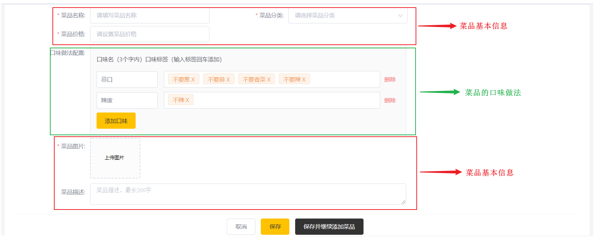
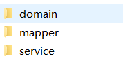

# 一、菜品管理

## 1.菜品列表

### （1）思路分析

#### 数据模型

 

菜品列表使用到两张数据表，分别是菜品dish表和菜品品味dish_flavor表。

 **① 菜品表:dish**

 

**② 菜品口味表:dish_flavor**

 

**③ 两表之间的关系**

 

#### 前端核心代码

>前端进入菜品页面之后，会向后台发送请求，查询菜品数据，请求中会携带参数：page、pageNum、name（不一定有值）

 


 

#### 后台思路分析

>~~~sql
>SELECT * FROM `dish`; -- 查询菜品信息 (1397849739276890114)
>SELECT * FROM `dish_flavor` WHERE dish_id = '1397849739276890114';-- 查询某个菜品的分类信息
>SELECT * FROM `category` WHERE id = '1397844263642378242';-- 查询某个菜品的分类信息 
>~~~

   

### （2）后台代码

#### 导入domain和mapper

 

#### DishController

>在`reggie-web-manage`模块下创建`com.itheima.reggie.controller.DishController`

~~~java
@RestController
public class DishController {

    @Autowired
    private DishService dishService;

    // 菜品分页查询
    @GetMapping("/dish/page")
    public ResultInfo findByPage(
            @RequestParam(value = "page", defaultValue = "1") Integer pageNum,
            @RequestParam(value = "pageSize", defaultValue = "10") Integer pageSize,
            String name) { // 1.接收参数

        // 2.调用service
        Page<Dish> page = dishService.findByPage(pageNum, pageSize, name);

        // 3.返回结果
        return ResultInfo.success(page);

    }
}
~~~

#### DishService

>在`reggie-service`模块下创建`com.itheima.reggie.service.DishService`

~~~java
public interface DishService {

    // 分页查询
    Page<Dish> findByPage(Integer pageNum, Integer pageSize, String name);
}
~~~

#### DishServiceImpl

>在`reggie-service`模块下创建`com.itheima.reggie.service.impl.DishServiceImpl`

~~~java
@Service
@Transactional
public class DishServiceImpl implements DishService {

    @Autowired
    private DishMapper dishMapper;

    @Autowired
    private DishFlavorMapper dishFlavorMapper;

    @Autowired
    private CategoryMapper categoryMapper;

    @Override
    public Page<Dish> findByPage(Integer pageNum, Integer pageSize, String name) {
        // 1.查询菜品分页数据
        // 1-1 查询条件封装
        LambdaQueryWrapper<Dish> wrapper = new LambdaQueryWrapper<>();
        wrapper.like(StrUtil.isNotEmpty(name), Dish::getName, name);
        // 1-2 分页条件封装
        Page<Dish> page = new Page<>(pageNum, pageSize);
        // 1-3 执行mapper查询
        page = dishMapper.selectPage(page, wrapper);
        // 2.遍历每一个菜品对象
        List<Dish> dishList = page.getRecords();
        if (CollectionUtil.isNotEmpty(dishList)) {
            for (Dish dish : dishList) {
                // 3.查询分类对象
                Category category = categoryMapper.selectById(dish.getCategoryId());
                dish.setCategoryName(category.getName());

                // 4.查询口味列表
                // 4-1 封装口味的查询条件
                LambdaQueryWrapper<DishFlavor> dishFlavorWrapper = new LambdaQueryWrapper<>();
                dishFlavorWrapper.eq(DishFlavor::getDishId, dish.getId());
                // 4-2 查询list
                List<DishFlavor> dishFlavorList = dishFlavorMapper.selectList(dishFlavorWrapper);
                // 4-3 封装到菜品对象中
                dish.setFlavors(dishFlavorList);
            }
        }

        return page; // 菜品（分类、口味）
    }
}
~~~

#### 配置分页拦截器

>在`reggie-mapper`模块下创建`com.itheima.reggie.config.MybatisPlusConfig`

~~~java
package com.itheima.reggie.config;

import com.baomidou.mybatisplus.annotation.DbType;
import com.baomidou.mybatisplus.extension.plugins.MybatisPlusInterceptor;
import com.baomidou.mybatisplus.extension.plugins.inner.PaginationInnerInterceptor;
import org.springframework.context.annotation.Bean;
import org.springframework.context.annotation.Configuration;

@Configuration
public class MybatisPlusConfig {
    @Bean
    public MybatisPlusInterceptor plusInterceptor() {
        //创建MybatisPlus拦截器
        MybatisPlusInterceptor mybatisPlusInterceptor = new MybatisPlusInterceptor();
        //添加分页拦截器
        mybatisPlusInterceptor.addInnerInterceptor(new PaginationInnerInterceptor(DbType.MYSQL));
        //返回
        return mybatisPlusInterceptor;
    }
}
~~~


## 2.图片上传

### （1）图片存储方案

实现图片上传服务，需要有存储的支持，那么我们的解决方案将以下几种：

> **直接将图片保存到服务的硬盘：**
>
> 1. 优点：开发便捷，成本低
> 2. 缺点：扩容困难
>
> **使用分布式文件系统进行存储：**
>
> 1. 优点：容易实现扩容
> 2. 缺点：开发复杂度稍大（有成熟的产品可以使用，比如：FastDFS）
>
> **使用第三方的存储服务：**
>
> 1. 优点：开发简单，拥有强大功能，免维护
> 2. 缺点：付费
>

在本套课程中选用阿里云的OSS服务进行图片存储。

 

### （2）阿里云OSS

> 官网地址：https://www.aliyun.com/product/oss 
>

>  


#### 注册阿里云

使用支付宝账户注册并绑定阿里云账户（实名认证）

   

#### 购买服务

oss需要我们付费的有两个地方: 

1. 存储，直接4.98购买套餐
2. 流量，按照访问量自动扣费

> 存储包，直接购买套餐

 

> 流量包，上行流量是免费的，下行流量是按照访问量自动扣费的

  


#### 创建存储空间

 

#### 创建秘钥

 

####  api

>https://help.aliyun.com/document_detail/84781.html?spm=a2c4g.11174283.6.946.425e7da24qVtmx
>

> 

```java
public class OssTest {

    @Test
    public void test01()throws Exception{
        // yourEndpoint填写Bucket所在地域对应的Endpoint。以华东1（杭州）为例，Endpoint填写为oss-cn-hangzhou.aliyuncs.com。
        String endpoint = "oss-cn-beijing.aliyuncs.com";
        // 阿里云账号AccessKey拥有所有API的访问权限，风险很高。强烈建议您创建并使用RAM用户进行API访问或日常运维，请登录RAM控制台创建RAM用户。
        String accessKeyId = "LTAI5tNsqhUNw7gZDy1yhpkV";
        String accessKeySecret = "5nEh988bOdKumLi1Si7Q5o7HVVuxZn";

        // 创建OSSClient实例。
        OSS ossClient = new OSSClientBuilder().build(endpoint, accessKeyId, accessKeySecret);

        // 填写本地文件的完整路径。如果未指定本地路径，则默认从示例程序所属项目对应本地路径中上传文件流。
        InputStream inputStream = new FileInputStream("E:\\temp\\upload\\3983B21AA4CA4969B20566A6F7E89D48.jpg");
        // 依次填写Bucket名称（例如examplebucket）和Object完整路径（例如exampledir/exampleobject.txt）。Object完整路径中不能包含Bucket名称。
        ossClient.putObject("tanhua-v1", "haha.jpg", inputStream);

        // 关闭OSSClient。
        ossClient.shutdown();
    }
}
```

#### 工具类抽取

**① 创建工具类**

>在`reggie-common`模块下创建`com.itheima.reggie.common.OssTemplate`

~~~java
package com.itheima.reggie.common;

import com.aliyun.oss.OSS;
import com.aliyun.oss.OSSClientBuilder;
import com.aliyun.oss.model.ObjectMetadata;
import lombok.Data;
import org.springframework.boot.context.properties.ConfigurationProperties;
import org.springframework.stereotype.Component;

import java.io.InputStream;
import java.text.SimpleDateFormat;
import java.util.Date;

//阿里存储工具类
@Component
@ConfigurationProperties(prefix = "reggie.oss")//读取配置信息
@Data
public class OssTemplate {

    private String key; //访问key
    private String secret;//访问秘钥
    private String endpoint;//端点
    private String bucket;//桶名
    private String url;//访问域名

    //文件上传
    public String upload(String fileName, InputStream inputStream) {

        //创建客户端
        OSS ossClient = new OSSClientBuilder().build(endpoint, key, secret);

        //设置文件最终的路径和名称
        String objectName = "images/" + new SimpleDateFormat("yyyy/MM/dd").format(new Date())
                + "/" + System.currentTimeMillis() + fileName.substring(fileName.lastIndexOf("."));

        //meta设置请求头,解决访问图片地址直接下载
        ObjectMetadata meta = new ObjectMetadata();
        meta.setContentType(getContentType(fileName.substring(fileName.lastIndexOf("."))));

        //上传
        ossClient.putObject(bucket, objectName, inputStream, meta);

        //关闭客户端
        ossClient.shutdown();

        return url + "/" + objectName;
    }

    //文件后缀处理
    private String getContentType(String FilenameExtension) {
        if (FilenameExtension.equalsIgnoreCase(".bmp")) {
            return "image/bmp";
        }
        if (FilenameExtension.equalsIgnoreCase(".gif")) {
            return "image/gif";
        }
        if (FilenameExtension.equalsIgnoreCase(".jpeg") ||
                FilenameExtension.equalsIgnoreCase(".jpg") ||
                FilenameExtension.equalsIgnoreCase(".png")) {
            return "image/jpg";
        }
        return "image/jpg";
    }
}
~~~

**② 添加配置**

>在`reggie-web-manage`模块下`application.yaml`中添加oss的配置

~~~yaml
reggie:
  oss:
    key: LTAI5tNmH22y9C7AxdFEgdNv
    secret: AHGC0JSnBuYtYg3BnNvyTuwlwyl27n
    endpoint: oss-cn-beijing.aliyuncs.com
    bucket: tanhua-gxm
    url: https://tanhua-gxm.oss-cn-beijing.aliyuncs.com
~~~

**③ 测试**

>在`reggie-web-manage`模块下创建`com.itheima.reggie.test.OssTemplateTest`

~~~java
package com.itheima.reggie.test;

import com.itheima.reggie.common.OssTemplate;
import lombok.extern.slf4j.Slf4j;
import org.junit.jupiter.api.Test;
import org.springframework.beans.factory.annotation.Autowired;
import org.springframework.boot.test.context.SpringBootTest;

import java.io.FileInputStream;
import java.io.FileNotFoundException;

@SpringBootTest
@Slf4j
public class OssTemplateTest {
    @Autowired
    private OssTemplate ossTemplate;

    @Test
    public void testFileUpload() throws FileNotFoundException {
        String filePath = ossTemplate.upload("1.jpg", new FileInputStream("D:/upload/1.jpg"));
        log.info("文件上传完毕之后的路径{}", filePath);
    }
}
~~~

### （3）图片上传实现

#### 前端页面说明

>页面点击选择文件之后开始上传，后台接收文件后保存到阿里云，然后将访问地址返回

 

虽然上述是ElementUI封装的代码，但是实际上最终还通过file域上传文件，如果未指定上传文件的参数名，默认为file。

 

#### 后台代码编写

>后台首先使用Spring的文件上传解析器接收上传的文件，然后将文件保存到阿里云，然后返回访问地址

 

**① 配置文件上传解析器**

>在`reggie-web-manage`模块下的`resources/application.yaml`中添加下面配置

~~~yaml
spring:
  servlet:
    multipart:
      max-request-size: 100MB # 最大请求文件大小,默认10MB
      max-file-size: 10MB # 单个请求文件大小,默认1MB
~~~

**② 编写文件上传代码**

>在`reggie-web-manage`模块下创建`com.itheima.reggie.controller.FileController`

~~~java
package com.itheima.reggie.controller;

import com.itheima.reggie.common.OssTemplate;
import com.itheima.reggie.common.ResultInfo;
import lombok.extern.slf4j.Slf4j;
import org.springframework.beans.factory.annotation.Autowired;
import org.springframework.web.bind.annotation.PostMapping;
import org.springframework.web.bind.annotation.RestController;
import org.springframework.web.multipart.MultipartFile;

import java.io.IOException;

@RestController
@Slf4j
public class FileController {

    @Autowired
    private OssTemplate ossTemplate;

    @PostMapping("/common/upload")
    public ResultInfo uploadFile(MultipartFile file) throws IOException {
        String filePath = ossTemplate.upload(file.getOriginalFilename(), file.getInputStream());
        log.info("文件上传成功,访问地址是:{}", filePath);
        return ResultInfo.success(filePath);
    }
}
~~~


## 3.菜品新增

### （1）回显菜品分类

#### 前端核心代码

>前端进入菜品新增页面之后，会向后台发送请求，<font color='#BAOC2F'>首先查询菜品分类信息</font>

 


 

#### 后台思路分析

>后台接收参数type，然后根据type从数据表查询分类列表

 

#### CategoryController

~~~java
// 根据type查询分类列表
@GetMapping("/category/list")
//Get请求的方法的参数可以单独接收
public ResultInfo categoryList(Integer type) { // 1.接收请求参数
    // 2.调用service查询
    List<Category> list = categoryService.findByType(type);
    // 3.返回结果
    return ResultInfo.success(list);
}
~~~

#### CategoryService

~~~java
// 根据type查询分类列表
List<Category> findByType(Integer type);
~~~

#### CategoryServiceImpl

~~~java
// 根据type查询分类列表
@Override
public List<Category> findByType(Integer type) {
    // 1.构建查询条件
    LambdaQueryWrapper<Category> wrapper = new LambdaQueryWrapper<>();
    wrapper.eq(Category::getType,type );//type值进行对比
    // 2.调用mapper查询
    return categoryMapper.selectList(wrapper);
}
~~~


### （2）新增菜品信息

#### 前端核心代码

>当点击保存按钮之后，向后台发送请求

 


 

#### 后台思路分析

>后台接收请求之后，将数据分别保存到菜品表和菜品口味表

  

#### DishController

~~~java
// 新增菜品
@PostMapping("/dish")
public ResultInfo save(@RequestBody Dish dish) { // 1.接收参数
    // 2.调用serivce保存
    dishService.save(dish);
    // 3.返回成功结果
    return ResultInfo.success(null);
}
~~~

#### DishService

~~~java
// 新增菜品
void save(Dish dish);
~~~

#### DishServiceImpl

~~~java
@Override
public void save(Dish dish) {
    // 1.添加菜品的主干信息
    log.info("菜品保存之前：{}",dish.getId());
    dishMapper.insert(dish);
    log.info("菜品保存之后：{}",dish.getId());

    // 2.根据添加后的菜品id，添加菜品的口味dis_flavor
    List<DishFlavor> flavorList = dish.getFlavors();
    if (CollectionUtil.isNotEmpty(flavorList)) {
        for (DishFlavor dishFlavor : flavorList) {
            // 为口味指定所属的菜品id
            dishFlavor.setDishId(dish.getId());
            // 保存口味
            dishFlavorMapper.insert(dishFlavor);
        }
    }
}
~~~


## 4.菜品修改

### （1）回显菜品详情

#### 前端核心代码

>当用户进入修改页面之后，首先根据传入的菜品id，发送请求，查询回菜品详情

 

 


#### 后台思路分析

>后台接收请求之后，根据菜品id分别从菜品表和菜品口味表查询信息，组装返回

 


#### DishController

```java
// 菜品回显
@GetMapping("/dish/{id}") // 前面没有#
public ResultInfo findById(@PathVariable Long id) { // 1.接收菜品id
    // 2.调用service查询
    Dish dish = dishService.findById(id);
    // 3.返回结果
    return ResultInfo.success(dish);
}
```

#### DishService

~~~java
// 菜品回显
Dish findById(Long id);
~~~

#### DishServiceImpl

~~~java
@Override
public Dish findById(Long id) {
    // 1.先查菜品基本信息
    Dish dish = dishMapper.selectById(id);
    // 2.在查询口味列表
    // 2-1 构建口味的查询条件对象
    LambdaQueryWrapper<DishFlavor> wrapper = new LambdaQueryWrapper<>();
    wrapper.eq(DishFlavor::getDishId, id);
    // 2-2查询列表
    List<DishFlavor> flavorList = dishFlavorMapper.selectList(wrapper);
    // 3.将口味列表设置到菜品对象中
    dish.setFlavors(flavorList);
    // 4.返回菜品对象
    return dish;
}
~~~

### （2）修改菜品信息

#### 前端核心代码

>当在修改页面，填写完修改数据之后，点击保存按钮，进行修改

 

 


#### 后台思路分析

>后台接收请求之后，根据id分别更新菜品和口味
>

> 

 

#### DishController

```java
// 菜品修改
@PutMapping("/dish")
public ResultInfo update(@RequestBody Dish dish) { // 1.接收请求体参数
    // 2.调用service修改
    dishService.update(dish);
    // 3.返回成功消息
    return ResultInfo.success(null);

}
```

#### DishService

~~~java
// 菜品修改
void update(Dish dish);
~~~

#### DishServiceImpl

~~~java
// 菜品修改
@Override
public void update(Dish dish) {
    // 1.先更新菜品基本信息
    dishMapper.updateById(dish);

    // 2.删除菜品原有的口味
    // 2-1 构建口味条件对象
    LambdaQueryWrapper<DishFlavor> wrapper = new LambdaQueryWrapper<>();
    wrapper.eq(DishFlavor::getDishId, dish.getId());
    // 2-2 执行mapper删除
    dishFlavorMapper.delete(wrapper);

    // 3.遍历前端提交的口味
    List<DishFlavor> flavorList = dish.getFlavors();
    if (CollectionUtil.isNotEmpty(flavorList)) {
        for (DishFlavor dishFlavor : flavorList) {
            // 设置菜品id
            dishFlavor.setDishId(dish.getId());
            // 调用mapper保存口味
            dishFlavorMapper.insert(dishFlavor);
        }
    }
}
~~~

## 5.菜品修改


## 6.菜品起售&停售


## 7.菜品检索

 

```java
@GetMapping("/dish/list")
public ResultInfo findList(Long categoryId, String name){
    List<Dish> dishList = null;
    if (StrUtil.isEmpty(name)) {
        dishList = dishService.findListByCategoryId(categoryId);
    } else {
        dishList = dishService.findByName(name);
    }
    return ResultInfo.success(dishList);
}
```

```java
//菜品模糊查询
List<Dish> findByName(String name);
```

```java
@Override
public List<Dish> findByName(String name) {
    // 1.菜品数据查询
    // (1)查询条件封装
    LambdaQueryWrapper<Dish> wrapper = new LambdaQueryWrapper<>();
    wrapper.like(StrUtil.isNotEmpty(name), Dish::getName, name);
    // (2)执行mapper查询
    List<Dish> dishList = dishMapper.selectList(wrapper);
    // 2.遍历每一个菜品对象
    if (CollectionUtil.isNotEmpty(dishList)) {
        for (Dish dish : dishList) {
            // 3.查询分类对象
            Category category = categoryMapper.selectById(dish.getCategoryId());
            dish.setCategoryName(category.getName());
            // 4.查询口味列表
            // (1)封装口味的查询条件
            LambdaQueryWrapper<DishFlavor> dishFlavorWrapper = new LambdaQueryWrapper<>();
            dishFlavorWrapper.eq(DishFlavor::getDishId, dish.getId());
            // (2)查询list
            List<DishFlavor> dishFlavorList = dishFlavorMapper.selectList(dishFlavorWrapper);
            // (3)封装到菜品对象中
            dish.setFlavors(dishFlavorList);
        }
    }
    return dishList; // 菜品（分类、口味）
}
```


### （1）菜品删除

#### DishController

```java
@DeleteMapping("/dish")
public ResultInfo deleteBatchIds(@RequestParam List<Long> ids){
    dishService.deleteBatchIds(ids);
    return ResultInfo.success(null);
}
```


#### DishService

```java
void deleteBatchIds(List<Long> ids);
```


#### DishServiceImpl

```java
@Override
public void deleteBatchIds(List<Long> ids) {
    // 先删菜品
    dishMapper.deleteBatchIds(ids);

    // 再删口味
    LambdaQueryWrapper<DishFlavor> wrapper = new LambdaQueryWrapper<>();
    wrapper.in(DishFlavor::getDishId, ids);
    dishFlavorMapper.delete(wrapper);
}
```


### （2）菜品起售、停售

#### DishController

```java
@PostMapping("/dish/status/{status}")
public ResultInfo updateStatus(@PathVariable Integer status,@RequestParam List<Long> ids){
    dishService.updateStatus(status,ids);
    return ResultInfo.success(null);
}
```


#### DishService

```java
void updateStatus(Integer status, List<Long> ids);
```


#### DishServiceImpl

```java
@Override
public void updateStatus(Integer status, List<Long> ids) {
    // 条件对象
    LambdaQueryWrapper<Dish> wrapper = new LambdaQueryWrapper<>();
    wrapper.in(Dish::getId, ids);
    // 修改实体
    Dish dish = new Dish();
    dish.setStatus(status);
    // 调用mapper
    dishMapper.update(dish, wrapper);
}
```


# 二、套餐管理

## 1.套餐列表

### （1）思路分析

#### 数据模型

套餐，涉及到数据库中两张表：setmeal（套餐表，存储套餐的基本信息）和setmeal_dish（套餐菜品关系表，存储套餐关联的菜品的信息）

**① 套餐表setmeal**

 

**② 套餐菜品关系表setmeal_dish**

 

> 在该表中，菜品的名称name，菜品的原价price实际上都是冗余字段，
>
> 因为我们在这张表中存储了菜品的ID(dish_id)，根据该ID我们就可以查询出name和price的数据信息，
>
> 而这里又存储了name和price，这样的话，在后续的查询展示操作中，就不需要再去查询数据库获取菜品名称和原价了

**③ 表关系**

 

#### 前端核心代码

>前端进入菜品页面之后，会向后台发送请求，查询套餐数据，请求中会携带参数：page、pageNum、name（不一定有值）

 


 

#### 后台思路分析

 

### （2）后台代码

#### 导入资料

 

#### SetmealController

>在`reggie-web-manage`模块下创建`com.itheima.reggie.controller.SetmealController`

~~~java
@RestController
public class SetmealController {

    @Autowired
    private SetmealService setmealService;

    // 套餐分页查询
    @GetMapping("/setmeal/page")
    public ResultInfo findByPage(
            String name,
            @RequestParam(value = "page", defaultValue = "1") Integer pageNum,
            @RequestParam(value = "pageSize", defaultValue = "10") Integer pageSize) {// 1.接收参数
        // 2.调用service查询
        Page<Setmeal> page = setmealService.findByPage(pageNum, pageSize, name);

        // 3.返回结果
        return ResultInfo.success(page);
    }
}
~~~

#### SetmealService

>在`reggie-service`模块下创建`com.itheima.reggie.service.SetmealService`

~~~java
//套餐
public interface SetmealService {

    // 套餐分页查询
    Page<Setmeal> findByPage(Integer pageNum, Integer pageSize, String name);
}
~~~

#### SetmealServiceImpl

>在`reggie-service`模块下创建`com.itheima.reggie.service.impl.SetmealServiceImpl`

~~~java
//套餐
@Service
@Transactional
public class SetmealServiceImpl implements SetmealService {

    @Autowired
    private SetmealMapper setmealMapper;

    @Autowired
    private CategoryMapper categoryMapper;

    @Autowired
    private SetmealDishMapper setmealDishMapper;

    @Override
    public Page<Setmeal> findByPage(Integer pageNum, Integer pageSize, String name) {
        // 1.先查套餐基本信息
        // 1-1 构建条件对象
        LambdaQueryWrapper<Setmeal> setmealWrapper = new LambdaQueryWrapper<>();
        setmealWrapper.like(StrUtil.isNotEmpty(name), Setmeal::getName, name);
        // 1-2 构建分页对象
        Page<Setmeal> page = new Page<>(pageNum, pageSize);
        // 1-3 查询
        page = setmealMapper.selectPage(page, setmealWrapper);

        // 2.获取套餐list集合并遍历
        List<Setmeal> setmealList = page.getRecords();
        if (CollectionUtil.isNotEmpty(setmealList)) {
            for (Setmeal setmeal : setmealList) {
                // 3.根据category_id查询分类对象
                Category category = categoryMapper.selectById(setmeal.getCategoryId());
                // 将分类名称关联到套餐中
                setmeal.setCategoryName(category.getName());
                // 4.根据setmeal的id查询菜品（中间表）列表
                // 4-1 构建中间表条件对象
                LambdaQueryWrapper<SetmealDish> sdWrapper = new LambdaQueryWrapper<>();
                sdWrapper.eq(SetmealDish::getSetmealId, setmeal.getId());
                // 4-2  查询套菜菜品集合
                List<SetmealDish> setmealDishList = setmealDishMapper.selectList(sdWrapper);
                // 4-3 关联到套餐中
                setmeal.setSetmealDishes(setmealDishList);
            }
        }
        // 5.返回结果
        return page;
    }
}
~~~


## 2.新增套餐

###  （1）前端页面分析

点击新建套餐按钮，访问页面(backend/page/combo/add.html)，梳理一下新增套餐时前端页面和服务端的交互过程：

> 1. 页面加载发送ajax请求，请求服务端获取**套餐分类（传递的type为2）**数据并展示到下拉框中(==已实现==) 
>      


> 2. 页面加载时发送ajax请求，请求服务端获取**菜品分类（传递的type为1）**数据并展示到添加菜品窗口中(==已实现==)
>      


> 3. 根据菜品分类查询对应的**菜品列表**数据并展示到添加菜品窗口中(==未实现==)
>      

### （2）回显菜品列表

>前台发送请求，根据categoryId查询分类下的菜品列表

#### DishController

~~~java
// 根据分类id查询菜品列表
@GetMapping("/dish/list")
public ResultInfo findList(Long categoryId){
    List<Dish> dishList = dishService.findListByCategoryId(categoryId);
    return ResultInfo.success(dishList);
}
~~~

#### DishService

~~~java
// 根据分类id查询菜品列表
List<Dish> findListByCategoryId(Long categoryId);
~~~

#### DishServiceImpl

~~~java
// 根据分类id查询菜品列表
@Override
public List<Dish> findListByCategoryId(Long categoryId) {
    // 1.构建条件
    LambdaQueryWrapper<Dish> wrapper = new LambdaQueryWrapper<>();
    wrapper.eq(Dish::getCategoryId, categoryId ); // category_id = xxx
    wrapper.eq(Dish::getStatus, 1); // statuas = 1
    // 2.查询list
    return dishMapper.selectList(wrapper);
}
~~~

### （3）新增套餐

#### 前端核心代码

>前端选择好套餐内容之后，点击新增，会将页面的json信息发送到后台

 

 


#### 后台思路分析

>后台接收数据之后，将信息分别保存到Setmeal和SetmealDish表中

 

 

#### SetmealController

~~~java
// 套餐新增
@PostMapping("/setmeal")
public ResultInfo save(@RequestBody Setmeal setmeal) { // 1.接收参数
    // 2.调用service
    setmealService.save(setmeal);

    // 3.返回结果
    return ResultInfo.success(null);

}
~~~

#### SetmealService

~~~java
// 套餐新增
void save(Setmeal setmeal);
~~~

#### SetmealServiceImpl

~~~java
// 套餐新增
@Override
public void save(Setmeal setmeal) {
    // 1.先保存套餐基本信息
    setmealMapper.insert(setmeal);
    log.info("保存套餐基本信息，id：{},名称：{},价格：{}", setmeal.getId(),setmeal.getName(),setmeal.getPrice());
    // 2.取出套餐菜品列表
    List<SetmealDish> dishList = setmeal.getSetmealDishes();
    if (CollectionUtil.isNotEmpty(dishList)) {
        for (SetmealDish setmealDish : dishList) {
            // 关联套餐id
            setmealDish.setSetmealId(setmeal.getId());
            // 保存套餐菜品
            setmealDishMapper.insert(setmealDish);
        }
    }
}
~~~


## 3.删除套餐

### （1）需求分析

在套餐管理列表页面，点击删除按钮，可以删除对应的套餐信息。也可以通过复选框选择多个套餐，点击批量删除按钮一次删除多个套餐。

注意，对于状态为售卖中的套餐不能删除，需要先停售，然后才能删除。

 

两种请求的**地址**和**请求方式**都是相同的，不同的则是传递的id个数，所以在服务端可以提供一个方法来统一处理。

~~~http
DELETE /setmeal?ids=1423640210125656065,1423338765002256385
~~~

### （2）代码开发

>后台接收请求参数ids，然后遍历进行删除，但是要注意，必须==停售状态==之后才能删除。

#### SetmealController

~~~java
// 套餐删除
@DeleteMapping("/setmeal")
public ResultInfo deleteBatchIds(@RequestParam List<Long> ids) { // 1.接收参数
    // 2.调用serivce删除
    if (CollectionUtil.isNotEmpty(ids)) {
        setmealService.deleteBatchIds(ids);
    }

    // 3.返回结果
    return ResultInfo.success(null);
}
~~~

#### SetmealService

~~~java
// 套餐删除
void deleteBatchIds(List<Long> ids);
~~~

#### SetmealServiceImpl

~~~java
@Override
public void deleteBatchIds(List<Long> ids) {
    // 1.先判断套餐状态
    // 1-1 构建套餐条件对象
    LambdaQueryWrapper<Setmeal> setmealWrapper = new LambdaQueryWrapper<>();
    setmealWrapper.in(Setmeal::getId, ids);
    setmealWrapper.eq(Setmeal::getStatus, 1);
    // 1-2 查询套餐数量
    Integer count = setmealMapper.selectCount(setmealWrapper);
    if (count > 0) {
        throw new CustomException("删除的套餐状态必须为停售~~~");
    }

    // 2.再删除套餐
    setmealMapper.deleteBatchIds(ids);

    // 3.最后删除套餐菜品
    // 3-1 构建套餐菜品条件对象
    LambdaQueryWrapper<SetmealDish> sdWrapper = new LambdaQueryWrapper<>();
    sdWrapper.in(SetmealDish::getSetmealId, ids);
    // 3-2 条件删除
    setmealDishMapper.delete(sdWrapper);
}
~~~


### （3）逻辑删除

 


# 三、订单明细

 

 

```java
@GetMapping("/order/page")
public ResultInfo findByPage(
    @RequestParam(value = "page", defaultValue = "1") Integer pageNum,
    @RequestParam(value = "pageSize", defaultValue = "10") Integer pageSize,
    Long number, String beginTime, String endTime) { // 1.接收参数
    log.info("pageNum：" + pageNum + "，pageSize：" + pageSize + "，orderId：" + number);
    log.info("beginTime：" + beginTime + "，endTime：" + endTime);

    // 2.调用service
    Page<Order> page = orderService.findByPage(pageNum, pageSize, number, beginTime, endTime);

    // 3.返回结果
    return ResultInfo.success(page);
}
```

```java
//订单分页显示
Page<Order> findByPage(Integer pageNum, Integer pageSize, Long number, String beginTime, String endTime);
```

```java
@Override
public Page<Order> findByPage(Integer pageNum, Integer pageSize, Long number, String beginTime, String endTime) {
    // 1.查询订单分页数据
    // (1)查询条件封装
    LambdaQueryWrapper<Order> wrapper = new LambdaQueryWrapper<>();
    wrapper.like(number != null, Order::getId, number);
    wrapper.between(beginTime!=null&&endTime!=null, Order::getOrderTime, beginTime, endTime);
    // (2)订单分页对象封装
    Page<Order> page = new Page<>(pageNum, pageSize);
    // (3)执行mapper查询
    page = orderMapper.selectPage(page, wrapper);
    // 2.遍历每一个订单对象
    List<Order> orderList = page.getRecords();
    if (CollectionUtil.isNotEmpty(orderList)) {
        for (Order order : orderList) {
            // 4.查询订单对应的用户名称并封装
            LambdaQueryWrapper<User> queryWrapper = new LambdaQueryWrapper<>();
            queryWrapper.eq(User::getId, order.getUserId());
            User user = userMapper.selectOne(queryWrapper);
            // (3)封装到菜品对象中
            order.setUserName(user.getName());
        }
    }
    return page; // 菜品（分类、口味）
}
```

