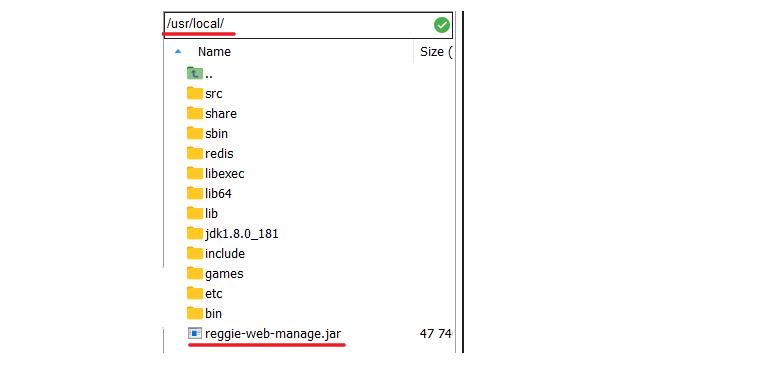

# 安装包简介

## 二进制发布包

绿色免安装

~~~markdown
软件已经针对具体平台编译打包发布，开发人员拿到安装包之后只要解压，修改配置即可使用
~~~

## 源码包

~~~markdown
此种安装包软件以源码工程的形式发布,需要程序员自行编译安装,它一般包含四个步骤:解压------>配置------->编译-------->安装	
~~~

## RPM包

类似于windows安装包

~~~markdown
这种包是redhat已经按照包管理规范对软件进行打包之后发布出来的一类包,对于rpm包的安装,有两种方式:
1  直接下载rpm包,然后使用rpm命令安装[A --> B--> C]
2  采用yum命令联网安装[它会自动联网下载rpm包]
~~~

~~~markdown
* rpm命令安装
	语法:  rpm 参数  安装包
	参数:
        -v 显示指令执行过程
        -h 表示显示进度
        -q 查询包是否已经安装
        -a 查看所有安装的软件
        -i 安装软件
        -U 更新升级
        -e 卸载软件
        --nodeps 不验证软件的相互关联性 
* 常用命令:
    安装：rpm  -ivh  rpm文件
    升级：rpm  -Uvh  rpm文件
    卸载：rpm  -e --nodeps 软件名
    查看所有安装的软件：rpm -qa | grep 具体名
~~~

~~~markdown
yum安装
    软件已经以RPM规范打包，但发布在了网络上的一些服务器上，可用yum在线安装服务器上的rpm软件，并且会自动解决软件安装过程中的库依赖问题。
    yum install 软件名      (yum install ksh)
    yum localinstall rpm包  使用yum安装本地rpm包[此过程会自动解决依赖]
~~~


# 软件部署

我们服务部署的任务是将瑞吉点餐项目（后台管理系统）部署到服务器上，


将资料中软件的安装包文件上传到`/usr/local/src/`，软件安装位置在`/usr/local/` 

## 手动部署

### 打包

直接执行idea中maven插件中得package命令，就可以在target下得到jar包

  

### 上传jar包

将得到的jar包上传到服务器上

 

### 运行程序

~~~shell
java -jar /usr/local/reggie-web-manage.jar --server.port=9090
~~~

上面方式会占据控制台运行，下面是后台运行

~~~shell
nohup java -jar /usr/local/reggie-web-manage.jar --server.port=9090 &
~~~

### 放行端口

使用下面命令，放行防火墙9090端口

~~~shell
firewall-cmd --zone=public --add-port=9090/tcp --permanent
firewall-cmd --reload
~~~

  


## 自动部署

### 思路说明

 


### 安装git

~~~shell
# 1. 安装git软件
yum install git -y

# 2. 尝试下载reggie代码(注意:这个代码必须是打jar包的版本)
cd /usr/local/
git clone https://gitee.com/ys-gitee/reggie-parent.git
~~~

### 安装maven

~~~shell
# 1. 解压软件
tar -zxvf /usr/local/src/apache-maven-3.5.4-bin.tar.gz -C /usr/local

# 2. 修改配置文件，在最后加入如下内容
vim /etc/profile
export MAVEN_HOME=/usr/local/apache-maven-3.5.4
export PATH=$JAVA_HOME/bin:$MAVEN_HOME/bin:$PATH

# 3. 更新配置
source /etc/profile

# 4. 修改maven配置文件settings.xml，配置本地仓库和中央仓库镜像
vim /usr/local/apache-maven-3.5.4/conf/settings.xml
~~~

```xml
<localRepository>/usr/local/apache-maven-3.5.4/repo</localRepository>
```

```xml
<mirror> 
    <id>alimaven</id> 
    <mirrorOf>central</mirrorOf> 
    <name>aliyun maven</name> 
    <url>http://maven.aliyun.com/nexus/content/groups/public/</url>
</mirror> 
```

 

### 自动化部署脚本

Shell脚本，是一种Linux系统中的脚本程序。

在`/usr/local/`下创建`bootStart.sh`脚本，内容如下

~~~shell
#!/bin/sh
echo =================================
echo  自动化部署脚本启动
echo =================================

echo 停止原来运行中的工程
APP_NAME=reggie-web-manage

tpid=`ps -ef|grep $APP_NAME|grep -v grep|grep -v kill|awk '{print $2}'`
if [ ${tpid} ]; then
    echo 'Stop Process...'
    kill -15 $tpid
fi
sleep 2
tpid=`ps -ef|grep $APP_NAME|grep -v grep|grep -v kill|awk '{print $2}'`
if [ ${tpid} ]; then
    echo 'Kill Process!'
    kill -9 $tpid
else
    echo 'Stop Success!'
fi

echo 准备从Git仓库拉取最新代码
cd /usr/local/reggie-parent

echo 开始从Git仓库拉取最新代码
git pull
echo 代码拉取完成

echo 开始打包
output=`mvn clean package -Dmaven.test.skip=true`

cd reggie-web-manage/target

echo 启动项目
nohup java -jar reggie-web-manage.jar --server.port=9090 &> reggie.log &
echo 项目启动完成
~~~

为脚本添加执行权限，然后运行脚本

~~~shell
# 添加执行权限
chmod +x /usr/local/bootStart.sh

# 执行脚本
/usr/local/bootStart.sh
~~~


